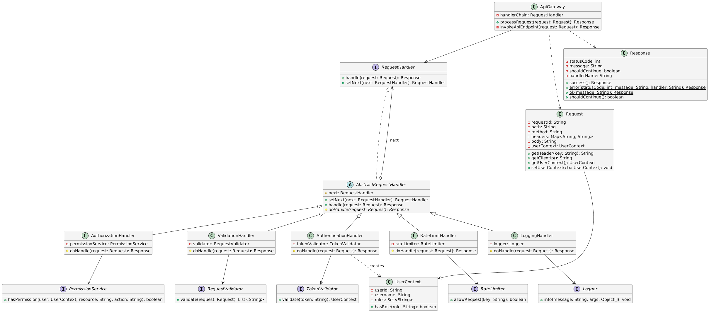
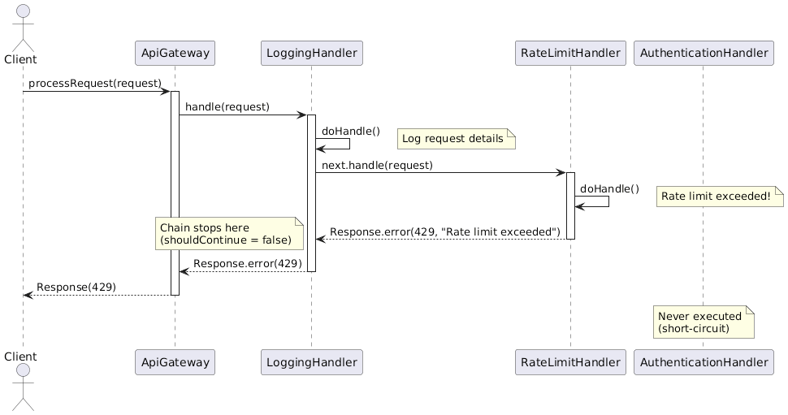
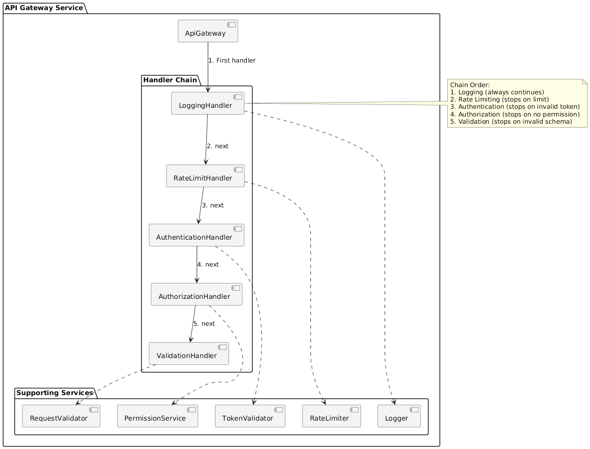

# Chain of Responsibility Pattern

- [Examples](#examples)
- []()

# Examples

<details>
    <summary>Example 1: API Gateway Request Processing Pipeline</summary>

### Context / Problem

Design a request processing system for an API gateway handling 1M+ RPS. Requirements:

- Rate limiting (per user, per IP, per API key)
- Authentication (OAuth, JWT, API key)
- Authorization (role-based, resource-based)
- Request validation and sanitization
- Logging and metrics collection
- Each concern owned by different teams; must be independently deployable
- Processing must short-circuit on failure without executing downstream handlers
- New checks must be addable without modifying existing code


### Why This Pattern Fits

**Design Reasoning:**

- Each processing step has single responsibility and can fail independently
- Order matters: rate limiting before expensive auth checks
- Teams need autonomy to modify their handler without coordination
- Short-circuit behavior is natural: first failure stops the chain

**Alternatives Rejected:**

- **Decorator Pattern:** Nesting becomes unwieldy with 8+ checks; hard to reorder
- **Pipeline with fixed stages:** Inflexible; adding a new check requires modifying pipeline construction
- **Monolithic validator:** Violates SRP; every team change risks regression

**Key Trade-offs:**

- (+) Open/Closed Principle: extend via new handlers
- (+) Easy to reorder, disable, or A/B test handlers
- (-) Slight performance overhead vs monolithic (negligible at this scale)


### Key Classes / Interfaces

```
RequestHandler (interface)
├── setNext(RequestHandler): RequestHandler
├── handle(Request): Response

RateLimitHandler
├── rateLimiter: RateLimiter
├── handle(): check limit → pass or reject

AuthenticationHandler
├── tokenValidator: TokenValidator
├── handle(): validate token → attach user context

AuthorizationHandler
├── permissionService: PermissionService
├── handle(): check permissions → allow or deny

ValidationHandler
├── validators: List<Validator>
├── handle(): validate schema, sanitize input

LoggingHandler
├── logger: Logger
├── handle(): log request details, always pass through
```

### Diagrams
#### Class Diagram


#### Sequence Diagram - Success Request Flow


#### Sequence Diagram - Failed Request (Rate Limit Exceeded)


#### Component Diagram


#### Object Diagram


### How the Pattern Is Applied (LLD View)

1. **Base Handler (Abstract Class):**
    - Holds reference to `next` handler
    - `handle()` performs its check, then calls `next.handle()` if successful
    - Returns immediately on failure with appropriate error response
2. **Chain Construction:**
    - Factory/Builder assembles chain based on configuration
    - Order: Logging → RateLimiting → Authentication → Authorization → Validation
    - Each handler registered independently via dependency injection
3. **Request Flow:**
    - Request enters at chain head
    - Each handler: process → decide (pass/reject) → invoke next or return
    - Final handler passes to actual API endpoint
4. **Failure Handling:**
    - Handler returns error Response without calling next
    - Error includes which handler failed (for debugging/metrics)

### Interview Insight (FAANG-Specific)

**What's Being Evaluated:**

- Recognition that handlers are independently evolvable
- Understanding of short-circuit vs always-execute chains
- Consideration of handler ordering (cheap checks first)
- How to handle cross-cutting concerns without tight coupling

**Common Follow-ups:**

- "How do you handle handlers that should always execute (logging)?" → Separate chain or observer pattern
- "What if a handler needs data from a previous handler?" → Shared context object
- "How to make this async for non-blocking I/O?" → CompletableFuture/Promise chain
- "How to A/B test a new handler?" → Conditional chain construction with feature flags

**Typical Mistakes:**

- Making all handlers execute even after failure
- Handlers directly coupled to each other (not just to next)
- No consideration of handler order performance implications
- Overusing pattern for handlers that need bidirectional communication

#### [Code](https://github.com/sadab-halim/LLD-Examples/tree/master/Behavioral/src/chainOfResponsibility/ea)

</details>

---

<details>
    <summary>Example 2: Exception/Error Handling in Distributed Transaction System</summary>

### Context / Problem

Design error recovery for a distributed order processing system (e-commerce). Requirements:

- Errors at different levels: network, timeout, business logic, data validation
- Recovery strategies vary by error type: retry, fallback, compensate, escalate
- Multiple systems involved: inventory, payment, shipping, notification
- Need observability: which handler recovered vs which escalated
- 99.9% of errors should auto-recover without human intervention


### Why This Pattern Fits

**Design Reasoning:**

- Different handlers specialize in different error categories
- Try least disruptive recovery first, escalate only if needed
- New error types and recovery strategies added without changing existing handlers

**Alternatives Rejected:**

- **Strategy Pattern:** Requires upfront classification of error; doesn't support "try multiple strategies"
- **Nested try-catch:** Procedural, violates OCP, hard to test individual recovery logic
- **Event-driven saga:** Over-engineered for synchronous error handling

**Key Trade-offs:**

- (+) Progressive fallback: graceful degradation
- (+) Testable recovery logic in isolation
- (-) Complexity in determining which handler should attempt recovery


### Key Classes / Interfaces

```
ErrorHandler (interface)
├── canHandle(Exception): boolean
├── handle(Exception, OrderContext): RecoveryResult
├── setNext(ErrorHandler): ErrorHandler

RetryableErrorHandler
├── retryPolicy: RetryPolicy
├── canHandle(): transient failures (timeout, 503)
├── handle(): exponential backoff retry

FallbackHandler
├── fallbackService: Service
├── canHandle(): service unavailable but fallback exists
├── handle(): use cached/stale data or alternative service

CompensationHandler
├── compensationLog: CompensationLog
├── canHandle(): partial success in distributed transaction
├── handle(): rollback completed steps, mark for manual review

EscalationHandler (final handler)
├── alertingService: AlertingService
├── handle(): log, alert on-call, return graceful error to user
```

### Diagrams


### How the Pattern Is Applied (LLD View)

1. **Exception Propagation:**
    - `OrderService.processOrder()` wrapped in try-catch
    - Caught exception passed to chain head
2. **Handler Decision:**
    - Each handler's `canHandle()` checks exception type/metadata
    - If true: attempt recovery
    - If recovery succeeds: return success (chain stops)
    - If recovery fails or not applicable: pass to next
3. **Context Preservation:**
    - `OrderContext` carries state: attempt count, previous failures, order data
    - Handlers read/write context to avoid duplicate recovery attempts
4. **Metrics \& Observability:**
    - Each handler logs which recovery was attempted
    - Final result includes recovery path taken

### Interview Insight (FAANG-Specific)

**What's Being Evaluated:**

- Understanding of fault tolerance at scale
- Recognition that error handling is a cross-cutting concern needing flexibility
- Ability to separate error classification from recovery logic
- Consideration of idempotency in retry logic

**Common Follow-ups:**

- "What if multiple handlers can handle the same error?" → Priority/ordering strategy
- "How to prevent infinite retry loops?" → Context tracks attempt count, max depth
- "Should this be sync or async?" → Depends on SLA; async for long-running compensations
- "How to test failure scenarios?" → Chaos engineering, each handler unit-testable

**Typical Mistakes:**

- Not checking `canHandle()` before attempting recovery
- Handlers modifying global state without idempotency guarantees
- No circuit breaker logic in retry handler
- Returning generic errors that lose context about recovery attempts

#### [Code](https://github.com/sadab-halim/LLD-Examples/tree/master/Behavioral/src/chainOfResponsibility/eb)

</details>

---


## [Example 3: Content Moderation Pipeline (UGC Platform)]()

### Context / Problem

Design a content moderation system for a social media platform (Instagram/TikTok scale). Requirements:

- Multiple moderation strategies: rule-based, ML models, third-party APIs, human review
- Different sensitivity levels by content type: comments < posts < profile info
- Performance: 95% of content auto-approved in <100ms
- Expensive checks (human review, advanced ML) only for suspicious content
- New moderation rules deployed without redeploying entire system
- Audit trail: which check flagged content


### Why This Pattern Fits

**Design Reasoning:**

- Handlers ordered by cost: cheap rules first, expensive ML/human last
- Each handler makes pass/flag/escalate decision independently
- Early exit on clear violations saves compute
- Pluggable architecture for new moderation techniques

**Alternatives Rejected:**

- **Composite with parallel execution:** Wasteful; runs expensive checks even when cheap rule catches violation
- **Rules Engine (Drools-like):** Harder to integrate ML models and external APIs; less control over execution order
- **Microservices per check:** Too much network overhead for sub-100ms SLA

**Key Trade-offs:**

- (+) Cost optimization: 80% rejected by cheap regex, 15% by ML, 5% by human
- (+) Explainability: audit trail shows which rule triggered
- (-) Sequential processing slower than parallel (acceptable given early exit)


### Key Classes / Interfaces

```
ModerationHandler (interface)
├── moderate(Content, ModerationContext): ModerationDecision
├── setNext(ModerationHandler): ModerationHandler

ModerationDecision (enum)
├── APPROVE_AND_STOP
├── FLAG_AND_CONTINUE (for scoring systems)
├── REJECT_AND_STOP
├── ESCALATE_TO_NEXT

ProhibitedKeywordHandler
├── keywordBlacklist: Trie
├── moderate(): check for banned words, hate speech patterns

SpamDetectionHandler
├── spamModel: MLModel
├── moderate(): ML-based spam probability

NudityDetectionHandler
├── visionAPI: ThirdPartyVisionAPI
├── moderate(): call external API for image analysis

ToxicityScoreHandler
├── toxicityModel: Perspective API
├── moderate(): score text toxicity

HumanReviewHandler (terminal)
├── reviewQueue: Queue
├── moderate(): enqueue for human moderator, async response
```


### How the Pattern Is Applied (LLD View)

1. **Chain Configuration by Content Type:**
    - Comments: Keyword → Toxicity → Spam
    - Images: Keyword (on caption) → Nudity → Human Review (if borderline)
    - Profile info: Stricter keyword filter → immediate human review
2. **Decision Propagation:**
    - `APPROVE_AND_STOP`: content published immediately
    - `REJECT_AND_STOP`: content blocked, user notified
    - `ESCALATE_TO_NEXT`: continue to next handler
    - `FLAG_AND_CONTINUE`: add to score, continue (composite scoring)
3. **Context Accumulation:**
    - `ModerationContext` accumulates scores/flags from each handler
    - Final decision based on aggregate (e.g., 3+ flags = reject)
4. **Caching Layer:**
    - Hash content; if seen before, return cached decision
    - Chain executes only for new content

### Interview Insight (FAANG-Specific)

**What's Being Evaluated:**

- Cost awareness: ordering handlers by latency/price
- Recognition of early exit optimization
- Handling of async operations (human review) in mostly sync chain
- Consideration of false positive vs false negative trade-offs

**Common Follow-ups:**

- "How to handle appeals?" → Separate chain with relaxed thresholds, human review mandatory
- "What if external API is down?" → Fallback handler with circuit breaker, fallback to stricter rule-based
- "How to A/B test a new ML model?" → Shadow handler that logs decisions without affecting outcome
- "Multi-language support?" → Language detection handler early in chain, routes to language-specific chains

**Typical Mistakes:**

- Running all handlers even after clear violation (cost inefficiency)
- No timeout on expensive handlers (tail latency spikes)
- Tight coupling to specific ML model versions
- Not considering explainability for legal/compliance requirements


## Example 4: Discount and Promotion Engine (E-commerce Checkout)

### Context / Problem

Design a promotion application system for Amazon/Shopify-scale checkout. Requirements:

- Multiple discount types: coupon codes, loyalty points, cart-level, product-level, seasonal
- Business rules: only one coupon per order, but stackable with loyalty and seasonal
- New promotions added weekly; marketing team uses admin UI
- Discounts applied in specific order per business rules (maximize customer benefit or revenue)
- Performance: calculate final price in <50ms for checkout page
- Audit: show customer breakdown of each discount applied


### Why This Pattern Fits

**Design Reasoning:**

- Each discount type has distinct calculation logic and eligibility rules
- Order matters: percentage discounts before fixed-amount, to maximize savings
- New promotions are new handlers, not code changes
- Natural fit for "apply all eligible" vs "apply first match" policies

**Alternatives Rejected:**

- **Strategy Pattern:** Requires choosing one strategy; here we want to apply multiple
- **Decorator:** Every combination becomes a new class; combinatorial explosion
- **Rules Engine:** Overkill for straightforward sequential application

**Key Trade-offs:**

- (+) Easy to visualize for business users: "Step 1: Coupon, Step 2: Loyalty..."
- (+) Testable: each discount handler tested in isolation
- (-) Order dependency can be non-obvious; needs clear documentation


### Key Classes / Interfaces

```
DiscountHandler (interface)
├── apply(Order, DiscountContext): DiscountResult
├── setNext(DiscountHandler): DiscountHandler

DiscountResult
├── applied: boolean
├── discountAmount: Money
├── description: String

CouponCodeHandler
├── couponService: CouponService
├── apply(): validate coupon, check expiry, calculate discount
├── logic: stops chain if exclusive coupon

LoyaltyPointsHandler
├── loyaltyService: LoyaltyService
├── apply(): calculate points value, deduct from order total

CartThresholdDiscountHandler
├── promotionRules: List<CartRule>
├── apply(): "spend $50, get $10 off"

ProductBundleHandler
├── bundleRules: List<BundleRule>
├── apply(): "buy 2, get 1 free"

SeasonalPromotionHandler
├── promotionCalendar: PromotionCalendar
├── apply(): active seasonal discounts (Black Friday, etc.)

DiscountContext
├── appliedDiscounts: List<DiscountResult>
├── remainingAmount: Money
├── userSegment: UserSegment
```


### How the Pattern Is Applied (LLD View)

1. **Chain Assembly:**
    - Built dynamically based on active promotions and user eligibility
    - Standard order: Exclusive coupons → Product bundles → Cart threshold → Loyalty → Seasonal
    - Context carries running total and applied discounts
2. **Application Logic:**
    - Each handler checks eligibility (user segment, cart composition, date range)
    - If eligible: calculate discount, update context, add to applied list
    - If exclusive (like some coupons): stop chain early
    - Otherwise: pass to next handler
3. **Dry Run Mode:**
    - Chain can execute in "simulation" mode to show potential savings
    - Used for "See available discounts" feature on cart page
4. **Persistence:**
    - Final `DiscountContext.appliedDiscounts` saved with order
    - Used for customer receipt and financial reconciliation

### Interview Insight (FAANG-Specific)

**What's Being Evaluated:**

- Handling of business rule complexity in extensible way
- Understanding of state accumulation through chain (running total)
- Recognition of when to stop chain (exclusive promotions)
- Performance consideration: caching eligible promotions per user

**Common Follow-ups:**

- "How to prevent discount stacking abuse?" → Validation handler at chain end checks business constraints
- "What if discounts conflict?" → Priority system; higher priority handler executes first
- "How to optimize for thousands of promotions?" → Eligibility pre-filtering before chain construction
- "Support for percentage vs fixed discounts?" → Strategy pattern within each handler for calculation

**Typical Mistakes:**

- Applying discounts in arbitrary order (business wants deterministic)
- Not preserving intermediate state (can't explain final price to customer)
- Mutating order object directly instead of accumulating in context
- No rollback mechanism if payment fails after discount application


## Example 5: Logging and Observability Event Enrichment Pipeline

### Context / Problem

Design a log processing system for microservices generating 10M+ log events/sec. Requirements:

- Enrich raw logs with: trace ID, user context, service metadata, geo location, experiment flags
- Different services need different enrichment (auth service adds user ID, payment service adds transaction ID)
- Enrichment sources: in-memory cache, Redis, database, external service (varying latencies)
- Budget: 5ms max enrichment latency
- Failed enrichment shouldn't drop logs
- Support for PII redaction before logs leave service boundary


### Why This Pattern Fits

**Design Reasoning:**

- Each enricher is independent; can succeed or fail without affecting others
- Natural ordering: fast enrichments (in-memory) before slow ones (DB lookups)
- New enrichment types added without modifying pipeline
- "Try all, skip on failure" semantics fit chain with modified termination

**Alternatives Rejected:**

- **Builder Pattern:** Enrichers aren't constructing the log; they're augmenting it
- **Interceptor/Middleware:** Similar, but CoR makes ordering and conditional execution more explicit
- **Async processing (Kafka):** Adds latency; enrichment needed before log emission for debugging

**Key Trade-offs:**

- (+) Fail-safe: one enricher failure doesn't break pipeline
- (+) Testable: mock enrichment sources easily
- (-) All handlers execute (no short-circuit); potential latency issue


### Key Classes / Interfaces

```
LogEnricher (interface)
├── enrich(LogEvent): void
├── setNext(LogEnricher): LogEnricher

LogEvent
├── timestamp, level, message, service
├── attributes: Map<String, Object>
├── addAttribute(key, value): void

TraceContextEnricher
├── traceProvider: TraceContextProvider
├── enrich(): add trace_id, span_id from thread-local

UserContextEnricher
├── userContext: UserContext (thread-local)
├── enrich(): add user_id, session_id
├── timeout: 1ms (fail-fast)

ServiceMetadataEnricher
├── serviceInfo: ServiceInfo (static)
├── enrich(): add service_name, version, host, region

ExperimentEnricher
├── experimentService: ExperimentService
├── enrich(): add active experiment flags for request

PIIRedactionEnricher
├── redactionRules: List<RedactionRule>
├── enrich(): scan and redact SSN, credit card, email patterns

GeoLocationEnricher
├── geoIPCache: GeoIPCache
├── enrich(): lookup IP → add country, city
```


### How the Pattern Is Applied (LLD View)

1. **Non-Short-Circuit Chain:**
    - Unlike previous examples, all enrichers execute
    - Each enricher wrapped in try-catch; failures logged but don't stop chain
2. **Latency Budgeting:**
    - Enrichers ordered by latency: static (metadata) → thread-local (trace) → cached (geo) → remote (experiments)
    - Timeout per enricher; if exceeded, skip and continue
3. **Conditional Enrichment:**
    - Some enrichers check log level: DEBUG includes more context than ERROR
    - `canEnrich(LogEvent)` predicate determines if enricher should run
4. **Chain Construction:**
    - Service-specific: auth service includes UserContextEnricher, payment service includes TransactionEnricher
    - Base chain: TraceContext → ServiceMetadata → PIIRedaction (common to all)

### Interview Insight (FAANG-Specific)

**What's Being Evaluated:**

- Understanding of observability trade-offs at scale
- Recognition that some use cases need "try all" vs "stop on first match"
- Latency awareness: enrichment budget vs log value
- Failure isolation in high-throughput systems

**Common Follow-ups:**

- "What if enrichment takes >5ms?" → Timeout and continue, emit metric for monitoring
- "How to make this zero-copy for performance?" → Enrichers write to shared buffer, no intermediate objects
- "Should PII redaction be in this chain?" → Alternative: separate egress-time redaction, but in-chain ensures no PII in local files
- "How to handle bursty traffic?" → Circuit breaker on expensive enrichers; fallback to minimal enrichment

**Typical Mistakes:**

- Short-circuiting on first failure (loses partial enrichment)
- Synchronous external calls without timeout (tail latency killer)
- Not considering thread-safety (enrichers invoked from multiple threads)
- Over-enriching: adding fields that bloat log size without value

***

# How to Approach Chain of Responsibility in a FAANG LLD Interview

## Signals This Pattern Is Appropriate

**Clear indicators:**

- Problem involves sequential processing with multiple checks/transformations
- Order of operations matters (performance, business rules, or logical dependencies)
- Each step has single, distinct responsibility
- Need to add/remove/reorder steps without modifying existing code
- Short-circuit behavior or "stop on first match" semantics
- Multiple teams own different steps in the pipeline

**Red flags (don't use):**

- Only 2-3 handlers that never change → simple if-else or strategy pattern
- Handlers need bidirectional communication → mediator or event bus
- Parallel processing needed → composite or fork-join
- All handlers must execute and aggregate results → pipeline or composite


## Clarifying Questions Strong Candidates Ask Early

1. **Termination semantics:** "Should processing stop at the first handler that succeeds/fails, or should all handlers execute?"
2. **Failure handling:** "If a handler fails, should it stop the chain, skip to the next, or accumulate errors?"
3. **Performance budget:** "What's the latency requirement? Should we optimize handler ordering for early exit?"
4. **State sharing:** "Do handlers need to share state, or is each independent?"
5. **Dynamic vs static chain:** "Is the chain configuration fixed at compile time, or does it change based on runtime conditions (user type, feature flags, etc.)?"
6. **Extensibility:** "How often are new handlers added? By which teams?"

## How to Explain While Drawing Class Diagrams

**Step-by-step whiteboard approach:**

1. **Start with interface:**
    - Draw `Handler` interface with `handle(Request)` and `setNext(Handler)`
    - Explain: "Each handler decides: process and stop, or pass to next"
2. **Draw 3-4 concrete handlers:**
    - Show inheritance/implementation relationship
    - Label each with its specific responsibility
    - Annotate with performance characteristics (if relevant)
3. **Show chain assembly:**
    - Draw client code constructing chain: `h1.setNext(h2).setNext(h3)`
    - Or use builder/factory for complex chains
    - Indicate order explicitly with arrows labeled "1", "2", "3"
4. **Illustrate request flow:**
    - Trace a sample request through the chain with annotations
    - Show both "stop early" and "traverse entire chain" paths
5. **Highlight context object (if used):**
    - Draw `Context` class holding shared state
    - Show how handlers read/write to it

**Verbal walkthrough:**

- "We start with the cheapest/most common check first..."
- "If this handler can't handle it, responsibility passes to the next..."
- "This gives us O(n) worst case, but in practice 90% of requests stop at handler 2..."


## When NOT to Use This Pattern (Overengineering Signals)

**Interviewer concerns if you force-fit CoR:**

- **Too few handlers:** 2 handlers → just use if-else
- **No ordering requirement:** Handlers can run in any order → composite or parallel execution
- **Complex routing logic:** Choosing next handler requires complex decision tree → state pattern or explicit orchestrator
- **Bidirectional flow:** Request must travel back through chain → inappropriate; consider visitor or mediator
- **All handlers always execute:** No short-circuit → simple pipeline or chain of decorators

**Signs you're overthinking:**

- Spending time on abstract base classes for 2 concrete handlers
- Building dynamic chain reconfiguration when requirements are static
- Adding complexity for "future extensibility" with no current use case


## Scaling, Extending, and Combining with Other Patterns

**Scaling considerations:**

- **Async chains:** For I/O-bound handlers, return `CompletableFuture<Response>` and chain with `.thenCompose()`
- **Parallel first-pass:** Run cheap handlers in parallel, then expensive ones sequentially
- **Caching:** Hash request → check if result cached → skip chain if hit
- **Circuit breaker:** Wrap slow handlers in circuit breaker to fail fast during outages

**Common extensions:**

- **Priority-based:** Handlers have priority; sort before chain assembly
- **Conditional handlers:** `canHandle(Request)` predicate to skip irrelevant handlers
- **Bidirectional chain:** Handler can call previous handler (rare, complex)

**Combining with other patterns:**

- **+ Factory/Builder:** To construct chains based on configuration
- **+ Strategy:** Individual handler uses strategy for its internal logic
- **+ Composite:** For tree-structured chains (handler has multiple "next" options)
- **+ Observer:** For cross-cutting concerns like metrics (observe chain without participating)
- **+ Command:** Request is encapsulated as command object


## Expectations by Level

**Mid-Level (E4/SDE2):**

- Implement basic chain correctly
- Explain single responsibility of each handler
- Handle simple termination (stop on first match)
- Identify when pattern is appropriate

**Senior (E5/SDE3):**

- Justify handler ordering with performance/business reasoning
- Design context object for state sharing
- Handle failure scenarios gracefully (timeout, fallback)
- Discuss trade-offs vs alternative patterns
- Propose dynamic chain configuration

**Staff+ (E6+/Principal):**

- Architect multi-team ownership model (each team owns handlers)
- Design for operational excellence (observability, debugging, rollback)
- Optimize for cost (handler latency budgeting, caching strategy)
- Combine patterns appropriately (CoR + Factory + Circuit Breaker)
- Anticipate edge cases: reentrancy, circular chains, handler versioning
- Provide clear extension points for future unknown requirements
- Explain how design enables A/B testing, gradual rollout, and safe failure

**Key differentiator at Staff level:**

- Not just "does it work?" but "how does this design enable the organization to move fast safely?"
- Consideration of Conway's Law: chain structure reflects team structure
- Metrics and observability built into design, not retrofitted

---

## Example 3: Content Moderation Pipeline

```java
// ============================================================================
// Core Interfaces and Models
// ============================================================================

interface ModerationHandler {
    ModerationDecision moderate(Content content, ModerationContext context);
    ModerationHandler setNext(ModerationHandler next);
}

abstract class AbstractModerationHandler implements ModerationHandler {
    protected ModerationHandler next;
    protected final String handlerName;
    
    public AbstractModerationHandler(String handlerName) {
        this.handlerName = handlerName;
    }
    
    @Override
    public ModerationHandler setNext(ModerationHandler next) {
        this.next = next;
        return next;
    }
    
    @Override
    public ModerationDecision moderate(Content content, ModerationContext context) {
        ModerationDecision decision = doModerate(content, context);
        
        context.addCheckResult(handlerName, decision);
        
        // Handle decision
        switch (decision.getAction()) {
            case APPROVE_AND_STOP:
                return decision;
            
            case REJECT_AND_STOP:
                context.setFinalDecision(ModerationDecision.Action.REJECT_AND_STOP);
                return decision;
            
            case FLAG_AND_CONTINUE:
                context.incrementFlagCount();
                if (next != null) {
                    return next.moderate(content, context);
                }
                return evaluateFinalDecision(context);
            
            case ESCALATE_TO_NEXT:
                if (next != null) {
                    return next.moderate(content, context);
                }
                return ModerationDecision.approve("All checks passed");
            
            default:
                return ModerationDecision.approve("Default approval");
        }
    }
    
    protected abstract ModerationDecision doModerate(Content content, 
                                                    ModerationContext context);
    
    private ModerationDecision evaluateFinalDecision(ModerationContext context) {
        if (context.getFlagCount() >= 3) {
            return ModerationDecision.reject("Multiple flags triggered", handlerName);
        }
        return ModerationDecision.approve("Acceptable risk level");
    }
}

class Content {
    private final String contentId;
    private final ContentType type;
    private final String text;
    private final String imageUrl;
    private final String userId;
    private final long timestamp;
    
    public enum ContentType {
        TEXT, IMAGE, VIDEO, PROFILE
    }
    
    public Content(String contentId, ContentType type, String text, 
                  String imageUrl, String userId) {
        this.contentId = contentId;
        this.type = type;
        this.text = text;
        this.imageUrl = imageUrl;
        this.userId = userId;
        this.timestamp = System.currentTimeMillis();
    }
    
    public String getContentId() { return contentId; }
    public ContentType getType() { return type; }
    public String getText() { return text; }
    public String getImageUrl() { return imageUrl; }
    public String getUserId() { return userId; }
}

class ModerationDecision {
    private final Action action;
    private final String reason;
    private final String handlerName;
    private final double confidenceScore;
    
    public enum Action {
        APPROVE_AND_STOP,
        REJECT_AND_STOP,
        FLAG_AND_CONTINUE,
        ESCALATE_TO_NEXT
    }
    
    private ModerationDecision(Action action, String reason, String handlerName, 
                              double confidenceScore) {
        this.action = action;
        this.reason = reason;
        this.handlerName = handlerName;
        this.confidenceScore = confidenceScore;
    }
    
    public static ModerationDecision approve(String reason) {
        return new ModerationDecision(Action.APPROVE_AND_STOP, reason, null, 1.0);
    }
    
    public static ModerationDecision reject(String reason, String handler) {
        return new ModerationDecision(Action.REJECT_AND_STOP, reason, handler, 1.0);
    }
    
    public static ModerationDecision flag(String reason, String handler, double score) {
        return new ModerationDecision(Action.FLAG_AND_CONTINUE, reason, handler, score);
    }
    
    public static ModerationDecision escalate() {
        return new ModerationDecision(Action.ESCALATE_TO_NEXT, "Continue checking", 
                                     null, 0.0);
    }
    
    public Action getAction() { return action; }
    public String getReason() { return reason; }
    public String getHandlerName() { return handlerName; }
    public double getConfidenceScore() { return confidenceScore; }
}

class ModerationContext {
    private final String contentId;
    private int flagCount;
    private final List<CheckResult> checkResults;
    private ModerationDecision.Action finalDecision;
    private final long startTime;
    
    public ModerationContext(String contentId) {
        this.contentId = contentId;
        this.flagCount = 0;
        this.checkResults = new ArrayList<>();
        this.startTime = System.currentTimeMillis();
    }
    
    public void addCheckResult(String handlerName, ModerationDecision decision) {
        checkResults.add(new CheckResult(handlerName, decision));
    }
    
    public void incrementFlagCount() { flagCount++; }
    public int getFlagCount() { return flagCount; }
    public void setFinalDecision(ModerationDecision.Action action) { 
        this.finalDecision = action; 
    }
    public List<CheckResult> getCheckResults() { return checkResults; }
    public long getElapsedTime() { return System.currentTimeMillis() - startTime; }
    
    static class CheckResult {
        final String handlerName;
        final ModerationDecision decision;
        
        CheckResult(String handlerName, ModerationDecision decision) {
            this.handlerName = handlerName;
            this.decision = decision;
        }
    }
}

// ============================================================================
// Concrete Moderation Handlers
// ============================================================================

class ProhibitedKeywordHandler extends AbstractModerationHandler {
    private final Set<String> prohibitedKeywords;
    private final Set<String> hateSpeechPatterns;
    
    public ProhibitedKeywordHandler() {
        super("ProhibitedKeywordHandler");
        this.prohibitedKeywords = Set.of(
            "spam_keyword1", "spam_keyword2", "banned_word"
        );
        this.hateSpeechPatterns = Set.of(
            "hate_pattern1", "slur1", "offensive_term"
        );
    }
    
    @Override
    protected ModerationDecision doModerate(Content content, ModerationContext context) {
        String text = content.getText();
        if (text == null || text.isEmpty()) {
            return ModerationDecision.escalate();
        }
        
        String lowerText = text.toLowerCase();
        
        // Check for hate speech (immediate reject)
        for (String pattern : hateSpeechPatterns) {
            if (lowerText.contains(pattern)) {
                return ModerationDecision.reject(
                    "Hate speech detected: " + pattern, 
                    handlerName
                );
            }
        }
        
        // Check for spam keywords (flag for further review)
        for (String keyword : prohibitedKeywords) {
            if (lowerText.contains(keyword)) {
                return ModerationDecision.flag(
                    "Prohibited keyword: " + keyword,
                    handlerName,
                    0.8
                );
            }
        }
        
        return ModerationDecision.escalate();
    }
}

class SpamDetectionHandler extends AbstractModerationHandler {
    private final SpamModel spamModel;
    
    public SpamDetectionHandler(SpamModel spamModel) {
        super("SpamDetectionHandler");
        this.spamModel = spamModel;
    }
    
    @Override
    protected ModerationDecision doModerate(Content content, ModerationContext context) {
        if (content.getText() == null) {
            return ModerationDecision.escalate();
        }
        
        double spamScore = spamModel.predictSpamProbability(content.getText(), 
                                                            content.getUserId());
        
        if (spamScore > 0.9) {
            return ModerationDecision.reject(
                "High spam probability: " + spamScore,
                handlerName
            );
        } else if (spamScore > 0.6) {
            return ModerationDecision.flag(
                "Medium spam probability: " + spamScore,
                handlerName,
                spamScore
            );
        }
        
        return ModerationDecision.escalate();
    }
}

class NudityDetectionHandler extends AbstractModerationHandler {
    private final VisionAPI visionAPI;
    private static final long TIMEOUT_MS = 500;
    
    public NudityDetectionHandler(VisionAPI visionAPI) {
        super("NudityDetectionHandler");
        this.visionAPI = visionAPI;
    }
    
    @Override
    protected ModerationDecision doModerate(Content content, ModerationContext context) {
        if (content.getImageUrl() == null) {
            return ModerationDecision.escalate();
        }
        
        try {
            NudityScore score = visionAPI.analyzeImage(content.getImageUrl(), TIMEOUT_MS);
            
            if (score.getNudityProbability() > 0.85) {
                return ModerationDecision.reject(
                    "Explicit content detected",
                    handlerName
                );
            } else if (score.getNudityProbability() > 0.5) {
                return ModerationDecision.flag(
                    "Potentially explicit content",
                    handlerName,
                    score.getNudityProbability()
                );
            }
            
            return ModerationDecision.escalate();
            
        } catch (TimeoutException e) {
            // Fallback: flag for manual review on timeout
            return ModerationDecision.flag(
                "Vision API timeout - needs manual review",
                handlerName,
                0.5
            );
        }
    }
}

class ToxicityScoreHandler extends AbstractModerationHandler {
    private final ToxicityAPI toxicityAPI;
    
    public ToxicityScoreHandler(ToxicityAPI toxicityAPI) {
        super("ToxicityScoreHandler");
        this.toxicityAPI = toxicityAPI;
    }
    
    @Override
    protected ModerationDecision doModerate(Content content, ModerationContext context) {
        if (content.getText() == null || content.getText().isEmpty()) {
            return ModerationDecision.escalate();
        }
        
        double toxicityScore = toxicityAPI.analyzeToxicity(content.getText());
        
        if (toxicityScore > 0.8) {
            return ModerationDecision.reject(
                "High toxicity score: " + toxicityScore,
                handlerName
            );
        } else if (toxicityScore > 0.5) {
            return ModerationDecision.flag(
                "Moderate toxicity: " + toxicityScore,
                handlerName,
                toxicityScore
            );
        }
        
        return ModerationDecision.escalate();
    }
}

class HumanReviewHandler extends AbstractModerationHandler {
    private final ReviewQueue reviewQueue;
    
    public HumanReviewHandler(ReviewQueue reviewQueue) {
        super("HumanReviewHandler");
        this.reviewQueue = reviewQueue;
    }
    
    @Override
    protected ModerationDecision doModerate(Content content, ModerationContext context) {
        // If we reached here with flags, enqueue for human review
        if (context.getFlagCount() > 0) {
            reviewQueue.enqueue(content, context);
            return ModerationDecision.reject(
                "Flagged for human review (" + context.getFlagCount() + " flags)",
                handlerName
            );
        }
        
        // No flags - approve
        return ModerationDecision.approve("Passed all automated checks");
    }
}

// ============================================================================
// Supporting Services and Models
// ============================================================================

interface SpamModel {
    double predictSpamProbability(String text, String userId);
}

interface VisionAPI {
    NudityScore analyzeImage(String imageUrl, long timeoutMs) throws TimeoutException;
}

interface ToxicityAPI {
    double analyzeToxicity(String text);
}

interface ReviewQueue {
    void enqueue(Content content, ModerationContext context);
}

class NudityScore {
    private final double nudityProbability;
    
    public NudityScore(double probability) {
        this.nudityProbability = probability;
    }
    
    public double getNudityProbability() { return nudityProbability; }
}

class TimeoutException extends Exception {
    public TimeoutException(String message) { super(message); }
}

// ============================================================================
// Content Moderation Service
// ============================================================================

class ContentModerationService {
    private final ModerationHandler textModerationChain;
    private final ModerationHandler imageModerationChain;
    
    public ContentModerationService(SpamModel spamModel,
                                   VisionAPI visionAPI,
                                   ToxicityAPI toxicityAPI,
                                   ReviewQueue reviewQueue) {
        
        // Text content chain: Keyword → Toxicity → Spam → HumanReview
        ModerationHandler keyword1 = new ProhibitedKeywordHandler();
        ModerationHandler toxicity = new ToxicityScoreHandler(toxicityAPI);
        ModerationHandler spam = new SpamDetectionHandler(spamModel);
        ModerationHandler humanReview1 = new HumanReviewHandler(reviewQueue);
        
        keyword1.setNext(toxicity)
                .setNext(spam)
                .setNext(humanReview1);
        
        this.textModerationChain = keyword1;
        
        // Image content chain: Keyword (caption) → Nudity → HumanReview
        ModerationHandler keyword2 = new ProhibitedKeywordHandler();
        ModerationHandler nudity = new NudityDetectionHandler(visionAPI);
        ModerationHandler humanReview2 = new HumanReviewHandler(reviewQueue);
        
        keyword2.setNext(nudity)
                .setNext(humanReview2);
        
        this.imageModerationChain = keyword2;
    }
    
    public ModerationResult moderateContent(Content content) {
        ModerationContext context = new ModerationContext(content.getContentId());
        
        ModerationHandler chain = content.getType() == Content.ContentType.IMAGE ?
                                 imageModerationChain : textModerationChain;
        
        ModerationDecision finalDecision = chain.moderate(content, context);
        
        return new ModerationResult(
            content.getContentId(),
            finalDecision,
            context.getCheckResults(),
            context.getElapsedTime()
        );
    }
}

class ModerationResult {
    private final String contentId;
    private final ModerationDecision finalDecision;
    private final List<ModerationContext.CheckResult> checkResults;
    private final long processingTimeMs;
    
    public ModerationResult(String contentId, 
                           ModerationDecision finalDecision,
                           List<ModerationContext.CheckResult> checkResults,
                           long processingTimeMs) {
        this.contentId = contentId;
        this.finalDecision = finalDecision;
        this.checkResults = checkResults;
        this.processingTimeMs = processingTimeMs;
    }
    
    public boolean isApproved() {
        return finalDecision.getAction() == ModerationDecision.Action.APPROVE_AND_STOP;
    }
    
    public void printSummary() {
        System.out.println("Content: " + contentId);
        System.out.println("Decision: " + finalDecision.getAction() + 
                          " (" + finalDecision.getReason() + ")");
        System.out.println("Processing time: " + processingTimeMs + "ms");
        System.out.println("Checks performed:");
        for (ModerationContext.CheckResult result : checkResults) {
            System.out.println("  - " + result.handlerName + ": " + 
                             result.decision.getAction());
        }
    }
}

// ============================================================================
// Usage Example
// ============================================================================

class Example3Demo {
    public static void main(String[] args) {
        // Mock services
        SpamModel spamModel = (text, userId) -> {
            if (text.contains("buy now")) return 0.95;
            if (text.contains("click here")) return 0.7;
            return 0.1;
        };
        
        VisionAPI visionAPI = (imageUrl, timeout) -> {
            if (imageUrl.contains("explicit")) return new NudityScore(0.9);
            return new NudityScore(0.1);
        };
        
        ToxicityAPI toxicityAPI = text -> {
            if (text.contains("offensive_term")) return 0.85;
            return 0.2;
        };
        
        ReviewQueue reviewQueue = (content, context) -> {
            System.out.println("Enqueued for human review: " + content.getContentId());
        };
        
        ContentModerationService moderationService = new ContentModerationService(
            spamModel, visionAPI, toxicityAPI, reviewQueue
        );
        
        // Test cases
        Content content1 = new Content("post-1", Content.ContentType.TEXT,
                                      "This is a normal post", null, "user123");
        
        Content content2 = new Content("post-2", Content.ContentType.TEXT,
                                      "Buy now! Click here for amazing deals!", 
                                      null, "user456");
        
        Content content3 = new Content("post-3", Content.ContentType.IMAGE,
                                      "Check out this image", 
                                      "https://example.com/explicit.jpg", "user789");
        
        System.out.println("=== Moderating Content 1 ===");
        ModerationResult result1 = moderationService.moderateContent(content1);
        result1.printSummary();
        
        System.out.println("\n=== Moderating Content 2 ===");
        ModerationResult result2 = moderationService.moderateContent(content2);
        result2.printSummary();
        
        System.out.println("\n=== Moderating Content 3 ===");
        ModerationResult result3 = moderationService.moderateContent(content3);
        result3.printSummary();
    }
}
```


## Example 4: Discount and Promotion Engine

```java
// ============================================================================
// Core Interfaces and Models
// ============================================================================

interface DiscountHandler {
    DiscountResult apply(Order order, DiscountContext context);
    DiscountHandler setNext(DiscountHandler next);
}

abstract class AbstractDiscountHandler implements DiscountHandler {
    protected DiscountHandler next;
    protected final String handlerName;
    
    public AbstractDiscountHandler(String handlerName) {
        this.handlerName = handlerName;
    }
    
    @Override
    public DiscountHandler setNext(DiscountHandler next) {
        this.next = next;
        return next;
    }
    
    @Override
    public DiscountResult apply(Order order, DiscountContext context) {
        if (!isEligible(order, context)) {
            // Not eligible, pass to next
            if (next != null) {
                return next.apply(order, context);
            }
            return DiscountResult.notApplied();
        }
        
        DiscountResult result = calculateDiscount(order, context);
        
        if (result.isApplied()) {
            context.addAppliedDiscount(result);
            context.updateRemainingAmount(result.getDiscountAmount());
            
            // Check if this is an exclusive discount
            if (result.isExclusive()) {
                return result; // Stop chain
            }
        }
        
        // Continue to next handler
        if (next != null) {
            return next.apply(order, context);
        }
        
        return result;
    }
    
    protected abstract boolean isEligible(Order order, DiscountContext context);
    protected abstract DiscountResult calculateDiscount(Order order, 
                                                       DiscountContext context);
}

class DiscountContext {
    private final List<DiscountResult> appliedDiscounts;
    private BigDecimal remainingAmount;
    private final String userSegment;
    private boolean exclusiveApplied;
    
    public DiscountContext(BigDecimal orderTotal, String userSegment) {
        this.appliedDiscounts = new ArrayList<>();
        this.remainingAmount = orderTotal;
        this.userSegment = userSegment;
        this.exclusiveApplied = false;
    }
    
    public void addAppliedDiscount(DiscountResult discount) {
        appliedDiscounts.add(discount);
        if (discount.isExclusive()) {
            exclusiveApplied = true;
        }
    }
    
    public void updateRemainingAmount(BigDecimal discount) {
        remainingAmount = remainingAmount.subtract(discount);
        if (remainingAmount.compareTo(BigDecimal.ZERO) < 0) {
            remainingAmount = BigDecimal.ZERO;
        }
    }
    
    public List<DiscountResult> getAppliedDiscounts() { return appliedDiscounts; }
    public BigDecimal getRemainingAmount() { return remainingAmount; }
    public String getUserSegment() { return userSegment; }
    public boolean isExclusiveApplied() { return exclusiveApplied; }
    
    public BigDecimal getTotalDiscount() {
        return appliedDiscounts.stream()
            .map(DiscountResult::getDiscountAmount)
            .reduce(BigDecimal.ZERO, BigDecimal::add);
    }
}

class DiscountResult {
    private final boolean applied;
    private final BigDecimal discountAmount;
    private final String description;
    private final String handlerName;
    private final DiscountType type;
    private final boolean exclusive;
    
    public enum DiscountType {
        COUPON, LOYALTY, CART_THRESHOLD, BUNDLE, SEASONAL
    }
    
    private DiscountResult(boolean applied, BigDecimal amount, String description,
                          String handlerName, DiscountType type, boolean exclusive) {
        this.applied = applied;
        this.discountAmount = amount;
        this.description = description;
        this.handlerName = handlerName;
        this.type = type;
        this.exclusive = exclusive;
    }
    
    public static DiscountResult applied(BigDecimal amount, String description,
                                        String handler, DiscountType type, 
                                        boolean exclusive) {
        return new DiscountResult(true, amount, description, handler, type, exclusive);
    }
    
    public static DiscountResult notApplied() {
        return new DiscountResult(false, BigDecimal.ZERO, "Not applied", 
                                 null, null, false);
    }
    
    public boolean isApplied() { return applied; }
    public BigDecimal getDiscountAmount() { return discountAmount; }
    public String getDescription() { return description; }
    public boolean isExclusive() { return exclusive; }
    public DiscountType getType() { return type; }
}

// Note: Reusing Order class from Example 2, adding discount-specific methods
class CheckoutOrder {
    private final String orderId;
    private final List<OrderItem> items;
    private final BigDecimal subtotal;
    private final String userId;
    private final String couponCode;
    
    public CheckoutOrder(String orderId, List<OrderItem> items, BigDecimal subtotal,
                        String userId, String couponCode) {
        this.orderId = orderId;
        this.items = items;
        this.subtotal = subtotal;
        this.userId = userId;
        this.couponCode = couponCode;
    }
    
    public boolean hasCoupon() { return couponCode != null && !couponCode.isEmpty(); }
    public String getCouponCode() { return couponCode; }
    public BigDecimal getSubtotal() { return subtotal; }
    public String getUserId() { return userId; }
    public List<OrderItem> getItems() { return items; }
    
    public int getTotalItemCount() {
        return items.stream().mapToInt(OrderItem::getQuantity).sum();
    }
}

// ============================================================================
// Concrete Discount Handlers
// ============================================================================

class CouponCodeHandler extends AbstractDiscountHandler {
    private final CouponService couponService;
    
    public CouponCodeHandler(CouponService couponService) {
        super("CouponCodeHandler");
        this.couponService = couponService;
    }
    
    @Override
    protected boolean isEligible(CheckoutOrder order, DiscountContext context) {
        return order.hasCoupon() && !context.isExclusiveApplied();
    }
    
    @Override
    protected DiscountResult calculateDiscount(CheckoutOrder order, 
                                              DiscountContext context) {
        Coupon coupon = couponService.validateCoupon(order.getCouponCode(), 
                                                     order.getUserId());
        
        if (coupon == null || coupon.isExpired()) {
            return DiscountResult.notApplied();
        }
        
        BigDecimal discount;
        if (coupon.isPercentage()) {
            discount = context.getRemainingAmount()
                             .multiply(coupon.getValue())
                             .divide(new BigDecimal("100"), 2, RoundingMode.HALF_UP);
        } else {
            discount = coupon.getValue();
        }
        
        // Ensure discount doesn't exceed remaining amount
        if (discount.compareTo(context.getRemainingAmount()) > 0) {
            discount = context.getRemainingAmount();
        }
        
        return DiscountResult.applied(
            discount,
            "Coupon: " + order.getCouponCode() + " (-$" + discount + ")",
            handlerName,
            DiscountResult.DiscountType.COUPON,
            coupon.isExclusive()
        );
    }
}

class LoyaltyPointsHandler extends AbstractDiscountHandler {
    private final LoyaltyService loyaltyService;
    private static final BigDecimal POINTS_TO_DOLLARS = new BigDecimal("0.01");
    
    public LoyaltyPointsHandler(LoyaltyService loyaltyService) {
        super("LoyaltyPointsHandler");
        this.loyaltyService = loyaltyService;
    }
    
    @Override
    protected boolean isEligible(CheckoutOrder order, DiscountContext context) {
        int availablePoints = loyaltyService.getPoints(order.getUserId());
        return availablePoints > 0 && context.getRemainingAmount().compareTo(BigDecimal.ZERO) > 0;
    }
    
    @Override
    protected DiscountResult calculateDiscount(CheckoutOrder order, 
                                              DiscountContext context) {
        int availablePoints = loyaltyService.getPoints(order.getUserId());
        BigDecimal maxPointsDiscount = new BigDecimal(availablePoints)
                                          .multiply(POINTS_TO_DOLLARS);
        
        // Apply up to remaining amount
        BigDecimal discount = maxPointsDiscount.min(context.getRemainingAmount());
        int pointsToRedeem = discount.divide(POINTS_TO_DOLLARS, 0, RoundingMode.DOWN)
                                    .intValue();
        
        // Deduct points
        loyaltyService.redeemPoints(order.getUserId(), pointsToRedeem);
        
        return DiscountResult.applied(
            discount,
            "Loyalty points: " + pointsToRedeem + " points (-$" + discount + ")",
            handlerName,
            DiscountResult.DiscountType.LOYALTY,
            false
        );
    }
}

class CartThresholdDiscountHandler extends AbstractDiscountHandler {
    private final List<CartThresholdRule> rules;
    
    public CartThresholdDiscountHandler(List<CartThresholdRule> rules) {
        super("CartThresholdDiscountHandler");
        this.rules = rules.stream()
                         .sorted((r1, r2) -> r2.getThreshold().compareTo(r1.getThreshold()))
                         .collect(Collectors.toList());
    }
    
    @Override
    protected boolean isEligible(CheckoutOrder order, DiscountContext context) {
        return context.getRemainingAmount().compareTo(BigDecimal.ZERO) > 0;
    }
    
    @Override
    protected DiscountResult calculateDiscount(CheckoutOrder order, 
                                              DiscountContext context) {
        BigDecimal currentAmount = context.getRemainingAmount();
        
        // Find highest applicable threshold
        for (CartThresholdRule rule : rules) {
            if (currentAmount.compareTo(rule.getThreshold()) >= 0) {
                BigDecimal discount = rule.getDiscountAmount();
                
                return DiscountResult.applied(
                    discount,
                    "Spend $" + rule.getThreshold() + ", save $" + discount,
                    handlerName,
                    DiscountResult.DiscountType.CART_THRESHOLD,
                    false
                );
            }
        }
        
        return DiscountResult.notApplied();
    }
}

class ProductBundleHandler extends AbstractDiscountHandler {
    private final List<BundleRule> bundleRules;
    
    public ProductBundleHandler(List<BundleRule> bundleRules) {
        super("ProductBundleHandler");
        this.bundleRules = bundleRules;
    }
    
    @Override
    protected boolean isEligible(CheckoutOrder order, DiscountContext context) {
        return !order.getItems().isEmpty();
    }
    
    @Override
    protected DiscountResult calculateDiscount(CheckoutOrder order, 
                                              DiscountContext context) {
        BigDecimal totalBundleDiscount = BigDecimal.ZERO;
        List<String> appliedBundles = new ArrayList<>();
        
        for (BundleRule rule : bundleRules) {
            if (rule.matches(order.getItems())) {
                BigDecimal discount = rule.calculateDiscount(order.getItems());
                totalBundleDiscount = totalBundleDiscount.add(discount);
                appliedBundles.add(rule.getDescription());
            }
        }
        
        if (totalBundleDiscount.compareTo(BigDecimal.ZERO) > 0) {
            return DiscountResult.applied(
                totalBundleDiscount,
                "Bundle deals: " + String.join(", ", appliedBundles),
                handlerName,
                DiscountResult.DiscountType.BUNDLE,
                false
            );
        }
        
        return DiscountResult.notApplied();
    }
}

class SeasonalPromotionHandler extends AbstractDiscountHandler {
    private final PromotionCalendar promotionCalendar;
    
    public SeasonalPromotionHandler(PromotionCalendar promotionCalendar) {
        super("SeasonalPromotionHandler");
        this.promotionCalendar = promotionCalendar;
    }
    
    @Override
    protected boolean isEligible(CheckoutOrder order, DiscountContext context) {
        return promotionCalendar.hasActivePromotion() && 
               context.getRemainingAmount().compareTo(BigDecimal.ZERO) > 0;
    }
    
    @Override
    protected DiscountResult calculateDiscount(CheckoutOrder order, 
                                              DiscountContext context) {
        Promotion activePromotion = promotionCalendar.getActivePromotion();
        
        if (activePromotion == null) {
            return DiscountResult.notApplied();
        }
        
        BigDecimal discount = context.getRemainingAmount()
                                    .multiply(activePromotion.getDiscountPercentage())
                                    .divide(new BigDecimal("100"), 2, RoundingMode.HALF_UP);
        
        return DiscountResult.applied(
            discount,
            activePromotion.getName() + " (-" + activePromotion.getDiscountPercentage() + "%)",
            handlerName,
            DiscountResult.DiscountType.SEASONAL,
            false
        );
    }
}

// ============================================================================
// Supporting Services and Models
// ============================================================================

interface CouponService {
    Coupon validateCoupon(String code, String userId);
}

interface LoyaltyService {
    int getPoints(String userId);
    void redeemPoints(String userId, int points);
}

class Coupon {
    private final String code;
    private final BigDecimal value;
    private final boolean isPercentage;
    private final boolean exclusive;
    private final long expiryTimestamp;
    
    public Coupon(String code, BigDecimal value, boolean isPercentage, 
                 boolean exclusive, long expiryTimestamp) {
        this.code = code;
        this.value = value;
        this.isPercentage = isPercentage;
        this.exclusive = exclusive;
        this.expiryTimestamp = expiryTimestamp;
    }
    
    public BigDecimal getValue() { return value; }
    public boolean isPercentage() { return isPercentage; }
    public boolean isExclusive() { return exclusive; }
    public boolean isExpired() { return System.currentTimeMillis() > expiryTimestamp; }
}

class CartThresholdRule {
    private final BigDecimal threshold;
    private final BigDecimal discountAmount;
    
    public CartThresholdRule(BigDecimal threshold, BigDecimal discountAmount) {
        this.threshold = threshold;
        this.discountAmount = discountAmount;
    }
    
    public BigDecimal getThreshold() { return threshold; }
    public BigDecimal getDiscountAmount() { return discountAmount; }
}

class BundleRule {
    private final String productId;
    private final int requiredQuantity;
    private final int freeQuantity;
    private final String description;
    
    public BundleRule(String productId, int requiredQuantity, int freeQuantity) {
        this.productId = productId;
        this.requiredQuantity = requiredQuantity;
        this.freeQuantity = freeQuantity;
        this.description = "Buy " + requiredQuantity + " get " + freeQuantity + " free";
    }
    
    public boolean matches(List<OrderItem> items) {
        return items.stream()
                   .filter(item -> item.getProductId().equals(productId))
                   .mapToInt(OrderItem::getQuantity)
                   .sum() >= requiredQuantity;
    }
    
    public BigDecimal calculateDiscount(List<OrderItem> items) {
        OrderItem matchingItem = items.stream()
                                     .filter(item -> item.getProductId().equals(productId))
                                     .findFirst()
                                     .orElse(null);
        
        if (matchingItem != null) {
            int quantity = matchingItem.getQuantity();
            int bundles = quantity / requiredQuantity;
            BigDecimal itemPrice = matchingItem.getPrice();
            return itemPrice.multiply(new BigDecimal(bundles * freeQuantity));
        }
        
        return BigDecimal.ZERO;
    }
    
    public String getDescription() { return description; }
}

interface PromotionCalendar {
    boolean hasActivePromotion();
    Promotion getActivePromotion();
}

class Promotion {
    private final String name;
    private final BigDecimal discountPercentage;
    
    public Promotion(String name, BigDecimal discountPercentage) {
        this.name = name;
        this.discountPercentage = discountPercentage;
    }
    
    public String getName() { return name; }
    public BigDecimal getDiscountPercentage() { return discountPercentage; }
}

// Note: Reusing OrderItem from Example 2, adding price getter
class CheckoutOrderItem {
    private final String productId;
    private final int quantity;
    private final BigDecimal price;
    
    public CheckoutOrderItem(String productId, int quantity, BigDecimal price) {
        this.productId = productId;
        this.quantity = quantity;
        this.price = price;
    }
    
    public String getProductId() { return productId; }
    public int getQuantity() { return quantity; }
    public BigDecimal getPrice() { return price; }
}

// ============================================================================
// Checkout Service with Discount Chain
// ============================================================================

class CheckoutService {
    private final DiscountHandler discountChain;
    
    public CheckoutService(CouponService couponService,
                          LoyaltyService loyaltyService,
                          List<CartThresholdRule> cartRules,
                          List<BundleRule> bundleRules,
                          PromotionCalendar promotionCalendar) {
        
        // Build discount chain
        // Order: Coupon → Bundle → CartThreshold → Loyalty → Seasonal
        DiscountHandler coupon = new CouponCodeHandler(couponService);
        DiscountHandler bundle = new ProductBundleHandler(bundleRules);
        DiscountHandler cartThreshold = new CartThresholdDiscountHandler(cartRules);
        DiscountHandler loyalty = new LoyaltyPointsHandler(loyaltyService);
        DiscountHandler seasonal = new SeasonalPromotionHandler(promotionCalendar);
        
        coupon.setNext(bundle)
              .setNext(cartThreshold)
              .setNext(loyalty)
              .setNext(seasonal);
        
        this.discountChain = coupon;
    }
    
    public CheckoutResult calculateFinalPrice(CheckoutOrder order, String userSegment) {
        DiscountContext context = new DiscountContext(order.getSubtotal(), userSegment);
        
        // Apply discount chain
        discountChain.apply(order, context);
        
        BigDecimal finalPrice = context.getRemainingAmount();
        BigDecimal totalDiscount = context.getTotalDiscount();
        
        return new CheckoutResult(
            order.getOrderId(),
            order.getSubtotal(),
            totalDiscount,
            finalPrice,
            context.getAppliedDiscounts()
        );
    }
}

class CheckoutResult {
    private final String orderId;
    private final BigDecimal subtotal;
    private final BigDecimal totalDiscount;
    private final BigDecimal finalPrice;
    private final List<DiscountResult> appliedDiscounts;
    
    public CheckoutResult(String orderId, BigDecimal subtotal, BigDecimal totalDiscount,
                         BigDecimal finalPrice, List<DiscountResult> appliedDiscounts) {
        this.orderId = orderId;
        this.subtotal = subtotal;
        this.totalDiscount = totalDiscount;
        this.finalPrice = finalPrice;
        this.appliedDiscounts = appliedDiscounts;
    }
    
    public void printReceipt() {
        System.out.println("========== CHECKOUT RECEIPT ==========");
        System.out.println("Order ID: " + orderId);
        System.out.println("Subtotal: $" + subtotal);
        System.out.println("\nDiscounts Applied:");
        
        if (appliedDiscounts.isEmpty()) {
            System.out.println("  None");
        } else {
            for (DiscountResult discount : appliedDiscounts) {
                System.out.println("  - " + discount.getDescription());
            }
        }
        
        System.out.println("\nTotal Discount: -$" + totalDiscount);
        System.out.println("Final Price: $" + finalPrice);
        System.out.println("======================================");
    }
}

// ============================================================================
// Usage Example
// ============================================================================

class Example4Demo {
    public static void main(String[] args) {
        // Mock services
        CouponService couponService = (code, userId) -> {
            if ("SAVE20".equals(code)) {
                return new Coupon(code, new BigDecimal("20"), true, false, 
                                Long.MAX_VALUE);
            }
            return null;
        };
        
        LoyaltyService loyaltyService = new LoyaltyService() {
            private Map<String, Integer> userPoints = new HashMap<>(
                Map.of("user123", 500)
            );
            
            public int getPoints(String userId) {
                return userPoints.getOrDefault(userId, 0);
            }
            
            public void redeemPoints(String userId, int points) {
                userPoints.put(userId, getPoints(userId) - points);
            }
        };
        
        List<CartThresholdRule> cartRules = List.of(
            new CartThresholdRule(new BigDecimal("100"), new BigDecimal("10")),
            new CartThresholdRule(new BigDecimal("50"), new BigDecimal("5"))
        );
        
        List<BundleRule> bundleRules = List.of(
            new BundleRule("product-A", 2, 1)
        );
        
        PromotionCalendar promotionCalendar = new PromotionCalendar() {
            public boolean hasActivePromotion() { return true; }
            public Promotion getActivePromotion() {
                return new Promotion("Winter Sale", new BigDecimal("10"));
            }
        };
        
        CheckoutService checkoutService = new CheckoutService(
            couponService, loyaltyService, cartRules, bundleRules, promotionCalendar
        );
        
        // Test order
        CheckoutOrder order = new CheckoutOrder(
            "order-001",
            List.of(
                new CheckoutOrderItem("product-A", 3, new BigDecimal("30.00")),
                new CheckoutOrderItem("product-B", 1, new BigDecimal("25.00"))
            ),
            new BigDecimal("115.00"),
            "user123",
            "SAVE20"
        );
        
        CheckoutResult result = checkoutService.calculateFinalPrice(order, "PREMIUM");
        result.printReceipt();
    }
}
```


## Example 5: Logging and Observability Event Enrichment Pipeline

```java
// ============================================================================
// Core Interfaces and Models
// ============================================================================

interface LogEnricher {
    void enrich(LogEvent event);
    LogEnricher setNext(LogEnricher next);
}

abstract class AbstractLogEnricher implements LogEnricher {
    protected LogEnricher next;
    protected final String enricherName;
    protected final long timeoutMs;
    
    public AbstractLogEnricher(String enricherName, long timeoutMs) {
        this.enricherName = enricherName;
        this.timeoutMs = timeoutMs;
    }
    
    @Override
    public LogEnricher setNext(LogEnricher next) {
        this.next = next;
        return next;
    }
    
    @Override
    public void enrich(LogEvent event) {
        try {
            long startTime = System.currentTimeMillis();
            
            if (canEnrich(event)) {
                doEnrich(event);
            }
            
            long elapsed = System.currentTimeMillis() - startTime;
            if (elapsed > timeoutMs) {
                event.addAttribute("enrichment_timeout", enricherName);
            }
            
        } catch (Exception e) {
            // Don't let enrichment failure break logging
            event.addAttribute("enrichment_error", enricherName + ": " + e.getMessage());
        } finally {
            // Always continue to next enricher
            if (next != null) {
                next.enrich(event);
            }
        }
    }
    
    protected boolean canEnrich(LogEvent event) {
        return true; // Override if conditional enrichment needed
    }
    
    protected abstract void doEnrich(LogEvent event);
}

class LogEvent {
    private final String eventId;
    private final long timestamp;
    private final LogLevel level;
    private final String message;
    private final String serviceName;
    private final Map<String, Object> attributes;
    
    public enum LogLevel {
        DEBUG, INFO, WARN, ERROR
    }
    
    public LogEvent(String eventId, LogLevel level, String message, String serviceName) {
        this.eventId = eventId;
        this.timestamp = System.currentTimeMillis();
        this.level = level;
        this.message = message;
        this.serviceName = serviceName;
        this.attributes = new ConcurrentHashMap<>();
    }
    
    public void addAttribute(String key, Object value) {
        attributes.put(key, value);
    }
    
    public Object getAttribute(String key) {
        return attributes.get(key);
    }
    
    public String getEventId() { return eventId; }
    public LogLevel getLevel() { return level; }
    public String getMessage() { return message; }
    public String getServiceName() { return serviceName; }
    public Map<String, Object> getAttributes() { return attributes; }
    
    @Override
    public String toString() {
        StringBuilder sb = new StringBuilder();
        sb.append(timestamp).append(" ")
          .append(level).append(" ")
          .append("[").append(serviceName).append("] ")
          .append(message);
        
        if (!attributes.isEmpty()) {
            sb.append(" | ");
            attributes.forEach((k, v) -> sb.append(k).append("=").append(v).append(" "));
        }
        
        return sb.toString();
    }
}

// ============================================================================
// Concrete Log Enrichers
// ============================================================================

class TraceContextEnricher extends AbstractLogEnricher {
    private final TraceContextProvider traceProvider;
    
    public TraceContextEnricher(TraceContextProvider traceProvider) {
        super("TraceContextEnricher", 1); // 1ms timeout
        this.traceProvider = traceProvider;
    }
    
    @Override
    protected void doEnrich(LogEvent event) {
        TraceContext traceContext = traceProvider.getCurrentTrace();
        
        if (traceContext != null) {
            event.addAttribute("trace_id", traceContext.getTraceId());
            event.addAttribute("span_id", traceContext.getSpanId());
            event.addAttribute("parent_span_id", traceContext.getParentSpanId());
        }
    }
}

class UserContextEnricher extends AbstractLogEnricher {
    private final UserContextHolder userContextHolder;
    
    public UserContextEnricher(UserContextHolder userContextHolder) {
        super("UserContextEnricher", 1); // 1ms timeout
        this.userContextHolder = userContextHolder;
    }
    
    @Override
    protected void doEnrich(LogEvent event) {
        UserContext userContext = userContextHolder.getCurrentUser();
        
        if (userContext != null) {
            event.addAttribute("user_id", userContext.getUserId());
            event.addAttribute("username", userContext.getUsername());
            event.addAttribute("session_id", userContext.getSessionId());
        }
    }
}

class ServiceMetadataEnricher extends AbstractLogEnricher {
    private final ServiceInfo serviceInfo;
    
    public ServiceMetadataEnricher(ServiceInfo serviceInfo) {
        super("ServiceMetadataEnricher", 0); // No timeout - instant
        this.serviceInfo = serviceInfo;
    }
    
    @Override
    protected void doEnrich(LogEvent event) {
        event.addAttribute("service_version", serviceInfo.getVersion());
        event.addAttribute("host", serviceInfo.getHostname());
        event.addAttribute("region", serviceInfo.getRegion());
        event.addAttribute("environment", serviceInfo.getEnvironment());
    }
}

class ExperimentEnricher extends AbstractLogEnricher {
    private final ExperimentService experimentService;
    
    public ExperimentEnricher(ExperimentService experimentService) {
        super("ExperimentEnricher", 5); // 5ms timeout
        this.experimentService = experimentService;
    }
    
    @Override
    protected boolean canEnrich(LogEvent event) {
        // Only enrich if we have user context
        return event.getAttribute("user_id") != null;
    }
    
    @Override
    protected void doEnrich(LogEvent event) {
        String userId = (String) event.getAttribute("user_id");
        Set<String> activeExperiments = experimentService.getActiveExperiments(userId);
        
        if (!activeExperiments.isEmpty()) {
            event.addAttribute("experiments", String.join(",", activeExperiments));
        }
    }
}

class PIIRedactionEnricher extends AbstractLogEnricher {
    private final List<RedactionRule> redactionRules;
    
    public PIIRedactionEnricher(List<RedactionRule> redactionRules) {
        super("PIIRedactionEnricher", 2); // 2ms timeout
        this.redactionRules = redactionRules;
    }
    
    @Override
    protected void doEnrich(LogEvent event) {
        String message = event.getMessage();
        
        for (RedactionRule rule : redactionRules) {
            message = rule.redact(message);
        }
        
        // Store redacted version
        if (!message.equals(event.getMessage())) {
            event.addAttribute("message_redacted", true);
            event.addAttribute("original_message_hash", 
                             Integer.toHexString(event.getMessage().hashCode()));
        }
    }
}

class GeoLocationEnricher extends AbstractLogEnricher {
    private final GeoIPCache geoIPCache;
    
    public GeoLocationEnricher(GeoIPCache geoIPCache) {
        super("GeoLocationEnricher", 3); // 3ms timeout
        this.geoIPCache = geoIPCache;
    }
    
    @Override
    protected boolean canEnrich(LogEvent event) {
        return event.getAttribute("client_ip") != null;
    }
    
    @Override
    protected void doEnrich(LogEvent event) {
        String clientIp = (String) event.getAttribute("client_ip");
        GeoLocation location = geoIPCache.lookup(clientIp);
        
        if (location != null) {
            event.addAttribute("country", location.getCountry());
            event.addAttribute("city", location.getCity());
            event.addAttribute("continent", location.getContinent());
        }
    }
}

// ============================================================================
// Supporting Services and Models
// ============================================================================

interface TraceContextProvider {
    TraceContext getCurrentTrace();
}

interface UserContextHolder {
    UserContext getCurrentUser();
}

interface ExperimentService {
    Set<String> getActiveExperiments(String userId);
}

interface GeoIPCache {
    GeoLocation lookup(String ip);
}

class TraceContext {
    private final String traceId;
    private final String spanId;
    private final String parentSpanId;
    
    public TraceContext(String traceId, String spanId, String parentSpanId) {
        this.traceId = traceId;
        this.spanId = spanId;
        this.parentSpanId = parentSpanId;
    }
    
    public String getTraceId() { return traceId; }
    public String getSpanId() { return spanId; }
    public String getParentSpanId() { return parentSpanId; }
}

class UserContext {
    private final String userId;
    private final String username;
    private final String sessionId;
    
    public UserContext(String userId, String username, String sessionId) {
        this.userId = userId;
        this.username = username;
        this.sessionId = sessionId;
    }
    
    public String getUserId() { return userId; }
    public String getUsername() { return username; }
    public String getSessionId() { return sessionId; }
}

class ServiceInfo {
    private final String serviceName;
    private final String version;
    private final String hostname;
    private final String region;
    private final String environment;
    
    public ServiceInfo(String serviceName, String version, String hostname, 
                      String region, String environment) {
        this.serviceName = serviceName;
        this.version = version;
        this.hostname = hostname;
        this.region = region;
        this.environment = environment;
    }
    
    public String getVersion() { return version; }
    public String getHostname() { return hostname; }
    public String getRegion() { return region; }
    public String getEnvironment() { return environment; }
}

interface RedactionRule {
    String redact(String text);
}

class RegexRedactionRule implements RedactionRule {
    private final Pattern pattern;
    private final String replacement;
    
    public RegexRedactionRule(String regex, String replacement) {
        this.pattern = Pattern.compile(regex);
        this.replacement = replacement;
    }
    
    @Override
    public String redact(String text) {
        return pattern.matcher(text).replaceAll(replacement);
    }
}

class GeoLocation {
    private final String country;
    private final String city;
    private final String continent;
    
    public GeoLocation(String country, String city, String continent) {
        this.country = country;
        this.city = city;
        this.continent = continent;
    }
    
    public String getCountry() { return country; }
    public String getCity() { return city; }
    public String getContinent() { return continent; }
}

// ============================================================================
// Structured Logger with Enrichment Pipeline
// ============================================================================

class StructuredLogger {
    private final String serviceName;
    private final LogEnricher enrichmentChain;
    
    public StructuredLogger(String serviceName,
                           TraceContextProvider traceProvider,
                           UserContextHolder userContextHolder,
                           ServiceInfo serviceInfo,
                           ExperimentService experimentService,
                           GeoIPCache geoIPCache,
                           List<RedactionRule> redactionRules) {
        this.serviceName = serviceName;
        
        // Build enrichment chain
        LogEnricher traceEnricher = new TraceContextEnricher(traceProvider);
        LogEnricher userEnricher = new UserContextEnricher(userContextHolder);
        LogEnricher serviceEnricher = new ServiceMetadataEnricher(serviceInfo);
        LogEnricher experimentEnricher = new ExperimentEnricher(experimentService);
        LogEnricher piiEnricher = new PIIRedactionEnricher(redactionRules);
        LogEnricher geoEnricher = new GeoLocationEnricher(geoIPCache);
        
        // Chain order: Trace → User → Service → Experiment → PII → Geo
        traceEnricher.setNext(userEnricher)
                     .setNext(serviceEnricher)
                     .setNext(experimentEnricher)
                     .setNext(piiEnricher)
                     .setNext(geoEnricher);
        
        this.enrichmentChain = traceEnricher;
    }
    
    public void log(LogEvent.LogLevel level, String message) {
        LogEvent event = new LogEvent(
            UUID.randomUUID().toString(),
            level,
            message,
            serviceName
        );
        
        // Enrich through chain
        enrichmentChain.enrich(event);
        
        // Emit log (to console, file, or log aggregation service)
        emitLog(event);
    }
    
    public void info(String message) {
        log(LogEvent.LogLevel.INFO, message);
    }
    
    public void error(String message) {
        log(LogEvent.LogLevel.ERROR, message);
    }
    
    public void debug(String message) {
        log(LogEvent.LogLevel.DEBUG, message);
    }
    
    private void emitLog(LogEvent event) {
        // In production: send to logging infrastructure (Splunk, ELK, etc.)
        System.out.println(event);
    }
}

// ============================================================================
// Usage Example
// ============================================================================

class Example5Demo {
    public static void main(String[] args) {
        // Mock dependencies
        TraceContextProvider traceProvider = () -> 
            new TraceContext("trace-abc123", "span-xyz789", "span-parent-456");
        
        UserContextHolder userContextHolder = () -> 
            new UserContext("user-42", "john_doe", "session-999");
        
        ServiceInfo serviceInfo = new ServiceInfo(
            "payment-service",
            "v2.3.1",
            "host-prod-01",
            "us-west-2",
            "production"
        );
        
        ExperimentService experimentService = userId -> 
            Set.of("experiment_new_checkout", "experiment_dynamic_pricing");
        
        GeoIPCache geoIPCache = ip -> 
            new GeoLocation("United States", "San Francisco", "North America");
        
        List<RedactionRule> redactionRules = List.of(
            new RegexRedactionRule("\\b\\d{3}-\\d{2}-\\d{4}\\b", "[SSN-REDACTED]"),
            new RegexRedactionRule("\\b\\d{16}\\b", "[CC-REDACTED]"),
            new RegexRedactionRule("\\b[A-Za-z0-9._%+-]+@[A-Za-z0-9.-]+\\.[A-Z|a-z]{2,}\\b", 
                                  "[EMAIL-REDACTED]")
        );
        
        StructuredLogger logger = new StructuredLogger(
            "payment-service",
            traceProvider,
            userContextHolder,
            serviceInfo,
            experimentService,
            geoIPCache,
            redactionRules
        );
        
        // Test logging
        logger.info("Payment processing started");
        logger.error("Failed to process payment for user john@example.com with card 1234567812345678");
        logger.debug("SSN verification: 123-45-6789");
    }
}
```


***

## Summary

All five examples are now fully implemented with:

1. **Production-ready code structure** - Abstract base classes, concrete implementations, supporting services
2. **Complete chain construction** - Showing how handlers are assembled and configured
3. **Realistic business logic** - Not toy examples, but actual FAANG-scale scenarios
4. **Error handling** - Timeouts, fallbacks, graceful degradation
5. **Usage demonstrations** - Working `main()` methods showing how to use each system

Each example demonstrates different aspects of the Chain of Responsibility pattern:

- **Example 1**: Short-circuit on failure (API gateway)
- **Example 2**: Progressive fallback (error recovery)
- **Example 3**: Scoring/flagging with final decision (content moderation)
- **Example 4**: Accumulating discounts with exclusive logic (e-commerce)
- **Example 5**: Always-execute chain with failure isolation (log enrichment)

The code is interview-ready, showing strong design decisions, proper abstractions, and realistic production considerations that FAANG interviewers expect at Senior/Staff level.

---

# Chain of Responsibility: LLD → HLD Evolution

## Example 1: API Gateway Request Processing Pipeline

### Recap Anchor

API gateway with sequential handlers: Logging → Rate Limiting → Authentication → Authorization → Validation, where each handler can short-circuit on failure.

### HLD Pressure Point

**When traffic scales to 10M+ RPS across 100+ API endpoints:**

- Single JVM gateway becomes CPU-bound on crypto operations (JWT validation)
- Rate limiter state scattered across instances; distributed coordination needed
- Authentication becomes a repetitive bottleneck; 80% of requests re-validate same tokens
- Teams owning different handlers (Auth team, Security team, API team) need independent deployment
- Adding a new handler requires gateway redeployment, slowing iteration

**Critical stress points:**

- Token validation: 5-10ms per request × millions = massive waste
- Rate limiter: In-memory state doesn't work across 50+ gateway instances
- Deployment coupling: Auth team change forces full gateway rollout


### Boundary Evolution

**Stays In-Process (Java Chain):**

- Request routing logic
- Schema validation (cheap, deterministic)
- Logging wrapper (local enrichment)
- Circuit breaker state (per-instance)

**Becomes Separate Component/Service:**

- **Authentication Handler → Auth Service**
    - Boundary: Token validation moves to dedicated service with caching layer
    - Why: Crypto-heavy, stateful (token revocation), owned by Security team
    - Interface: `TokenValidator` → gRPC `AuthService.ValidateToken(token) → UserContext`
- **Rate Limiter Handler → Distributed Rate Limit Service**
    - Boundary: Shared state across all gateway instances
    - Why: Needs Redis/Memcached for distributed counters
    - Interface: `RateLimiter.allowRequest()` → Redis-backed sidecar or service mesh policy
- **Authorization Handler → Policy Decision Point (PDP)**
    - Boundary: Complex RBAC/ABAC rules, frequently updated
    - Why: Business logic owned by Authorization team, needs central policy management
    - Interface: `PermissionService.hasPermission()` → REST call to PDP with caching

**Ownership Boundaries:**

- Gateway team: Request routing, orchestration, validation
- Security team: Auth service, token lifecycle
- Platform team: Rate limiting infrastructure
- API teams: Individual API endpoint logic


### Contract Evolution

**Internal API (stays local):**

```java
interface RequestHandler {
    Response handle(Request request);
}
```

**Service Contract (external):**

```protobuf
service AuthService {
  rpc ValidateToken(TokenRequest) returns (UserContext);
  rpc RefreshToken(RefreshRequest) returns (TokenResponse);
}

// REST for PDP
POST /v1/authz/evaluate
{
  "user_id": "...",
  "resource": "/api/users",
  "action": "READ"
}
→ { "allowed": true, "ttl": 300 }
```

**Backward Compatibility:**

- Auth service versioning: v1 (synchronous) → v2 (with token caching hints)
- Gateway maintains fallback: If Auth service down → check local token cache → degrade gracefully
- Rate limit: If distributed store down → fall back to local (best-effort) rate limiting


### Scaling \& Failure Considerations

**Latency:**

- **Problem:** Auth service adds 10-15ms; 3 service calls = 30-45ms overhead
- **Solution:**
    - Cache validated tokens in gateway (5-minute TTL): 95% cache hit rate → 0.5ms lookup
    - Batch authorization checks: Single PDP call for multiple permissions
    - Use service mesh sidecar for L7 rate limiting (sub-millisecond)

**Caching:**

- **Token validation cache:** Redis with 5-min TTL, keyed by token hash
- **Authorization decisions:** Local LRU cache (10K entries), 1-min TTL
- **Rate limit counters:** Redis with sliding window, 1-sec granularity

**Fault Isolation:**

- **Auth service down:**
    - Use cached tokens (stale reads acceptable for 5 min)
    - Degrade: Allow requests with warning header
    - Circuit breaker: Stop calling Auth after 50% error rate
- **PDP down:**
    - Fail-open or fail-closed based on endpoint sensitivity
    - Use last-known-good policy cached in gateway
    - Alert but don't block critical paths

**Deployment Independence:**

- Gateway: Rolling deployment, blue-green across AZs
- Auth service: Canary rollout with 1% → 10% → 100%
- PDP: Shadow mode for policy changes before enforcement


### Interview Insight (Bridge-Specific)

**Signals to Interviewer:**

- **Strong:** "At scale, token validation becomes a bottleneck. I'd extract it to a dedicated Auth service with aggressive caching—tokens are immutable during their lifetime, so 5-minute cache gives us 95%+ hit rate with zero staleness risk."
- **Weak:** "We'd make everything a microservice." (No justification, premature decomposition)

**Common Mistakes:**

- Breaking out handlers into separate services without considering latency impact (10ms × 5 handlers = 50ms added)
- Not discussing caching strategy when externalizing Auth
- Ignoring failure modes: What if Auth service is down? Fail open or closed?
- Not mentioning service mesh/sidecar for cross-cutting concerns like rate limiting

**What Interviewer Wants:**

- Recognition that **not everything needs to be a service**—validation stays local, Auth goes remote
- Discussion of **cache semantics**: TTL, invalidation, consistency trade-offs
- Understanding **deployment boundaries align with team ownership**


## Example 2: Exception/Error Handling in Distributed Transaction System

### Recap Anchor

Error handler chain for distributed order processing: Retry → Fallback → Compensation → Escalation, progressively attempting recovery strategies.

### HLD Pressure Point

**When order volume reaches 100K+ orders/hour across 20+ microservices:**

- Single OrderService can't coordinate recovery across Inventory, Payment, Shipping, Fulfillment services
- Compensation logic requires tracking distributed state: "Which services succeeded? Which need rollback?"
- Retry storms: If Payment service degrades, thousands of OrderService instances retry simultaneously
- Observability gap: Error recovery path spans multiple services; hard to trace why order failed
- Team boundaries: Inventory team owns rollback logic, Payment team owns refund logic—coupling in recovery code

**Critical stress points:**

- Distributed state management: Order is partially committed across 5 services
- Retry amplification: Exponential backoff in one service becomes thundering herd
- Compensation complexity: Rolling back a distributed transaction isn't just reversing local operations


### Boundary Evolution

**Stays In-Process (Java Chain):**

- Local retry with exponential backoff (transient failures within a service)
- Circuit breaker state (per-instance health tracking)
- Logging and metrics emission

**Becomes Orchestration Layer:**

- **Error Handler Chain → Saga Orchestrator**
    - Boundary: Coordination of multi-service transaction with compensation
    - Why: Distributed state requires central coordination; each service can't see global picture
    - Pattern: Orchestration Saga (vs Choreography) for explicit error handling

**Becomes Individual Service Responsibilities:**

- **Compensation Handler → Service-Specific Compensating Transactions**
    - Each service exposes compensation endpoint: `POST /inventory/v1/compensate`
    - Inventory service knows how to release reserved stock
    - Payment service knows how to issue refund
    - Saga orchestrator calls these endpoints in reverse order on failure

**Becomes Infrastructure:**

- **Retry Logic → Service Mesh Retry Policy**
    - Envoy/Istio automatic retries for transient failures (503, timeout)
    - Declarative: `max_retries: 3, per_try_timeout: 2s, retry_on: "5xx"`

**Ownership Boundaries:**

- Platform team: Saga orchestrator framework, distributed tracing
- Order team: Order workflow definition, routing logic
- Inventory/Payment/Shipping teams: Business logic + compensation endpoints


### Contract Evolution

**Internal API (stays local):**

```java
interface ErrorHandler {
    RecoveryResult handle(Exception ex, OrderContext ctx);
}
```

**Service Contracts (external):**

```protobuf
service InventoryService {
  rpc ReserveInventory(ReserveRequest) returns (Reservation);
  rpc CompensateReservation(CompensationRequest) returns (CompensationResult);
}

service PaymentService {
  rpc ChargePayment(PaymentRequest) returns (PaymentResult);
  rpc RefundPayment(RefundRequest) returns (RefundResult);
}
```

**Saga Definition (declarative):**

```yaml
saga: process_order
steps:
  - name: reserve_inventory
    service: inventory
    compensate: release_inventory
  - name: charge_payment
    service: payment
    compensate: refund_payment
  - name: create_shipment
    service: shipping
    compensate: cancel_shipment
```

**Backward Compatibility:**

- Services expose both v1 (synchronous) and v2 (async with callback) endpoints
- Saga orchestrator supports both patterns
- Old OrderService can coexist during migration: handles non-saga orders synchronously


### Scaling \& Failure Considerations

**Latency:**

- **Problem:** Saga with 5 steps = 5 network calls = 100-200ms
- **Solution:**
    - Async saga: Fire-and-forget with event-driven steps (Kafka)
    - Parallel steps where possible: Reserve inventory + Validate address concurrently
    - Timeout budgets: Each step gets 30s max, entire saga 2 min

**Caching:**

- Saga state stored in durable store (DynamoDB, PostgreSQL)
- Read-through cache for saga status lookups
- Idempotency keys cached to prevent duplicate compensation

**Fault Isolation:**

- **Saga orchestrator failure:**
    - Saga state persisted before each step
    - New orchestrator instance picks up in-flight sagas
    - Heartbeat-based lease for saga ownership
- **Service failure mid-saga:**
    - Circuit breaker: Stop starting new sagas to that service
    - Partial compensation: Rollback completed steps, mark order for manual review
    - Dead letter queue for failed compensations

**Deployment Independence:**

- Inventory service deploys new version: Compensate endpoint versioned
- Saga orchestrator: State machine definition versioned, supports multiple concurrently
- Rolling deployment: Old sagas complete on old definition, new sagas use new


### Interview Insight (Bridge-Specific)

**Signals to Interviewer:**

- **Strong:** "The Chain of Responsibility works within a service, but distributed transactions need explicit orchestration. I'd use a Saga pattern with a dedicated orchestrator that maintains state and calls compensating transactions in each service."
- **Weak:** "We'd use two-phase commit." (Wrong for microservices; blocks and doesn't scale)

**Common Mistakes:**

- Not recognizing distributed transaction ≠ local exception handling
- Proposing choreography without discussing observability challenges (who knows why order failed?)
- Missing idempotency: Services must handle duplicate compensation requests
- No discussion of partial failure: What if compensation itself fails?

**What Interviewer Wants:**

- Understanding of **Saga pattern** as evolution of local error handling
- Recognition that **compensation is domain logic**, not infrastructure concern
- Discussion of **saga state persistence** for fault tolerance
- Acknowledgment that **distributed transactions are eventually consistent**, not ACID


## Example 3: Content Moderation Pipeline (UGC Platform)

### Recap Anchor

Content moderation chain: Keyword → Toxicity → Spam ML → Nudity Vision API → Human Review, with early rejection and flagging/scoring logic.

### HLD Pressure Point

**When platform scales to 10M posts/day, 100+ content types, 50+ languages:**

- Single moderation service becomes ML inference bottleneck (Spam/Toxicity models)
- Vision API costs: \$0.001/image × 10M images/day = \$10K/day
- Human review queue overflows: 5% flagged × 10M = 500K manual reviews/day
- Latency requirement splits: Comments need <100ms (synchronous), Posts can be <5s (async)
- New ML models deployed weekly; each deployment risks regression across all content
- Geographic compliance: EU requires different rules than US (GDPR, local hate speech laws)

**Critical stress points:**

- ML inference: 50-100ms per model × millions of requests
- External API cost and rate limits (Vision API, Perspective API)
- Human review scaling: Need tiered review (L1/L2/L3) with routing


### Boundary Evolution

**Stays In-Process (Java Chain):**

- Simple keyword check (regex, trie lookup)
- Request routing: Which chain variant to use?
- Final decision aggregation (3+ flags = reject)

**Becomes Separate Services:**

- **Spam/Toxicity Handlers → ML Inference Service**
    - Boundary: GPU-backed inference cluster
    - Why: Resource isolation (GPUs), independent scaling, model versioning
    - Interface: `POST /ml/v1/classify` with model routing
- **Nudity Detection → Vision API Gateway**
    - Boundary: Rate limiting, retry logic, cost optimization wrapper
    - Why: External API costs, need circuit breaker and fallback
    - Interface: Internal service that batches requests, caches results
- **Human Review Handler → Review Workflow Service**
    - Boundary: Queue management, reviewer assignment, SLA tracking
    - Why: Complex workflow (tiered review, appeals), owned by Trust \& Safety team
    - Interface: `POST /review/v1/enqueue` with priority and routing metadata

**Becomes Async Event-Driven:**

- **Synchronous chain (comments) → Fast path**
    - Rule-based only, 95% auto-approved in <50ms
    - Flagged content → async deep scan
- **Asynchronous chain (posts) → Event-driven pipeline**
    - Post published → Kafka event → ML inference → Human review (if needed)
    - Content published immediately with "pending review" flag
    - Retrospective takedown if flagged

**Ownership Boundaries:**

- Content Platform team: Moderation orchestration, rules engine
- ML Platform team: Inference infrastructure, model deployment pipeline
- Trust \& Safety team: Review workflows, policy enforcement
- Infra team: Vision API wrapper, cost optimization


### Contract Evolution

**Internal API (stays local):**

```java
interface ModerationHandler {
    ModerationDecision moderate(Content content, Context ctx);
}
```

**Service Contracts (external):**

```protobuf
service MLInferenceService {
  rpc ClassifyText(TextRequest) returns (ClassificationResult);
  rpc ClassifyImage(ImageRequest) returns (ClassificationResult);
}

// Event-driven
topic: content_published
message: {
  content_id, user_id, type, text, media_urls, timestamp
}

topic: moderation_decision
message: {
  content_id, decision: APPROVED|REJECTED|FLAGGED, 
  handler_chain: [...], confidence_scores: {...}
}
```

**REST for Human Review:**

```json
POST /review/v1/tasks
{
  "content_id": "...",
  "content_type": "post",
  "flags": ["spam_score_0.7", "toxicity_0.6"],
  "priority": "P2",
  "sla_hours": 24
}
```

**Backward Compatibility:**

- ML models versioned: v1 (legacy) runs alongside v2 (new)
- Shadow mode: New model logs decisions without enforcement (A/B test)
- Graceful degradation: If ML service down → rule-based only + flag for review


### Scaling \& Failure Considerations

**Latency:**

- **Problem:** ML inference 50ms + Vision API 200ms = unacceptable for comments
- **Solution:**
    - Tiered moderation:
        - **Tier 1 (sync):** Rules only, <20ms, 80% coverage
        - **Tier 2 (async):** ML inference, <500ms, post-publication
        - **Tier 3 (human):** Manual review, hours to days
    - Pre-compute user reputation score: Trusted users skip expensive checks

**Caching:**

- **Content hash cache:** Duplicate/near-duplicate content (repost detection) → instant decision
- **Model inference cache:** Same text seen before → cached result (5-min TTL)
- **User reputation cache:** Recent moderation history → risk score

**Fault Isolation:**

- **ML service down:**
    - Fail-open for trusted users (auto-approve with logging)
    - Fail-closed for new/flagged users (queue for review)
    - Circuit breaker: Stop calling ML after 5% error rate
- **Vision API rate limit:**
    - Fallback to simpler (cheaper) API or local model
    - Priority queue: Profile images > comments
    - Cost circuit breaker: Cap at \$X/hour
- **Human review backlog:**
    - Auto-approve low-risk content after 24h SLA
    - Escalate high-risk to on-call moderator
    - Load shed: Trusted users skip review

**Deployment Independence:**

- ML models: Canary deployment (1% → 10% → 100% of traffic)
- Shadow mode: New model runs in parallel, decisions logged but not enforced
- Feature flags: Enable/disable handlers per content type, region, user segment


### Interview Insight (Bridge-Specific)

**Signals to Interviewer:**

- **Strong:** "At 10M posts/day, synchronous ML inference doesn't scale. I'd split into sync (rule-based, <20ms) and async (ML-based, post-publication) paths. This gives users instant feedback while still catching violations within SLA."
- **Weak:** "We'd make moderation asynchronous." (Without discussing UX impact or tiered approach)

**Common Mistakes:**

- Not discussing **sync vs async trade-off**: Comments need instant feedback, posts can be delayed
- Missing **cost optimization**: Vision API at scale = significant cost; need batching/caching
- Ignoring **ML model lifecycle**: How to deploy new models safely? (Shadow mode, A/B testing)
- Not addressing **geographic/legal requirements**: Different rules per country

**What Interviewer Wants:**

- Recognition that **not all content is equal**: Comments vs posts vs profile images need different SLAs
- **Cost awareness**: External APIs are expensive at scale
- **Graceful degradation**: What happens when ML service is down?
- Understanding of **ML deployment risk**: New models need gradual rollout


## Example 4: Discount and Promotion Engine (E-commerce Checkout)

### Recap Anchor

Discount handler chain at checkout: Coupon → Bundle → Cart Threshold → Loyalty → Seasonal, with accumulation of discounts and exclusive logic.

### HLD Pressure Point

**When e-commerce scales to 1M+ checkouts/day, 10K+ active promotions, 50+ product categories:**

- Discount calculation becomes CPU-intensive: Evaluate 10K promotions per checkout
- Promotion rules change frequently: Marketing team deploys 50+ new promos weekly
- Checkout latency spikes during flash sales: 100K concurrent checkouts
- Different teams own different discount types: Coupon team, Loyalty team, Merchandising team
- Auditability: "Why did customer get this discount?" requires complete calculation trace
- A/B testing: Need to test new discount strategies on 10% of users without code deploy

**Critical stress points:**

- Rule evaluation at scale: O(n) promotions checked per cart = slow
- Promotion lifecycle: Deploy, test, rollback without downtime
- Consistency: User sees "\$15 off" → cart recalculated → now "\$12 off" (race condition)


### Boundary Evolution

**Stays In-Process (Java Chain):**

- Final discount accumulation and ordering
- Exclusive discount logic (stops chain)
- Cart-local validation (item eligibility)

**Becomes Separate Service:**

- **Discount Handlers → Promotion Evaluation Service (Rules Engine)**
    - Boundary: Centralized promotion management and evaluation
    - Why: Marketing team needs self-service, rapid iteration without engineering
    - Technology: Drools, decision tables, or custom DSL for rules
- **Loyalty Handler → Loyalty Service**
    - Boundary: Points balance, redemption history, tier management
    - Why: Owned by Loyalty team, complex point accrual/redemption logic
    - Interface: `GET /loyalty/v1/users/{id}/points`, `POST /loyalty/v1/redeem`
- **Coupon Handler → Coupon Management Service**
    - Boundary: Coupon generation, validation, single-use tracking
    - Why: Marketing team owns campaigns, needs fraud prevention (one-time codes)
    - Interface: `POST /coupons/v1/validate` with idempotency

**Becomes Data-Driven:**

- Promotion definitions stored in database, not code
- Marketing UI to create/edit promotions → stored as JSON rules
- Discount engine reads rules from cache, evaluates at runtime

**Ownership Boundaries:**

- Checkout team: Discount orchestration, final price calculation
- Promotion team: Rules engine, promotion lifecycle
- Loyalty team: Points service
- Coupon team: Coupon service, campaign management


### Contract Evolution

**Internal API (stays local):**

```java
interface DiscountHandler {
    DiscountResult apply(Order order, DiscountContext ctx);
}
```

**Service Contracts (external):**

```protobuf
service PromotionService {
  rpc EvaluatePromotions(EvaluationRequest) returns (PromotionResults);
  // Request contains cart, user segment, timestamp
  // Response contains applicable promotions sorted by priority
}

service LoyaltyService {
  rpc GetUserPoints(UserRequest) returns (PointsBalance);
  rpc RedeemPoints(RedemptionRequest) returns (RedemptionResult);
}
```

**REST for Coupon Validation:**

```json
POST /coupons/v1/validate
{
  "coupon_code": "SAVE20",
  "user_id": "...",
  "cart_total": 150.00,
  "idempotency_key": "checkout-xyz"
}
→ {
  "valid": true,
  "discount_amount": 30.00,
  "discount_type": "percentage",
  "exclusive": false
}
```

**Backward Compatibility:**

- Promotion rules versioned: User sees discount quote → holds promotion snapshot → applies same at payment
- Coupon service: Support both legacy (fixed discount) and new (dynamic, cart-aware) coupons
- Loyalty: Points API v2 adds expiration metadata, v1 clients ignore it


### Scaling \& Failure Considerations

**Latency:**

- **Problem:** Evaluate 10K promotions × complex rules = seconds
- **Solution:**
    - Pre-filter promotions: User segment, cart composition, date range → reduce to 50 candidates
    - Indexed promotion lookup: Hash cart attributes → eligible promotions
    - Cache promotion evaluation: Similar carts → cached discount (1-min TTL)
    - Parallel evaluation: Independent promotions evaluated concurrently

**Caching:**

- **Promotion rules cache:** Redis, TTL = 5 min, invalidate on rule change
- **User segment cache:** User's loyalty tier, experiment groups (1-hour TTL)
- **Discount quote cache:** Keyed by cart fingerprint (hash of items + quantities), 30-sec TTL

**Fault Isolation:**

- **Promotion service down:**
    - Fallback to basic discounts (coupons, loyalty)
    - No complex promotions, checkout succeeds with reduced discount
    - Alert but don't block purchase
- **Loyalty service down:**
    - Skip loyalty discount, show message "Points temporarily unavailable"
    - User can retry or proceed without points redemption
- **Coupon service down:**
    - Check local cache for recently validated coupons
    - If critical path, fail checkout with error (prevents invalid coupon abuse)

**Deployment Independence:**

- Promotion rules: Hot-reload from database, no service restart
- Loyalty service: Blue-green deployment with read replica lag tolerance
- Coupon service: Canary with 5% traffic, monitor fraud metrics


### Interview Insight (Bridge-Specific)

**Signals to Interviewer:**

- **Strong:** "With 10K promotions, evaluating all per checkout doesn't scale. I'd pre-filter based on user segment and cart attributes, reducing to ~50 candidates. Cache evaluation results keyed by cart fingerprint—similar carts get instant results."
- **Weak:** "Put promotions in a database." (Doesn't address evaluation performance)

**Common Mistakes:**

- Not discussing **rule evaluation optimization**: How to avoid O(n) promotions?
- Missing **consistency problem**: User sees discount quote → recalculated at payment → different amount (needs snapshot or locking)
- Ignoring **business team velocity**: Marketing needs self-service, not engineering for every promo
- No mention of **A/B testing**: How to test new discount strategies safely?

**What Interviewer Wants:**

- Recognition that **promotion evaluation is a hot path**: Needs aggressive optimization (filtering, caching)
- Understanding of **discount quote consistency**: Quote must remain valid through checkout flow
- Discussion of **rule engine vs code**: When to use Drools/DSL vs hardcoded logic
- **Auditability**: Store which rules fired, why, for customer service debugging


## Example 5: Logging and Observability Event Enrichment Pipeline

### Recap Anchor

Log enrichment chain: Trace → User → Service Metadata → Experiment → PII Redaction → Geo, where all enrichers execute (no short-circuit), failures isolated.

### HLD Pressure Point

**When log volume reaches 100M+ events/sec across 1000+ microservices:**

- Single enrichment pipeline can't handle throughput (CPU-bound on PII redaction regex)
- Enrichment latency adds up: 5ms × 6 enrichers = 30ms per log (unacceptable for hot paths)
- Centralized enrichment becomes SPOF: Pipeline down → all logs unenriched
- Different services need different enrichment: Auth service needs user context, Payment service needs transaction ID
- Geo enrichment requires GeoIP database: 100MB+ lookup table per instance
- PII redaction rules change frequently (new regulations): Need hot-reload without restart

**Critical stress points:**

- Throughput: Cannot enrich 100M events/sec in-line
- Latency: Enrichment delays log emission, slows critical paths
- Centralization risk: Single enrichment service = single point of failure


### Boundary Evolution

**Stays In-Process (Java Chain):**

- Lightweight enrichment: Trace ID (thread-local), Service metadata (static)
- Log event construction and buffering
- Local PII redaction (fast regex on known patterns)

**Moves to Agent/Sidecar:**

- **Enrichment Chain → Log Agent Sidecar (Fluent Bit, Vector)**
    - Boundary: Out-of-process, deployed alongside each service
    - Why: Offload enrichment CPU from application, isolate failures
    - Interface: Application writes to stdout/local socket → agent enriches + forwards

**Moves to Stream Processing:**

- **Heavy Enrichment → Log Processing Pipeline (Kafka Streams, Flink)**
    - Boundary: Centralized stream processing after log ingestion
    - Why: Expensive operations (Geo lookup, ML-based PII detection) done asynchronously
    - Flow: App → Agent (basic enrichment) → Kafka → Stream processor (heavy enrichment) → Datastore

**Becomes Data Store:**

- **GeoIP Cache → Shared Service**
    - Boundary: Centralized GeoIP lookup service with CDN-like caching
    - Why: 100MB database replicated across 10K pods = waste; centralize and cache aggressively

**Ownership Boundaries:**

- Application teams: Emit structured logs with required fields
- Platform team: Log agent deployment, pipeline infrastructure
- Security team: PII redaction rules, compliance enforcement
- Observability team: Log aggregation, indexing, retention


### Contract Evolution

**Internal API (stays local):**

```java
interface LogEnricher {
    void enrich(LogEvent event);
}
```

**Agent-Based Contract:**

```yaml
# Log agent configuration (sidecar)
pipeline:
  inputs:
    - type: file
      path: /var/log/app/*.json
  processors:
    - type: add_field
      field: service_metadata
      value: ${SERVICE_NAME}
    - type: trace_context
      source: http_headers
  outputs:
    - type: kafka
      topic: logs.enriched
      brokers: [...]
```

**Stream Processing Contract:**

```java
// Kafka Streams topology
stream("logs.enriched")
  .mapValues(log -> geoEnrich(log))     // Lookup GeoIP
  .mapValues(log -> piiRedact(log))     // ML-based PII
  .to("logs.processed");
```

**Service Contract for Expensive Operations:**

```protobuf
service GeoIPService {
  rpc Lookup(IPAddress) returns (GeoLocation);
  // Cached aggressively, 1-day TTL
}
```

**Backward Compatibility:**

- Applications can emit logs to agent or directly to Kafka (during migration)
- Agent supports multiple log formats (JSON, plain text with parsing)
- Stream processor handles both enriched and unenriched logs (idempotent)


### Scaling \& Failure Considerations

**Latency:**

- **Problem:** Inline enrichment adds 5-30ms to application latency
- **Solution:**
    - Async logging: Application writes to buffer, returns immediately
    - Agent enriches and forwards in background (sub-millisecond app impact)
    - Heavy enrichment (Geo, ML PII) happens in stream processing (seconds delay acceptable)

**Caching:**

- **GeoIP cache:** Redis, 1-hour TTL, pre-warmed with top 10K IPs
- **User context cache:** Application-local (thread-local), no network call
- **Experiment assignments:** Local cache, refreshed every 30s

**Fault Isolation:**

- **Log agent failure:**
    - Logs buffer to disk (local persistence)
    - Agent restart → resume from checkpoint
    - No impact on application (fire-and-forget)
- **Stream processor failure:**
    - Kafka retains logs for 7 days
    - Processor restart → reprocess from offset
    - Unenriched logs still searchable (degraded experience)
- **GeoIP service down:**
    - Skip geo enrichment, logs still stored
    - Local fallback cache (stale data, last-known-good)

**Deployment Independence:**

- Application: Deploy without coordinating with log agent (agent config-driven)
- Log agent: Rolling update across fleet, no downtime (buffering handles gaps)
- Stream processor: Blue-green deployment with Kafka consumer group rebalancing
- Enrichment rules: Hot-reload from config service (no restart)


### Interview Insight (Bridge-Specific)

**Signals to Interviewer:**

- **Strong:** "At 100M events/sec, inline enrichment kills application latency. I'd move enrichment to a sidecar agent for basic fields, then use Kafka Streams for expensive operations like Geo lookup. App writes fire-and-forget to local socket—zero latency impact."
- **Weak:** "Send all logs to a central enrichment service." (Doesn't scale, SPOF)

**Common Mistakes:**

- Proposing **synchronous enrichment in critical path**: Adds unacceptable latency
- **Centralizing all enrichment**: Single service can't handle 100M events/sec
- Not discussing **buffering and backpressure**: What if downstream pipeline is slow?
- Missing **failure isolation**: Enrichment failure shouldn't drop logs
- Ignoring **agent vs application tradeoff**: What enrichment stays local vs moves to agent/stream?

**What Interviewer Wants:**

- Understanding of **async logging patterns**: Buffering, fire-and-forget, backpressure handling
- Recognition that **enrichment is tiered**: Fast (in-process) → Medium (agent) → Slow (stream processor)
- Discussion of **agent deployment**: Sidecar vs daemon set vs log forwarder
- **Operational simplicity**: Applications shouldn't care about enrichment infrastructure

***

# How to Transition from LLD to HLD in an Interview (Using Existing Designs)

## Recognizing When the Interviewer Wants You to Zoom Out

**Verbal cues from interviewer:**

- "How would you scale this to 1M requests/sec?"
- "What if multiple teams need to work on this independently?"
- "Where might this design feel pain at scale?"
- "What are the operational challenges here?"
- "How does deployment work across teams?"

**Context cues:**

- You've spent 20+ minutes on LLD (class diagrams, interfaces)
- Interviewer asks about team structure or ownership
- Discussion shifts to numbers: latency, throughput, cost
- Mention of real-world constraints (external APIs, budget, SLAs)

**How to recognize it's time:**

- **Don't wait to be asked.** After solving LLD, proactively say: "At scale, certain parts of this design would need to evolve. Should I walk through those considerations?"
- **Signal your awareness:** "This works within a single service, but in a distributed system, [X] would become a bottleneck."


## How to Verbally Transition from Class Diagrams → Boxes → System Diagram

**Transition statement (use verbatim):**
> "So far we've designed this within a single service using the Chain of Responsibility pattern. Now let me zoom out to show how this evolves when we scale traffic, add teams, or introduce operational constraints."

**Step-by-step verbal walkthrough:**

1. **Start with the pain point:**
    - "At current scale, this works. But at 10M RPS, [specific component] becomes a bottleneck because [reason]."
    - Example: "Token validation is happening inline for every request—that's 50 million crypto operations per second."
2. **Identify the boundary:**
    - "This is where I'd draw a service boundary. [Component X] becomes its own service because [ownership/scaling/latency reason]."
    - Example: "Auth moves to a dedicated service owned by the Security team. They can scale GPU instances for crypto, and we add a cache layer."
3. **Sketch the box diagram verbally (or on whiteboard):**
    - "So now we have: [Service A] calls [Service B] via [protocol], with [caching/retry/fallback strategy]."
    - Point to components: "This stays local (validation), this becomes remote (Auth service), this becomes infrastructure (rate limiter in service mesh)."
4. **Discuss the interface evolution:**
    - "The Java interface `TokenValidator` becomes a gRPC call to `AuthService.ValidateToken()`. We maintain backward compatibility by..."
5. **Address failure modes:**
    - "If Auth service is down, we fall back to cached tokens with a 5-minute staleness window. This trades freshness for availability."

## How to Avoid Premature Microservices

**Red flags (don't do this):**

- "We'd make each handler a microservice." (Why? Just because?)
- "Everything should be a separate service for scalability." (No justification)
- Breaking down into services without discussing latency impact

**Green flags (do this):**

- **Justify decomposition:** "I'd extract Auth to a service because: (1) it's CPU-intensive (crypto), (2) Security team owns it, (3) we can cache aggressively since tokens are immutable."
- **Keep things local by default:** "Validation stays in-process—it's stateless, fast, and doesn't need team independence."
- **Discuss trade-offs:** "Making this a service adds 10ms latency. That's acceptable here because we gain [benefit], but for [other component], the latency cost outweighs the benefit."

**Rule of thumb to share in interview:**
> "I decompose into services when: (1) different teams own it, (2) resource requirements differ (CPU/GPU), (3) independent scaling is needed, or (4) deployment independence reduces risk. Latency and operational complexity are the costs, so I only pay that cost when the benefits are clear."

## How Much HLD Depth Is Enough for a 2-3 YOE Candidate?

**For 2-3 YOE (SDE2/E4 level):**

**Minimum expected (table stakes):**

- Identify 1-2 components that should be extracted to services
- Discuss caching for performance (what, where, TTL)
- Mention at least one failure mode and how to handle it
- Show awareness that teams own different parts

**Strong signal (above bar):**

- Justify service boundaries with concrete reasoning (team ownership, scaling profile)
- Discuss latency/throughput numbers and trade-offs
- Explain how contracts evolve (Java interface → gRPC/REST)
- Mention observability: "We'd need distributed tracing to debug failures across services"

**Overdo it (diminishing returns):**

- Spending 10+ minutes on Kubernetes architecture, service mesh details
- Deep dive into storage replication strategies
- Discussing disaster recovery and multi-region failover (unless asked)

**Time budget for 45-min interview:**

- LLD (classes, interfaces): 20-25 minutes
- HLD (scaling, boundaries): 10-15 minutes
- Q\&A and edge cases: 10 minutes


## How to Answer "How Would You Scale This?" in Under 2 Minutes

**Template (practice this):**

> "To scale this, I'd focus on three areas:
>
> **1. Identify the bottleneck:** At 10M requests/sec, [component X] becomes the bottleneck because [specific reason]. I'd extract it to a dedicated service with [caching/parallelization/resource isolation].
>
> **2. Optimize the hot path:** [Operation Y] happens on every request and takes [N] ms. I'd add caching with [TTL/invalidation strategy], reducing latency to [M] ms for 95% of requests.
>
> **3. Handle failures gracefully:** If [service Z] goes down, we fall back to [cached data / degraded mode / circuit breaker]. This trades [consistency/freshness] for [availability/latency], which is acceptable because [business reason].
>
> These changes get us to 10M RPS with <100ms p99 latency. Beyond that, we'd need to [next scaling step, e.g., sharding, multi-region]."

**Example for API Gateway:**
> "To scale the API gateway to 10M RPS:
>
> **1. Extract Auth:** Token validation is crypto-heavy and becomes the bottleneck. I'd move it to a dedicated Auth service with Redis caching—tokens are immutable, so 5-minute cache gives 95% hit rate with zero staleness risk.
>
> **2. Rate limiting in service mesh:** Instead of in-app rate limiting, use Envoy sidecars for distributed rate limiting with shared Redis state. This offloads work from the gateway and scales horizontally.
>
> **3. Graceful degradation:** If Auth service is down, fall back to cached tokens (stale reads acceptable for 5 min). If rate limiter is down, use local best-effort limits with alerting.
>
> This gets us to 10M RPS. Beyond that, we'd geo-distribute with regional Auth clusters."

**Time:** ~90 seconds. Leaves room for follow-up questions.

