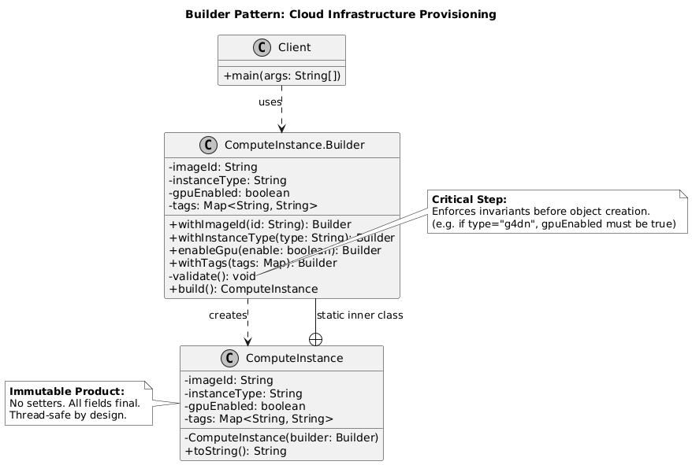
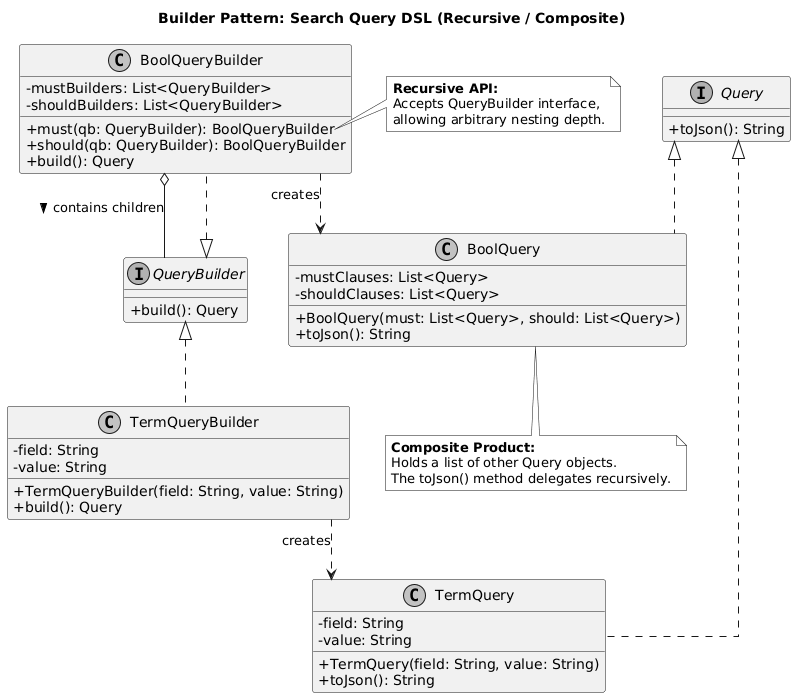
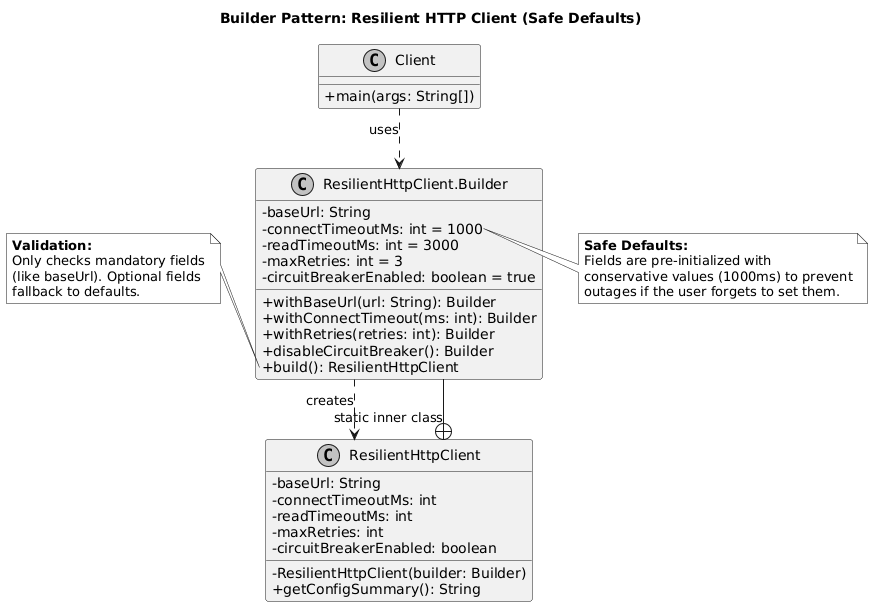
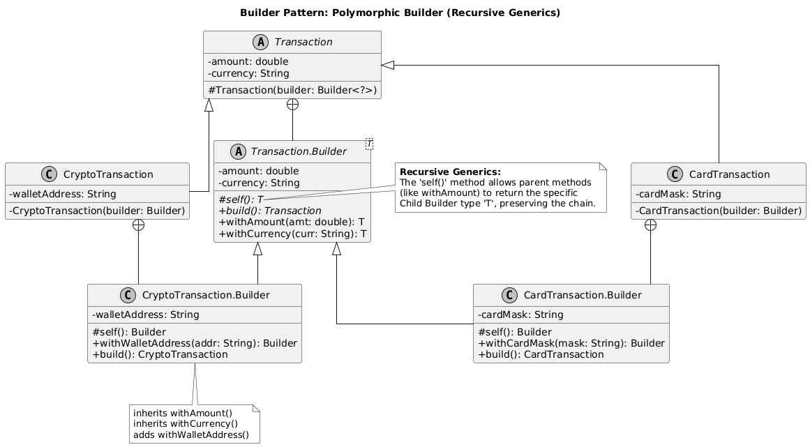
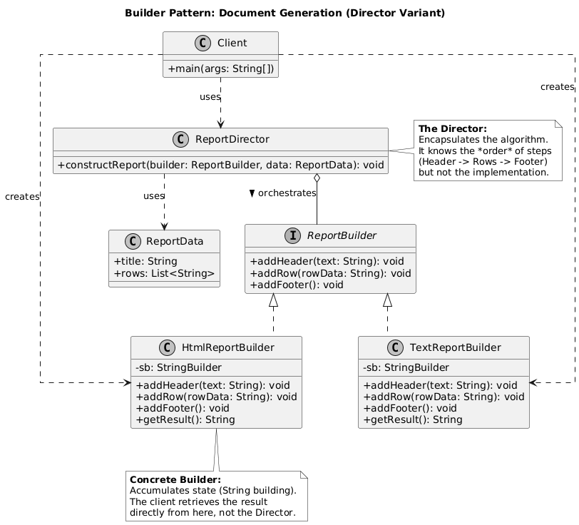

# Builder

- [Examples](#examples)

## Examples

    
1. Cloud Infrastructure Resource Provisioning

**Domain:** Cloud Computing (AWS/GCP/Azure)

### **1. Context / Problem**

**Key Concept:** In-method validation ensuring an object is never created in an invalid state.

* **Scenario:** You are designing the internal SDK for provisioning a Virtual Machine (Compute Instance).
* **Constraints:** An instance has 50+ attributes (AMI ID, instance type, VPC, subnet, security groups, IAM roles, tags, user data script).
* **Challenge:** Most fields are optional. However, there are complex inter-field dependencies (e.g., if `InstanceType` is `g4dn.xlarge` (GPU), then `Tenancy` cannot be `DedicatedHost`).
* **Goal:** Prevent client code from instantiating an invalid configuration.

### **2. Why This Pattern Fits**

* **Reasoning:** A constructor with 50 arguments is impossible to read or maintain ("Telescoping Constructor" anti-pattern). Setters allow an object to exist in an inconsistent state during creation.
* **Rejected Alternative:** *JavaBean (Setters)*. Rejected because we need the `ComputeInstance` to be immutable once created to ensure thread safety in the provisioning engine.
* **Key Trade-off:** More boilerplate code (duplicating fields in Builder and Target) vs. guaranteed object validity and immutability.

### **3. Key Classes / Interfaces**

* `ComputeInstance`: The product. Immutable. Private constructor.
* `InstanceBuilder`: The builder. Holds mutable temporary state.
* `Validator`: A helper class invoked inside `build()` to check cross-field logic.

### UML Diagram

### **4. How the Pattern Is Applied (LLD View)**

* `InstanceBuilder` exposes fluent methods like `withImageId(String id)` and `withGpuSupport(boolean enable)`.
* Crucially, the `build()` method is not just `return new ComputeInstance(this)`. It executes a `validate()` routine.
* If the user selects a GPU instance type but forgets to attach the specific GPU-compatible driver reference, `build()` throws an `IllegalStateException` before the object is ever created.

### **5. Interview Insight (FAANG-Specific)**

* **Evaluation:** Are you checking invariants? A Senior candidate puts validation in the `build()` method. A Junior candidate just copies fields.
* **Weak Signal:** Using the Builder only for syntax sugar (chaining) without leveraging it for immutability or validation.
* **Follow-up:** "How would you handle default values (e.g., default region) without forcing the user to specify them?"

***

    
2. Complex Search Query Construction (DSL)

**Domain:** Search Infrastructure (Elasticsearch / Solr wrapper)

### **1. Context / Problem**

**Key Concept:** Recursive composition (Composite Pattern) masked by a Builder API.

* **Scenario:** Building an internal library to query a NoSQL product catalog.
* **Constraints:** Queries can be arbitrarily nested. A query might contain a `BoolQuery`, which contains `Must` clauses, which contain `Term` queries and `Range` queries.
* **Challenge:** The syntax is brittle. Writing raw JSON strings is error-prone and hard to refactor.

### **2. Why This Pattern Fits**

* **Reasoning:** We are effectively building a Domain Specific Language (DSL). The Builder pattern allows us to construct a composite tree structure safely.
* **Rejected Alternative:** *Factory Pattern*. Factories are good for creating single objects, not recursive, hierarchical structures.
* **Key Trade-off:** Complexity in the builder implementation (managing the tree) vs. Ease of use for the client developer.

### **3. Key Classes / Interfaces**

* `Query`: Abstract base class.
* `BoolQueryBuilder`, `RangeQueryBuilder`, `TermQueryBuilder`: Specific builders.
* `SearchRequest`: The final object containing the root query, sorting, and pagination.

### UML Diagram

### **4. How the Pattern Is Applied (LLD View)**

* The `BoolQueryBuilder` has methods like `must(QueryBuilder qb)` and `should(QueryBuilder qb)`.
* This demonstrates a Recursive Builder. The `must` method accepts another Builder, not just a finished Query object.
* The `build()` method traverses the tree, converting the builder hierarchy into the final JSON or Protocol Buffer representation required by the search engine.

### **5. Interview Insight (FAANG-Specific)**

* **Evaluation:** Ability to handle recursion and composition. Can the candidate design an API that prevents invalid logical groupings (e.g., a Range query on a text field)?
* **Follow-up:** "How do you ensure this builder is extensible if we add a new query type, like 'GeoSpatial'?" (Answer: Interface-based builders).

***

    
3. Resilient HTTP Client Configuration

**Domain:** Microservices / Service Mesh

### **1. Context / Problem**

**Key Concept:** Enforcing safe defaults ("Opinionated Defaults") to prevent production outages.

* **Scenario:** Creating a standardized HTTP client wrapper to be used by 500+ microservices in the company.
* **Constraints:** The client needs configuration for Retries, Circuit Breakers, Connection Pooling, Timeouts (Connect vs. Read), and Proxy settings.
* **Challenge:** Defaults are critical. If a user doesn't specify a timeout, we *must* inject a safe default (e.g., 500ms) to prevent cascading failures.

### **2. Why This Pattern Fits**

* **Reasoning:** We need to enforce "Safe Defaults." The Builder allows us to pre-populate fields with safe values (e.g., `retryCount = 3`) while allowing overrides.
* **Rejected Alternative:** *Configuration Object*. Passing a `Config` object into a constructor is okay, but constructing that `Config` object often faces the same telescoping problem.
* **Key Trade-off:** Hiding complexity. The user sees a simple API, but the Builder handles the complex instantiation of underlying connection pools.

### **3. Key Classes / Interfaces**

* `ResilientHttpClient`: The complex product.
* `ClientBuilder`: Holds flags.
* `RetryStrategy`: Interface for backoff logic (Exponential, Fixed).

### UML Diagram

### **4. How the Pattern Is Applied (LLD View)**

* The `ClientBuilder` constructor initializes private fields with conservative defaults: `connectTimeout = 1000ms`, `retryPolicy = None`.
* Methods like `withExponentialBackoff(int baseMs, int maxRetries)` encapsulate complex logic (instantiating specific Strategy objects) into a readable method name.
* The `build()` method assembles the underlying networking libraries (e.g., Netty or OkHttp) using these configurations.

### **5. Interview Insight (FAANG-Specific)**

* **Evaluation:** Focus on "Operational Excellence." Does the candidate mention defaults? Do they prevent dangerous configs (e.g., `timeout = 0` meaning infinite)?
* **Typical Mistake:** Exposing low-level implementation details (like the underlying Netty Bootstrap class) through the Builder API.

***

    
4. Immutable Financial Transaction Request

**Domain:** Fintech / Payments

### **1. Context / Problem**

**Key Concept:** Solving the inheritance problem in Builders using recursive generics. This is a very strong signal for Senior/Staff roles.

* **Scenario:** A payment gateway processing millions of transactions.
* **Constraints:** A `TransactionRequest` must be immutable. Once a request enters the pipeline, it cannot be altered. It contains sensitive data (PCI-DSS).
* **Challenge:** We have different "flavors" of transactions: Credit Card, PayPal, Crypto. Each requires different fields (Card Number vs. Wallet ID), but they share common metadata (Amount, Merchant ID).

### **2. Why This Pattern Fits**

* **Reasoning:** Ensures Atomicity. We cannot have a transaction object that is "half-built" (e.g., has amount but no currency).
* **Rejected Alternative:** *Abstract Factory*. Factories are great for polymorphism, but here we are constructing a single data carrier with high variance in fields.
* **Key Trade-off:** Verbosity in test code vs. Safety in production code.

### **3. Key Classes / Interfaces**

* `TransactionRequest`: The immutable product.
* `TransactionBuilder`: The abstract builder.
* `CreditCardTransactionBuilder`, `WalletTransactionBuilder`: Concrete implementations.

### UML Diagram

### **4. How the Pattern Is Applied (LLD View)**

* The `TransactionRequest` class has no setters. All fields are `final`.
* The Builder enforces a step-wise build if necessary (Step Builder pattern), or simply validates that `if (paymentType == CARD) { ensure(cardNumber != null); }` inside the `build()` method.
* The `build()` method returns the specific subclass or a generic wrapper, ensuring the resulting object is "sealed."

### **5. Interview Insight (FAANG-Specific)**

* **Evaluation:** Handling of constraints and immutability. Strong candidates emphasize that the returned object is thread-safe.
* **Follow-up:** "How would you design this if we needed to clone an existing request but change just the Transaction ID for a retry?" (Answer: `toBuilder()` method).

***

    
5. Document Generation (The "Director" Variant)

**Domain:** Enterprise Reporting / Legal Tech

### **1. Context / Problem**

**Key Concept:** Separating the *construction steps* (logic) from the *representation* (format).

* **Scenario:** Generating a standard "End of Year" tax report for users.
* **Constraints:** The report must be output in multiple formats: PDF, HTML, and Plain Text.
* **Challenge:** The *structure* of the report is identical (Header -> User Summary -> Transaction Table -> Footer), but the *representation* differs wildly.

### **2. Why This Pattern Fits**

* **Reasoning:** This separates the algorithm for building a complex object (the report structure) from its representation (PDF vs HTML). This uses the full "Director" participant from the GoF definition.
* **Rejected Alternative:** *Strategy Pattern*. Strategy changes logic, but Builder is better for constructing the *view* or output step-by-step.

### **3. Key Classes / Interfaces**

* `ReportBuilder` (Interface): Methods like `addHeader(String)`, `addTable(List data)`, `addFooter()`.
* `PdfReportBuilder`, `HtmlReportBuilder`: Concrete implementations.
* `ReportDirector`: The class that controls the order of calls.

### UML Diagram

### **4. How the Pattern Is Applied (LLD View)**

* The `ReportDirector` accepts a `ReportBuilder` interface in its constructor.
* The Director has a method `constructYearEndReport(User user)`. It calls `builder.addHeader()`, then loops through data to call `builder.addTable()`.
* The Director doesn't know if it's making a PDF or HTML. It just knows the sequence.
* The client retrieves the result from the *Builder*, not the Director.

### **5. Interview Insight (FAANG-Specific)**

* **Evaluation:** Understanding of the Open/Closed Principle. Can we add a "Markdown" format without changing the Director logic?
* **Typical Mistake:** Putting the construction sequence logic inside the Client or the Builder itself, rather than a Director (or orchestrator service).

---
