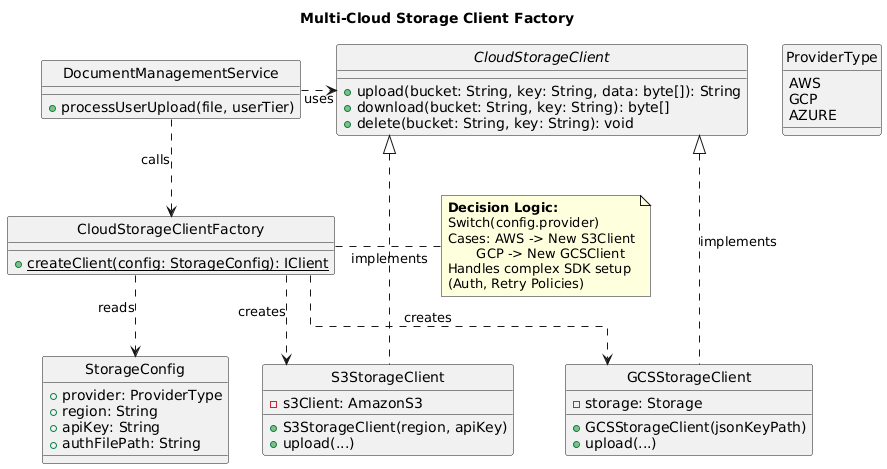
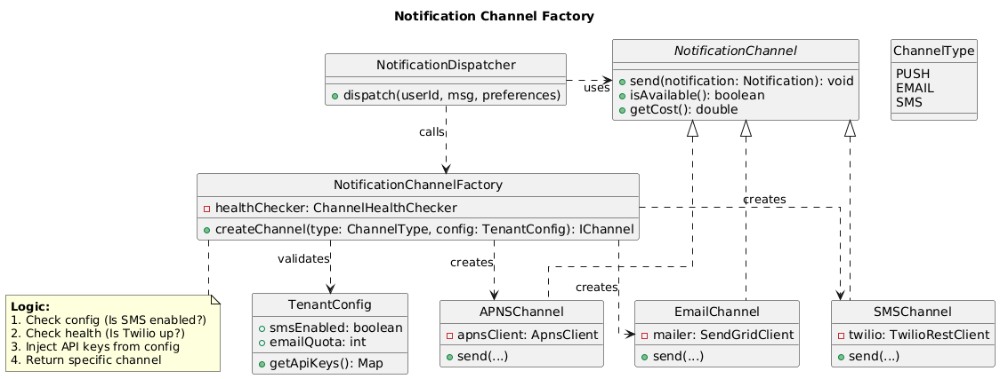
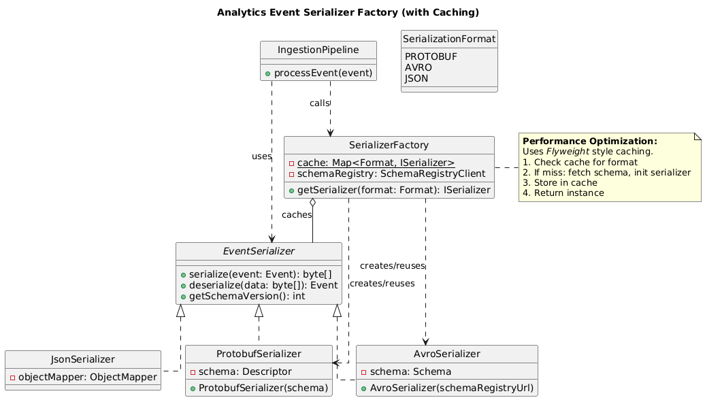
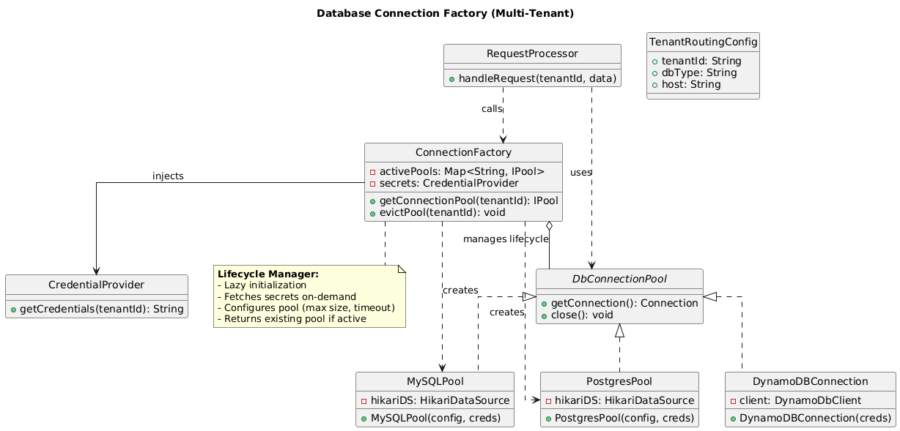
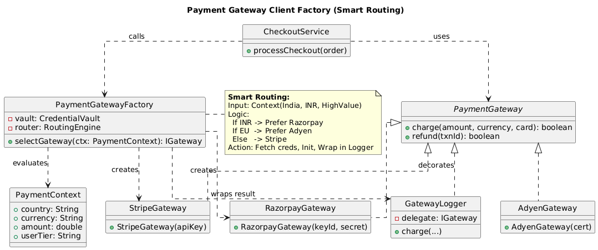

# Factory Design Pattern

- [Examples](#examples)

## Examples

    
1: Multi-Cloud Storage Client Factory

### 1. Context / Problem

**Focus:** Encapsulating complex initialization logic (credentials, regions) and separating "what" to use from "how" to create it.

- Design a document management service that stores files across AWS S3, Google Cloud Storage, and Azure Blob
- Requirements: Runtime selection based on user tier (free → GCS, premium → S3), region availability, and cost optimization
- Constraints: Each cloud SDK has different initialization (credentials, retry policies, endpoints), 100+ services depend on this client
- Must support adding new providers without modifying consumer code

### 2. Why This Pattern Fits

- **Design reasoning**: Centralized object creation isolates complex SDK initialization logic; clients depend on abstraction, not concrete implementations
- **Alternatives considered**: Direct instantiation (rejected: scattered configuration, hard to test), Service Locator (rejected: hidden dependencies, runtime errors), Dependency Injection only (rejected: still need conditional logic somewhere)
- **Key trade-offs**: Added indirection vs. flexibility; factory becomes critical path component but enables A/B testing providers

### 3. Key Classes / Interfaces

- `CloudStorageClient` (interface): `upload()`, `download()`, `delete()`, `getMetadata()`
- `S3StorageClient`, `GCSStorageClient`, `AzureBlobClient` (concrete implementations)
- `CloudStorageClientFactory` (factory): `createClient(StorageConfig config)`
- `StorageConfig`: Contains provider type, region, credentials, retry policies
- `ProviderRegistry`: Maps provider enum to implementation classes (optional, enables plugin architecture)

### UML Diagram

**Design Highlights:**

* **Dependency Inversion:** The `DocumentService` (Client) depends only on the `CloudStorageClient` interface, not the complex concrete classes.
* **Encapsulation:** The detailed initialization logic (credentials, regions) is hidden inside the Factory.

### 4. How the Pattern Is Applied (LLD View)

- Factory method accepts `StorageConfig` containing provider discriminator (enum/string)
- Switch/map lookup determines which concrete client to instantiate
- Factory encapsulates provider-specific initialization: AWS signature v4 setup, GCP service account JSON parsing, Azure SAS token generation
- Returns `CloudStorageClient` interface reference to caller
- Optionally caches clients per configuration hash to avoid repeated initialization
- Factory can consult feature flags or routing tables before selection

### 5. Interview Insight (FAANG-Specific)

- **Evaluating**: Can you identify when object creation complexity warrants abstraction? Do you separate "what" from "how"?
- **Follow-ups**: How do you handle factory failures (one provider down)? How do you test this without hitting real cloud APIs? If we add 10 more providers, does this scale? Should factory be stateful (caching) or stateless?
- **Mistakes**: Making factory a God object that also handles business logic; not showing interface segregation; claiming "factory makes code testable" without explaining mock injection

---

    
2: Notification Channel Factory (Push/Email/SMS/Webhook)

### 1. Context / Problem

**Focus:** Selecting implementation based on configuration enums and handling validation before creation.

- Build notification dispatch system for an e-commerce platform handling order updates, promotions, fraud alerts
- Supports 4 channels: APNs/FCM push, SendGrid email, Twilio SMS, HTTP webhooks for partners
- Requirements: User preferences determine channel priority; fallback if primary fails; 10M+ notifications/day
- Constraints: Each channel has rate limits, retry semantics, payload formatting (JSON vs HTML vs plaintext)

### 2. Why This Pattern Fits

- **Design reasoning**: Channel selection logic is configuration-driven, not compile-time; factory consolidates provider SDK setup and credential management
- **Alternatives considered**: Strategy pattern alone (rejected: still need creation logic), Builder (rejected: not constructing complex object graphs), Registry of singletons (rejected: doesn't handle per-tenant configurations)
- **Key trade-offs**: Factory couples to all channel implementations but decouples caller from them; simplifies adding channels but requires factory update

### 3. Key Classes / Interfaces

- `NotificationChannel` (interface): `send(Notification notification)`, `isAvailable()`, `getCost()`
- `APNSChannel`, `EmailChannel`, `SMSChannel`, `WebhookChannel` (implementations)
- `NotificationChannelFactory`: `createChannel(ChannelType type, TenantConfig config)`, `createChannels(List<ChannelType> priorities)`
- `TenantConfig`: API keys, rate limits, custom templates per tenant
- `ChannelHealthChecker`: Used by factory to skip unavailable channels

### UML Diagram

**Design Highlights:**

* **Validation:** The factory acts as a gatekeeper, checking `TenantConfig` (e.g., is SMS enabled?) before attempting to create a channel.
* **Extensibility:** Adding a new channel (e.g., Slack/Teams) involves creating a new class and adding one case to the factory, without breaking existing client code.

### 4. How the Pattern Is Applied (LLD View)

- Factory receives `ChannelType` enum and tenant-specific config
- Factory validates prerequisites (API key present, service health check passed)
- Instantiates appropriate channel implementation with configured client (e.g., `TwilioRestClient`)
- For batch requests, factory can return ordered list based on user preference + availability
- Factory may wrap channels in decorators (retry, circuit breaker, metrics) before returning
- Supports creating fallback chains: `[EmailChannel, SMSChannel]` if email has deliverability issues

### 5. Interview Insight (FAANG-Specific)

- **Evaluating**: Do you handle multi-tenancy correctly? Can you explain why factory is better than hard-coded if-else in caller?
- **Follow-ups**: How do you invalidate/recreate channels when config changes hot? What if two threads request same channel type simultaneously? How do you implement graceful degradation (skip failed channels)?
- **Mistakes**: Not considering channel lifecycle (singleton vs per-request); ignoring failure modes; claiming factory "improves performance" without justification; not showing how factory enables testing with mock channels

---

    
3: Analytics Event Serializer Factory

### 1. Context / Problem

**Focus:** Performance optimization using Caching (Flyweight style) within the Factory.

- Data ingestion pipeline receives events from mobile apps, web, IoT devices
- Must serialize events to Protobuf (internal Kafka), JSON (partner APIs), Avro (data lake), Thrift (legacy systems)
- Requirements: Format determined by downstream consumer; schema evolution support; 500K events/sec
- Constraints: Each format has different schema registries, versioning, and backward compatibility rules

### 2. Why This Pattern Fits

- **Design reasoning**: Serialization strategy varies by destination, not by event type; factory encapsulates format-specific setup (schema registry clients, codec initialization)
- **Alternatives considered**: Type-based dispatch (rejected: events shouldn't know serialization details), Abstract Factory (overkill: not creating families of related objects), Visitor (rejected: adds traversal overhead)
- **Key trade-offs**: Factory centralizes schema registry interactions but becomes bottleneck if schema lookups are slow; enables format negotiation but adds layer

### 3. Key Classes / Interfaces

- `EventSerializer` (interface): `serialize(Event event)`, `deserialize(byte[] data)`, `getSchemaVersion()`
- `ProtobufSerializer`, `AvroSerializer`, `JsonSerializer`, `ThriftSerializer`
- `SerializerFactory`: `getSerializer(SerializationFormat format, SchemaConfig config)`
- `SchemaConfig`: Registry URL, schema ID, compatibility mode
- `SchemaCache`: Shared by factory to avoid repeated registry lookups

### UML Diagram

**Design Highlights:**

* **Caching/Flyweight:** This factory is stateful. It uses a `SchemaCache` (or internal map) to reuse expensive serializer instances, which is critical for high-throughput systems (500k events/sec).
* **Schema Registry Integration:** The factory manages the complexity of fetching schemas from external registries, keeping the serializers themselves focused on the act of serialization.

### 4. How the Pattern Is Applied (LLD View)

- Factory method receives `SerializationFormat` enum (from routing table or message header)
- Factory checks cache for existing serializer with matching schema version
- If miss, fetches schema from appropriate registry (Confluent Schema Registry for Avro, internal service for Protobuf)
- Initializes serializer with compiled schema/codec
- Returns pooled or new instance based on thread-safety properties
- Factory can pre-warm cache on startup for common formats

### 5. Interview Insight (FAANG-Specific)

- **Evaluating**: Do you consider performance implications (pooling, caching)? Can you justify why this isn't premature abstraction?
- **Follow-ups**: How do you handle schema evolution (producer writes v2, consumer reads v1)? What if schema registry is down? Should serializers be stateless? How do you benchmark different formats?
- **Mistakes**: Creating new serializer per event (memory churn); not discussing thread safety; ignoring schema versioning; making factory responsible for routing decisions (mixed concerns)

---

    
4: Database Connection Factory (Multi-Tenant SaaS)

### 1. Context / Problem

**Focus:** Lifecycle management, routing, and mocking dependency injection for external secret managers.

- SaaS application serving 10K+ enterprise customers, each with isolated database (security/compliance requirement)
- Tech stack: PostgreSQL primary, MySQL for legacy customers, DynamoDB for high-throughput tenants
- Requirements: Connection pooling per tenant, read replica routing, automatic failover, connection limits per tier
- Constraints: Can't hold 10K open connection pools in memory; cold start latency must be <100ms; credentials rotated via AWS Secrets Manager

### 2. Why This Pattern Fits

- **Design reasoning**: Connection creation involves database-specific driver loading, pool configuration, health checks; factory manages lifecycle (lazy init, eviction, refresh)
- **Alternatives considered**: Singleton pool (rejected: doesn't support per-tenant isolation), Flyweight (rejected: connections aren't immutable shared state), Proxy pattern alone (rejected: still need creation logic)
- **Key trade-offs**: Factory enables lazy loading but adds lookup overhead; centralized credential management but factory becomes security-critical component

### 3. Key Classes / Interfaces

- `DatabaseConnection` (interface): `executeQuery()`, `executeUpdate()`, `beginTransaction()`, `close()`
- `PostgresConnection`, `MySQLConnection`, `DynamoDBConnection`
- `ConnectionFactory`: `getConnection(TenantId tenantId)`, `evictConnection(TenantId tenantId)`
- `TenantRoutingConfig`: Database type, host, pool size, read replica endpoints
- `ConnectionPool`: Wraps HikariCP or custom pool per tenant
- `CredentialProvider`: Fetches credentials from Secrets Manager

### UML Diagram

* **Security \& Isolation:** The factory handles the retrieval of credentials (via `CredentialProvider` / `SecretManager`), ensuring the client code doesn't handle sensitive secrets directly.
* **Lifecycle Management:** The factory manages connection pools (creating them lazily and evicting old ones), which is essential when supporting thousands of tenants where keeping all pools open is impossible.

### 4. How the Pattern Is Applied (LLD View)

- Factory receives `TenantId`, looks up routing config from cache/database
- Checks if connection pool for tenant exists in local cache (LRU with TTL)
- If miss, fetches credentials via `CredentialProvider`, determines database type from config
- Instantiates appropriate connection pool with database-specific settings (PostgreSQL: prepared statement cache, MySQL: connection attributes)
- Registers pool for monitoring and eviction (idle timeout, max lifetime)
- Returns connection from pool; factory handles pool exhaustion by queuing or fast-fail
- Background thread periodically validates pools, evicts unused, refreshes credentials

### 5. Interview Insight (FAANG-Specific)

- **Evaluating**: Do you understand connection pooling and lifecycle management? Can you explain caching strategy and eviction policy?
- **Follow-ups**: How do you handle credential rotation without dropping active connections? What if tenant is migrated to different DB mid-request? How do you prevent one tenant from exhausting global resources? What metrics do you emit?
- **Mistakes**: Confusing factory with pool itself; not discussing concurrency (what if two threads request same tenant simultaneously?); ignoring security (credentials in logs); not explaining how to test without real databases

---

    
5: Payment Gateway Client Factory

### 1. Context / Problem

- Payment processing service supporting Stripe, PayPal, Razorpay, Adyen for global marketplace
- Requirements: Country/currency routing (India → Razorpay, EU → Adyen), user preference, fallback on failure
- Constraints: Each gateway has different auth (API keys, OAuth, certificates), webhook signature verification, refund workflows
- Must support PCI compliance (no cardholder data in logs), idempotency, reconciliation

### 2. Why This Pattern Fits

- **Design reasoning**: Gateway selection involves business rules (routing), security setup, SDK initialization; factory encapsulates complex instantiation and credential injection
- **Alternatives considered**: Chain of Responsibility (rejected: not trying multiple handlers, single gateway per transaction), Abstract Factory (considered but overkill: not creating families), Strategy + DI (rejected: still need conditional selection logic)
- **Key trade-offs**: Factory centralizes routing logic but couples to all gateway SDKs; enables A/B testing gateways but adds latency for rule evaluation

### 3. Key Classes / Interfaces

- `PaymentGateway` (interface): `charge()`, `refund()`, `verifyWebhook()`, `tokenizeCard()`
- `StripeGateway`, `PayPalGateway`, `RazorpayGateway`, `AdyenGateway`
- `PaymentGatewayFactory`: `selectGateway(PaymentContext context)`, `createGateway(GatewayType type, Credentials creds)`
- `PaymentContext`: Amount, currency, country, user preference, merchant config
- `RoutingEngine`: Evaluates rules (currency support, transaction fees, success rate)
- `CredentialVault`: Returns gateway-specific credentials (PCI-compliant storage)

### UML Diagram

**Design Highlights:**

* **Business Logic Integration:** Unlike simple factories, this one uses a `RoutingEngine` context (Country, Currency, Amount) to decide *which* class to instantiate.
* **Decorator Pattern Integration:** The diagram shows how the factory wraps the raw gateway client in decorators (for Logging/Metrics) before returning it, ensuring cross-cutting concerns are applied uniformly.

### 4. How the Pattern Is Applied (LLD View)

- Factory receives `PaymentContext` containing transaction metadata
- Consults `RoutingEngine` to determine eligible gateways (currency support, regional availability)
- Selects optimal gateway based on cost, latency, historical success rate (may use ML model)
- Fetches credentials from `CredentialVault` (certificate for Adyen, secret key for Stripe)
- Instantiates gateway client with credentials, configures webhooks endpoint, retry policy
- Wraps client in decorators for logging (PCI-filtered), metrics, circuit breaker
- Returns `PaymentGateway` interface to caller
- Factory may return fallback list if caller wants automatic retry with different gateway

### 5. Interview Insight (FAANG-Specific)

- **Evaluating**: Do you consider business logic in technical design? Can you explain separation between routing (business) and creation (technical)?
- **Follow-ups**: How do you handle atomic fallback (don't double-charge)? What if credentials expire mid-request? How do you A/B test new gateways safely? How do you ensure idempotency across gateways?
- **Mistakes**: Putting routing logic in caller (scattered business rules); not explaining credential security; claiming factory "makes system more scalable" without metrics; ignoring failure modes (all gateways down); not showing how to mock gateways for testing

---