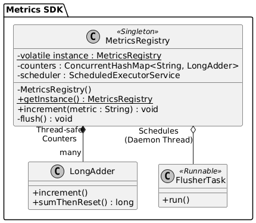
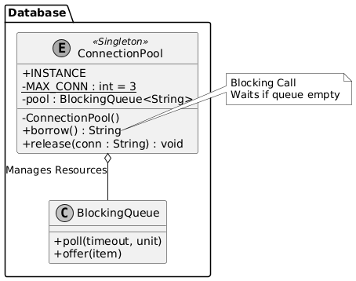
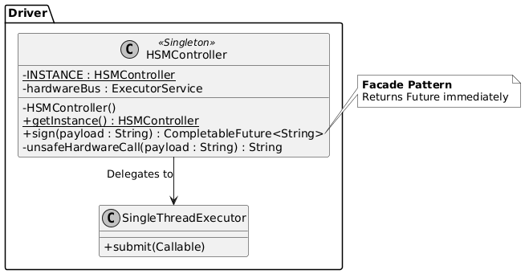
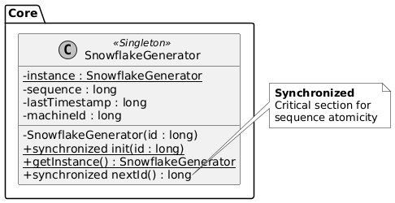
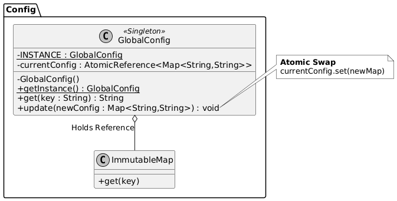

# Singleton Design Pattern

- [Examples](#examples)

***

## Examples

    
1: The Telemetry \& Metrics Aggregator (SDK Design)

### Context / Problem

You are designing a **latency-sensitive internal SDK** used by thousands of microservices to report metrics (CPU, request counts, error rates) to a central observability system. The SDK must aggregate metrics locally in memory and flush them every 60 seconds to reduce network overhead.
*Constraint:* Creating multiple buffers would split the data, lead to inefficient small network packets, and potentially cause Out-Of-Memory (OOM) errors if thousands of threads spawn their own buffers.

### Why This Pattern Fits

* **Reasoning:** You need a single "sink" for all application threads to dump data into. A unique global instance ensures centralized buffering and batching.
* **Rejected Alternative:** Passing a `MetricsClient` instance to every single class via constructor injection is possible but creates massive boilerplate in legacy codebases adopting the SDK.
* **Trade-off:** Ease of integration vs. Testability. (Mitigated by allowing the internal `flush()` mechanism to be mocked).

#### Key Classes / Interfaces

* `MetricsRegistry` (Singleton): The public entry point. Maintains the map of active counters/gauges.
* `MetricBuffer`: The internal thread-safe queue holding data points.
* `FlushScheduler`: A background thread owned by the Singleton that drains the buffer.

### UML Diagram

### How the Pattern Is Applied (LLD View)

1. **Initialization:** The `MetricsRegistry` uses **Double-Checked Locking** or an **Enum Singleton** (in Java) to ensure only one registry initializes the heavy `FlushScheduler` thread.
2. **State Management:** It holds a `ConcurrentHashMap` of metric names to values.
3. **Access:** All service threads call `MetricsRegistry.getInstance().increment("api_latency")`.
4. **Lifecycle:** The Singleton registers a JVM shutdown hook to flush remaining metrics before the application exits.

### Interview Insight (FAANG-Specific)

* **Evaluation:** Does the candidate worry about thread safety during lazy initialization? Do they mention `volatile`?
* **Follow-up:** "How do we prevent the Singleton from becoming a bottleneck if 10,000 threads write to it simultaneously?" (Answer: Use `LongAdder` or striping instead of `AtomicLong`).
* **Mistake:** Making the *methods* `synchronized` instead of the internal data structures, causing massive contention.

---

    
2: The Database Connection Pool (Resource Constraint)

### Context / Problem

Design the connection management layer for a high-throughput payment service. The database (PostgreSQL) has a hard limit of 5,000 concurrent connections. Your service runs on 500 nodes.
*Constraint:* Each node must strictly limit itself to 10 connections. If a node creates multiple pools, it will breach the limit and crash the database.

### Why This Pattern Fits

* **Reasoning:** The connection pool represents a physical limit. You must enforce exactly *one* pool manager per JVM to strictly respect the `max_connections` configuration.
* **Rejected Alternative:** Creating a connection per request (latency too high). Static utility classes (hard to mock connection logic).
* **Trade-off:** Strict resource control vs. Flexibility.

### Key Classes / Interfaces

* `ConnectionPoolManager` (Singleton): Orchestrates the lifecycle of connections.
* `PooledConnection`: A wrapper around the raw JDBC/DB connection.
* `PoolConfig`: Configuration object (max size, timeout).

### UML Diagram

### How the Pattern Is Applied (LLD View)

1. **Instantiation:** The `ConnectionPoolManager` is initialized eagerly at application startup (Eager Initialization) to fail fast if DB config is missing.
2. **Resource Ownership:** It owns a `BlockingQueue<PooledConnection>`.
3. **Borrowing:** `getInstance().borrowConnection()` blocks if the queue is empty.
4. **Enforcement:** Because the constructor is private, no developer can accidentally instantiate a second pool and bypass the 10-connection limit.

### Interview Insight (FAANG-Specific)

* **Evaluation:** Understanding "Why Singleton?" here is about **protection**, not just access.
* **Follow-up:** "How do you unit test code that uses this Singleton?" (Answer: Ideally, refactor to dependency injection, or allow `reset()` in the Singleton for test cleanup).
* **Mistake:** Implementing the pool using a simple `List` without handling concurrency or blocking/timeouts correctly.

---

    
3: Hardware Interface Controller (Physical Constraint)

### Context / Problem

You are writing software for a customized standard server in a data center that includes a specialized **Hardware Security Module (HSM)** card for cryptographic signing.
*Constraint:* The HSM device driver is single-threaded at the hardware level. Concurrent commands sent to the bus will cause a bus error or driver panic.

### Why This Pattern Fits

* **Reasoning:** The software object must mirror the physical reality. There is exactly one physical card; there must be exactly one software gateway to serialize access to it.
* **Rejected Alternative:** A lock file on disk (too slow/brittle). A localized mutex in every class using it (error-prone).
* **Trade-off:** Serialization (throughput bottleneck) vs. Correctness (preventing hardware crashes).

### Key Classes / Interfaces

* `HSMController` (Singleton): The gatekeeper.
* `CommandRequest`: Encapsulates an operation (sign, verify).
* `SerialExecutor`: An internal single-threaded executor service.

### UML Diagram

### How the Pattern Is Applied (LLD View)

1. **Serialization:** The Singleton initializes a single-threaded `ExecutorService`.
2. **Queuing:** When multiple threads call `HSMController.getInstance().sign(payload)`, the requests are wrapped in `CommandRequest` objects and submitted to the executor queue.
3. **Execution:** The executor runs tasks sequentially, ensuring the physical bus never sees concurrent writes.
4. **Recovery:** If the hardware hangs, the Singleton is responsible for the reset sequence.

### Interview Insight (FAANG-Specific)

* **Evaluation:** Does the candidate identify the bottleneck? Since the Singleton serializes all calls, they should propose an async/Future-based API (`CompletableFuture<Result> sign(...)`) so calling threads don't block.
* **Typical Weak Signal:** Using `synchronized` methods on the Singleton which blocks the *calling* threads, starving the application.

---

    
4: Distributed ID Generator (Snowflake Worker)

### Context / Problem

Design a unique ID generator (like Twitter Snowflake) for a distributed chat application. Each ID must be unique, roughly sorted by time, and 64-bit.
*Constraint:* The algorithm relies on a `MachineID` and a `SequenceNumber`. If two instances of the generator run on the same machine, they might generate the same ID for the same millisecond.

### Why This Pattern Fits

* **Reasoning:** To guarantee uniqueness, there must be only one authority on `SequenceNumber` incrementation within a single JVM/Process.
* **Rejected Alternative:** Static counters (not thread-safe by default, hard to manage lifecycle). Stateless functions (cannot track the previous sequence number).
* **Trade-off:** Zero collision guarantee vs. Single point of contention.

### Key Classes / Interfaces

* `IdGenerator` (Singleton): Holds the state.
* `NodeConfigLoader`: Fetches the Machine ID from environment/Zookeeper.

### UML Diagram

### How the Pattern Is Applied (LLD View)

1. **State Protection:** The Singleton holds `lastTimestamp` and `sequence` as volatile/atomic variables.
2. **Synchronization:** The `nextId()` method is `synchronized`. Because logic is bitwise arithmetic (extremely fast), the lock contention is acceptable for typical loads.
3. **Clock Drift Defense:** The Singleton tracks the system clock. If the clock moves backwards (NTP drift), the Singleton pauses or throws an alert to prevent duplicate IDs.

### Interview Insight (FAANG-Specific)

* **Evaluation:** Candidates must realize that multiple instances would reset the `sequence` to 0 for the same millisecond, causing collisions.
* **Follow-up:** "Can we relax the Singleton requirement?" (Only if we partition the `MachineID` further, e.g., allocating different ranges to different threads, which is complex).

---

    
5: Configuration Manager with Hot-Reload

### Context / Problem

Design the configuration subsystem for a global search indexer. The service needs to toggle features (e.g., "enable_new_ranking") or update blacklists without restarting.
*Constraint:* Reading the config file from disk or a remote service (like ZooKeeper/Etcd) on every request is too slow.

### Why This Pattern Fits

* **Reasoning:** You need a **Single Source of Truth** that caches the config in memory and updates it atomically. If you have multiple config managers, some requests might see the "old" config and some the "new" one during a rollout, leading to inconsistent behavior (Heisenbugs).
* **Rejected Alternative:** Passing config maps around. Static variables (impossible to implement hot-reload cleanly).
* **Trade-off:** Consistency vs. Stale data window.

### Key Classes / Interfaces

* `GlobalConfig` (Singleton): Stores the immutable snapshot of the current configuration.
* `ConfigWatcher`: A background thread monitoring the source.
* `ConfigSnapshot`: An immutable map of key-values.

### UML Diagram

### How the Pattern Is Applied (LLD View)

1. **Immutability:** The `GlobalConfig` singleton holds a `volatile` reference to a `ConfigSnapshot` object.
2. **Atomic Swap:** When `ConfigWatcher` detects a change, it parses the new config, creates a *new* `ConfigSnapshot`, and updates the reference in `GlobalConfig`.
3. **Readers:** Threads call `GlobalConfig.getInstance().get("timeout")`. They always get a consistent view from the current snapshot.
4. **Observer Pattern:** The Singleton can act as a Subject, notifying listeners when the swap happens.

### Interview Insight (FAANG-Specific)

* **Evaluation:** The "Atomic Reference Swap" technique is a strong signal. It shows the candidate understands memory visibility and lock-free reads.
* **Typical Mistake:** Using a `ReadWriteLock` poorly, causing readers to block while the config is being parsed from disk.

***