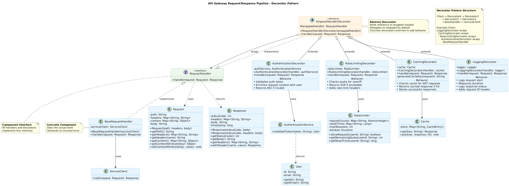
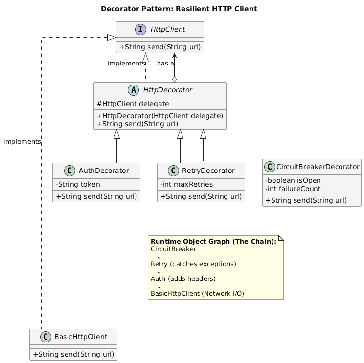
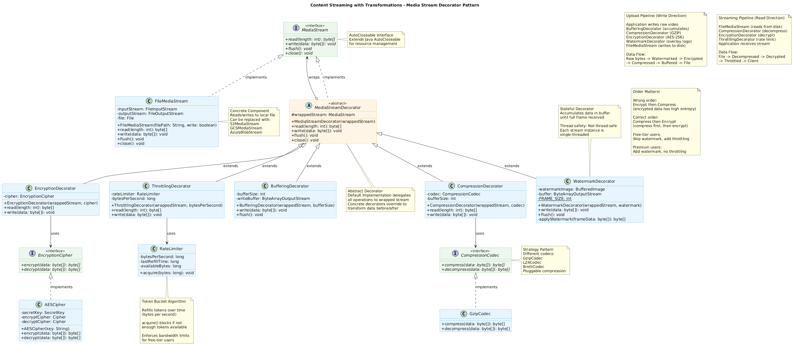
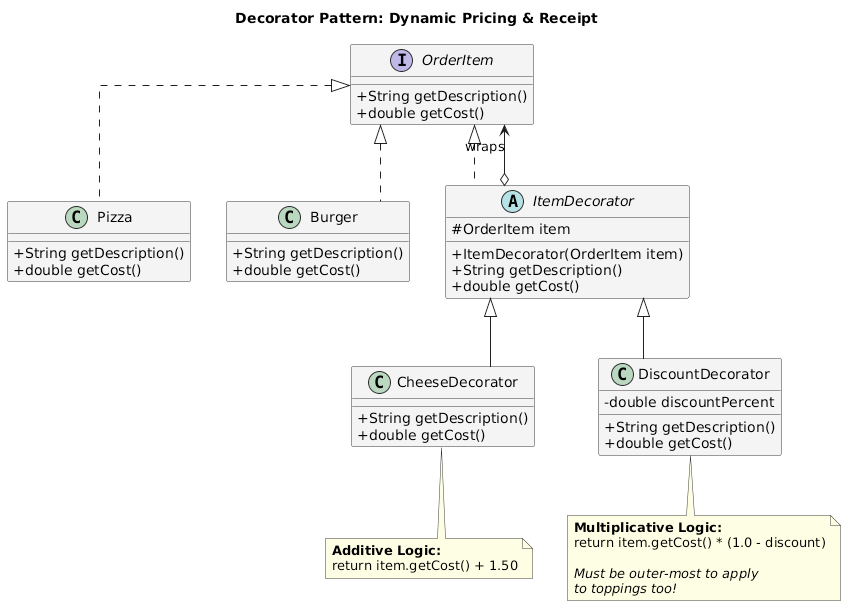
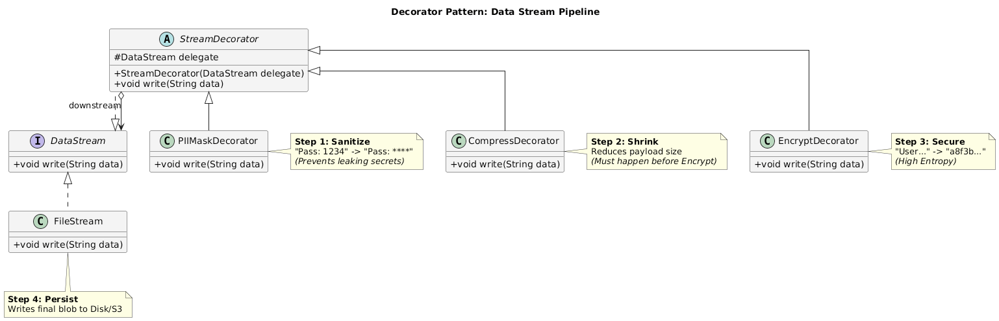

# Decorator Examples

- [Examples](#examples)
- [Evolving Decorator Pattern Examples: LLD → HLD](#evolving-decorator-pattern-examples-lld--hld)
- [How to Transition from LLD to HLD in an Interview (Using Existing Designs)](#how-to-transition-from-lld-to-hld-in-an-interview-using-existing-designs)

# Examples

<details>
    <summary>Example 1: API Gateway Request/Response Pipeline</summary>

### 1. Context / Problem

You're designing an API gateway that handles requests to microservices. Requirements:

- Add cross-cutting concerns: authentication, rate limiting, logging, request validation, caching
- Different endpoints need different combinations (e.g., public endpoints skip auth but need rate limiting)
- New middleware capabilities added frequently without modifying existing services
- Must support async processing and short-circuit on failures (e.g., auth fails → don't proceed)


### 2. Why This Pattern Fits

**Design reasoning:**

- Each middleware concern is independent and should be composable in any order
- Avoids class explosion (N middleware × M combinations = N classes, not N×M)
- Allows runtime configuration per endpoint

**Alternatives rejected:**

- **Inheritance hierarchy**: Would need AuthenticatedRateLimitedLoggingHandler, PublicRateLimitedHandler, etc. → unmaintainable
- **Chain of Responsibility**: Close, but decorators preserve the original interface and can modify both request/response; CoR typically passes or blocks
- **Strategy pattern**: Doesn't compose multiple behaviors; switches between implementations

**Key trade-offs:**

- More object allocation per request (acceptable at API gateway scale)
- Stack of decorators can complicate debugging (mitigated with proper logging)


### 3. Key Classes / Interfaces

```
RequestHandler (interface)
├── handle(Request): Response

BaseRequestHandler (concrete component)
├── Forwards to downstream service

RequestHandlerDecorator (abstract decorator)
├── wrappedHandler: RequestHandler
├── handle(Request): Response // delegates to wrapped

AuthenticationDecorator extends RequestHandlerDecorator
├── authService: AuthenticationService
├── handle(): validates token, enriches request context, delegates

RateLimitingDecorator extends RequestHandlerDecorator
├── rateLimiter: RateLimiter
├── handle(): checks quota, delegates or throws 429

LoggingDecorator extends RequestHandlerDecorator
├── logger: Logger
├── handle(): logs request, delegates, logs response + latency

CachingDecorator extends RequestHandlerDecorator
├── cache: Cache
├── handle(): check cache, delegate if miss, store result
```

#### UML Diagram


**This UML diagram shows:**

1. **Component Interface**: `RequestHandler` - the contract all components implement
2. **Concrete Component**: `BaseRequestHandler` - does the actual work
3. **Abstract Decorator**: `RequestHandlerDecorator` - base class for all decorators, holds reference to wrapped handler
4. **Concrete Decorators**:
    - `AuthenticationDecorator` - validates tokens
    - `RateLimitingDecorator` - enforces quotas
    - `CachingDecorator` - caches responses
    - `LoggingDecorator` - logs requests/responses
5. **Supporting Classes**: Services used by decorators (AuthenticationService, RateLimiter, Cache)
6. **Data Models**: Request and Response classes
7. **Key Relationships**:
    - Inheritance (extends): Decorators extend abstract decorator
    - Implementation (implements): Base handler and decorator implement interface
    - Composition (wraps): Decorator holds reference to wrapped handler
    - Dependency (uses): Decorators use supporting services

**Color coding:**

- 🟢 Green: Interfaces
- 🟠 Orange: Abstract classes
- 🔵 Blue: Concrete classes

**Responsibilities:**

- Each decorator owns ONE cross-cutting concern
- Decorators are stateless; external dependencies injected
- Order matters: Auth → RateLimit → Cache → Logging → BaseHandler


### 4. How the Pattern Is Applied (LLD View)

**Step-by-step:**

1. **Base component**: `BaseRequestHandler` implements `RequestHandler`, forwards to actual microservice
2. **Wrapping layers**: Each decorator wraps the next handler:

```
handler = new LoggingDecorator(
            new CachingDecorator(
              new RateLimitingDecorator(
                new AuthenticationDecorator(
                  new BaseRequestHandler(serviceClient)
                )
              )
            )
          );
```

3. **Request flow**: Client calls `handler.handle(request)`
    - LoggingDecorator: logs start time, calls wrapped
    - CachingDecorator: checks cache, calls wrapped if miss
    - RateLimitingDecorator: checks quota, calls wrapped or throws
    - AuthenticationDecorator: validates token, calls wrapped or throws 401
    - BaseRequestHandler: makes actual service call
4. **Response flow**: Each decorator can transform response on the way back
    - BaseHandler returns response
    - Auth adds user context to response headers
    - RateLimit adds remaining quota headers
    - Caching stores response
    - Logging records latency

### 5. Interview Insight (FAANG-Specific)

**What interviewer evaluates:**

- Do you identify this as a composition problem, not inheritance?
- Can you articulate why order matters? (Auth before rate limit vs. after)
- Do you handle failures gracefully? (short-circuit, rollback)

**Common follow-ups:**

- "How do you configure different decorator chains per endpoint?" → Factory pattern or config-driven builder
- "What if a decorator needs to modify the request for downstream decorators?" → Request context object pattern
- "How do you handle async/non-blocking?" → Discuss CompletableFuture/reactive streams with decorator wrapping
- "Performance concerns?" → Decorator object allocation vs. readability; connection pooling in base handler

**Typical mistakes:**

- Making decorators stateful (thread-safety issues)
- Not defining clear interfaces (leaky abstractions)
- Tight coupling between decorators (e.g., RateLimiter accessing AuthDecorator's state directly)
- Forgetting that order matters and not documenting it

#### [Code]()

</details>

---

<details>
    <summary>Example 2: Distributed Tracing \& Observability for Service Calls</summary>

### 1. Context / Problem

You're building an internal service client library used across 1000+ microservices. Requirements:

- All service calls need distributed tracing (trace IDs, span creation)
- Add retries with exponential backoff for transient failures
- Circuit breaker to prevent cascading failures
- Metrics collection (latency, error rates) per endpoint
- Some services need additional enrichment (A/B test context, geographic routing)
- Library users shouldn't modify code when new observability features are added


### 2. Why This Pattern Fits

**Design reasoning:**

- Each concern (tracing, retries, circuit breaking, metrics) is independent
- Teams can opt into specific decorators based on SLA requirements
- New observability features (e.g., chaos testing, cost attribution) added without changing existing code

**Alternatives rejected:**

- **Aspect-Oriented Programming (AOP)**: Runtime weaving is opaque; hard to debug and test; order of aspects is implicit
- **Middleware in framework**: Couples to specific framework (gRPC interceptors, Servlet filters); library is framework-agnostic
- **Single monolithic wrapper**: Violates SRP; every feature change affects all users

**Key trade-offs:**

- Slight performance overhead (5-10 allocations per call) vs. clean separation
- More verbose setup code vs. explicitness and testability


### 3. Key Classes / Interfaces

```
ServiceClient (interface)
├── call(Request): Response

HttpServiceClient (concrete component)
├── httpClient: HttpClient
├── call(): performs actual HTTP call

ServiceClientDecorator (abstract)
├── delegate: ServiceClient
├── call(Request): Response

TracingDecorator extends ServiceClientDecorator
├── tracer: DistributedTracer
├── call(): creates span, injects trace context, delegates, finishes span

RetryDecorator extends ServiceClientDecorator
├── retryPolicy: RetryPolicy
├── call(): delegates, catches exceptions, retries with backoff

CircuitBreakerDecorator extends ServiceClientDecorator
├── circuitBreaker: CircuitBreaker
├── call(): checks state, delegates if closed, fast-fails if open

MetricsDecorator extends ServiceClientDecorator
├── metricsCollector: MetricsCollector
├── call(): records start, delegates, records latency/errors
```

#### UML Diagram


**This UML diagram shows:**

1. **Component Interface**: `ServiceClient` - contract for making service calls
2. **Concrete Component**: `HttpServiceClient` - makes actual HTTP requests
3. **Abstract Decorator**: `ServiceClientDecorator` - base for all decorators
4. **Concrete Decorators** (Resilience \& Observability):
    - `TracingDecorator` - distributed tracing with span creation
    - `RetryDecorator` - exponential backoff retries
    - `CircuitBreakerDecorator` - fail-fast pattern
    - `MetricsDecorator` - latency and error tracking
5. **Tracing Infrastructure**: DistributedTracer, Span, SpanContext
6. **Resilience Components**: RetryPolicy, CircuitBreaker with state machine
7. **Metrics Infrastructure**: MetricsCollector
8. **Key Patterns**:
    - Decorator composition for cross-cutting concerns
    - State pattern in CircuitBreaker
    - Thread-local context in DistributedTracer

**Key Design Highlights:**

- Circuit breaker uses state machine (CLOSED → OPEN → HALF_OPEN)
- Retry policy configurable with exponential backoff
- Tracing automatically injects headers for distributed context
- Metrics track latency, errors, status codes per service

### 4. How the Pattern Is Applied (LLD View)

**Step-by-step:**

1. **Base client**: `HttpServiceClient` uses connection pooling, makes raw HTTP calls
2. **Builder pattern for composition**:

```
client = ServiceClientBuilder.wrap(new HttpServiceClient(config))
           .withTracing(tracer)
           .withMetrics(metricsCollector)
           .withCircuitBreaker(circuitBreakerConfig)
           .withRetries(retryPolicy)
           .build();
```

3. **Execution flow**:
    - MetricsDecorator starts timer
    - CircuitBreakerDecorator checks state (open/closed/half-open)
    - RetryDecorator attempts call
    - TracingDecorator creates new span, injects headers
    - HttpServiceClient makes HTTP call
4. **Error handling**: Exceptions bubble up; each decorator handles what it cares about
    - TracingDecorator: marks span as error
    - RetryDecorator: retries if exception is retryable
    - CircuitBreaker: increments failure count, opens if threshold exceeded
    - MetricsDecorator: records error metric

### 5. Interview Insight (FAANG-Specific)

**What interviewer evaluates:**

- Understanding of production resilience patterns (circuit breaker, retries)
- Can you explain decorator order? (Metrics outside, tracing inside, retries innermost)
- Do you consider thread safety? (decorators share state in circuit breaker)

**Common follow-ups:**

- "CircuitBreaker is stateful. How do you handle concurrency?" → Atomic counters, sliding window with thread-safe data structures
- "What if retry spans clutter your traces?" → Retry decorator doesn't create new spans; TracingDecorator marks retries as events
- "How do you test this stack?" → Each decorator tested in isolation; integration tests with mocks
- "Memory overhead of 5 wrappers per client?" → Clients are singletons; one stack per service dependency

**Typical mistakes:**

- Putting retries outside circuit breaker (defeats purpose; should retry → circuit breaker → call)
- Not considering idempotency when adding retries
- Forgetting to propagate trace context in retries
- Making all decorators required when some are optional

#### [Code]()

</details>

---

<details>
    <summary>Example 3: Content Streaming with Transformations (Video/Image Processing)</summary>

### 1. Context / Problem

Design a media processing pipeline for a Netflix/YouTube-like platform:

- Upload video → apply transcoding, encryption, watermarking, thumbnail generation
- Different content types need different pipelines (ads skip watermarks, trailers need age ratings overlay)
- Stream data in chunks (can't load 4K video into memory)
- Add new transformations frequently (blur faces, HDR conversion) without redeploying core service
- Support both real-time streaming and batch processing


### 2. Why This Pattern Fits

**Design reasoning:**

- Stream transformations are naturally composable (output of one is input to next)
- Decorator pattern works perfectly with Java InputStream/OutputStream paradigm
- Each transformation is independently testable and reusable

**Alternatives rejected:**

- **Pipeline pattern**: Similar, but typically implies a fixed sequence; decorators allow dynamic runtime composition
- **Template method**: Requires inheritance; can't mix and match transformations
- **Chain of Responsibility**: Doesn't preserve stream interface; more about handling vs. transforming

**Key trade-offs:**

- Each decorator adds buffering overhead; need careful memory management
- Deep decorator stacks can impact latency (each layer adds processing time)


### 3. Key Classes / Interfaces

```
MediaStream (interface)
├── read(): byte[]
├── write(byte[])
├── close()

FileMediaStream (concrete component)
├── fileHandle: File
├── read/write to disk

MediaStreamDecorator (abstract)
├── wrappedStream: MediaStream
├── read/write delegates with transformation

CompressionDecorator extends MediaStreamDecorator
├── codec: CompressionCodec
├── read(): decompresses chunks from wrapped stream
├── write(): compresses chunks before delegating

EncryptionDecorator extends MediaStreamDecorator
├── cipher: EncryptionCipher
├── read/write: encrypts/decrypts using AES-256

WatermarkDecorator extends MediaStreamDecorator
├── watermarkOverlay: Image
├── write(): overlays watermark on video frames

ThrottlingDecorator extends MediaStreamDecorator
├── rateLimiter: RateLimiter
├── read(): throttles bandwidth for free-tier users
```

#### UML Diagram


**This UML diagram shows:**

1. **Component Interface**: `MediaStream` - contract for streaming read/write/flush/close operations
2. **Concrete Component**: `FileMediaStream` - reads/writes to local filesystem (or S3/GCS)
3. **Abstract Decorator**: `MediaStreamDecorator` - base for all stream decorators
4. **Concrete Decorators** (Transformation Pipeline):
    - `CompressionDecorator` - GZIP/LZ4 compression
    - `EncryptionDecorator` - AES-256 encryption
    - `WatermarkDecorator` - overlays watermark on video frames
    - `ThrottlingDecorator` - bandwidth limiting for free-tier users
    - `BufferingDecorator` - buffers writes to reduce I/O
5. **Strategy Pattern Integration**:
    - `CompressionCodec` interface with `GzipCodec` implementation
    - `EncryptionCipher` interface with `AESCipher` implementation
6. **Inner Classes**: `RateLimiter` for token bucket algorithm

**Key Design Highlights:**

- **Bidirectional transformations**: Write (compress → encrypt) vs. Read (decrypt → decompress)
- **Order dependencies**: Compress BEFORE encrypt (entropy consideration)
- **Stateful decorators**: `WatermarkDecorator` buffers frames, `BufferingDecorator` accumulates writes
- **Different pipelines for different tiers**: Premium (watermark, no throttle) vs. Free (throttle, no watermark)
- **Chunked processing**: Handles large files (4K video) without loading into memory

**Use Cases Shown:**

- **Upload**: Raw video → Watermark → Encrypt → Compress → Buffer → File
- **Streaming**: File → Decompress → Decrypt → Throttle → User

### 4. How the Pattern Is Applied (LLD View)

**Step-by-step:**

1. **Base stream**: `FileMediaStream` or `S3MediaStream` handles raw I/O
2. **Decorator composition by content type**:

```
// Premium movie upload
stream = new CompressionDecorator(
           new EncryptionDecorator(
             new WatermarkDecorator(
               new FileMediaStream("output.mp4")
             )
           )
         );

// Free-tier user streaming
stream = new ThrottlingDecorator(
           new CompressionDecorator(
             new FileMediaStream("video.mp4")
           )
         );
```

3. **Write pipeline** (upload processing):
    - Client writes unprocessed chunks to outermost decorator
    - WatermarkDecorator: adds overlay to video frames
    - EncryptionDecorator: encrypts processed frames
    - CompressionDecorator: compresses encrypted data
    - FileMediaStream: writes to disk/S3
4. **Read pipeline** (streaming to user):
    - FileMediaStream reads encrypted compressed data
    - CompressionDecorator decompresses
    - EncryptionDecorator decrypts
    - ThrottlingDecorator limits bandwidth
    - Client receives processed stream

### 5. Interview Insight (FAANG-Specific)

**What interviewer evaluates:**

- Do you understand streaming/chunked processing? (Can't load 100GB video in memory)
- Can you reason about decorator order? (Compress after encrypt vs. before)
- Do you consider performance? (Buffering, async I/O)

**Common follow-ups:**

- "Encryption before or after compression?" → Compressed then encrypted (encrypted data has high entropy, doesn't compress well)
- "How do you handle errors mid-stream?" → Each decorator propagates exceptions; cleanup in close() method; discuss transaction log for retry
- "What if watermarking is CPU-intensive and blocks the pipeline?" → Async decorator with worker thread pool; bounded queue
- "How do you support seeking in decorated streams?" → Discuss challenges; some decorators break seekability (compression, encryption)

**Typical mistakes:**

- Not considering memory usage (buffering entire stream)
- Wrong decorator order (efficiency issues)
- Blocking I/O in decorators without thread pools
- Not handling partial reads/writes or stream interruptions

#### [Code]()

</details>

---

<details>
    <summary>Example 4: Dynamic Pricing Engine for E-commerce</summary>

### 1. Context / Problem

Design a pricing system for Amazon/Uber-like platform:

- Base price calculated from inventory cost, demand, competitor pricing
- Apply layered adjustments: seasonal discounts, membership tiers (Prime), location-based taxes, promotional codes, bundle offers, dynamic surge pricing
- Different categories have different pricing rules (groceries vs. electronics vs. rides)
- Business teams add new pricing strategies without engineering changes
- Must support "explain price" feature showing breakdown
- High throughput: 100K+ pricing calculations per second


### 2. Why This Pattern Fits

**Design reasoning:**

- Pricing modifiers are independent and composable (10% off + \$5 coupon + 18% tax)
- Order matters: some discounts apply before tax, some after
- Each pricing rule is a separate business concern; teams own specific decorators
- Supports transparency (each decorator records its contribution to final price)

**Alternatives rejected:**

- **Strategy pattern**: Replaces entire algorithm; we need to layer multiple strategies
- **Rule engine**: Overkill for simple transformations; harder to test and reason about
- **Hardcoded calculation**: Unmaintainable; every new discount requires code change

**Key trade-offs:**

- More objects per pricing request (20-30 decorators possible) vs. flexibility
- Need careful ordering logic (configurable priority system)


### 3. Key Classes / Interfaces

```
PriceCalculator (interface)
├── calculate(PriceContext): Price
├── explain(): List<PriceAdjustment>

BasePriceCalculator (concrete component)
├── inventoryCost: BigDecimal
├── calculate(): returns base price from cost + margin

PriceDecorator (abstract)
├── wrapped: PriceCalculator
├── adjustments: List<PriceAdjustment>
├── calculate(): delegates, applies adjustment, records

PercentageDiscountDecorator extends PriceDecorator
├── percentage: double
├── condition: Predicate<PriceContext>
├── calculate(): applies discount if condition met

CouponDecorator extends PriceDecorator
├── couponService: CouponService
├── calculate(): validates coupon, applies fixed/percentage discount

MembershipDiscountDecorator extends PriceDecorator
├── tier: MembershipTier (Prime, PrimePlus)
├── calculate(): applies tier-specific discount

TaxDecorator extends PriceDecorator
├── taxCalculator: TaxCalculator
├── calculate(): adds sales tax based on location

SurgePricingDecorator extends PriceDecorator
├── demandForecast: DemandService
├── calculate(): multiplies price based on real-time demand
```

**Relationships:**

- `PriceContext` contains: user, product, location, cart, timestamp
- `Price` object is immutable; each decorator creates new Price
- `PriceAdjustment` records: amount, reason, applied_by decorator

#### UML Diagram


**This UML diagram shows:**

1. **Component Interface**: `PriceCalculator` - contract for calculating prices
2. **Concrete Component**: `BasePriceCalculator` - calculates base price from cost + margin
3. **Abstract Decorator**: `PriceDecorator` - base for all pricing decorators
4. **Concrete Decorators** (Pricing Adjustments):
    - `SurgePricingDecorator` - dynamic pricing based on demand
    - `PercentageDiscountDecorator` - conditional discounts (Black Friday, seasonal)
    - `MembershipDiscountDecorator` - tier-based discounts (Prime, Prime+)
    - `CouponDecorator` - validates and applies coupon codes
    - `TaxDecorator` - calculates sales tax (always last)
5. **Immutable Design**: `Price` and `PriceAdjustment` are immutable for thread safety
6. **Context Pattern**: `PriceContext` encapsulates all inputs (user, product, location, timestamp)
7. **Supporting Services**:
    - `DemandService` - ML-based surge pricing
    - `CouponService` - coupon validation
8. **Enums**: `AdjustmentType` (categorizes adjustments), `MembershipTier` (user tiers)

**Key Design Highlights:**

- **Immutability**: Each decorator returns NEW Price object, never mutates
- **Transparency**: `Price.getAdjustments()` returns full breakdown for customer
- **Order dependency**: Tax ALWAYS last; surge before discounts
- **Conditional logic**: `PercentageDiscountDecorator` has `Predicate<PriceContext>` condition
- **Auditability**: Every adjustment tracked with reason, type, appliedBy
- **Extensibility**: Add new decorators (loyalty points, bundle discounts) without changing existing code

**Example Calculation Flow:**

```
$100 (base) → +$50 (surge) → -$22.50 (15% off) 
→ -$10 (Prime) → -$5 (coupon) → +$9.84 (tax) 
= $122.34 final
```

### 4. How the Pattern Is Applied (LLD View)

**Step-by-step:**

1. **Factory builds decorator chain from configuration**:

```
calculator = new TaxDecorator(region,
               new CouponDecorator(couponService,
                 new MembershipDiscountDecorator(tier,
                   new PercentageDiscountDecorator(0.15, "Black Friday",
                     new SurgePricingDecorator(demandService,
                       new BasePriceCalculator(product.cost)
                     )
                   )
                 )
               )
             );
```

2. **Execution** (inside-out):
    - BasePriceCalculator: \$100 base
    - SurgePricingDecorator: ×1.5 → \$150 (high demand)
    - PercentageDiscountDecorator: -15% → \$127.50 (Black Friday)
    - MembershipDiscountDecorator: -\$10 → \$117.50 (Prime)
    - CouponDecorator: -\$5 → \$112.50 (coupon code)
    - TaxDecorator: +18% → \$132.75 (final)
3. **Explain feature**:

```
calculator.explain() returns:
[
  {base: $100},
  {surge: +$50, reason: "High demand"},
  {discount: -$22.50, reason: "Black Friday 15% off"},
  {discount: -$10, reason: "Prime member"},
  {coupon: -$5, code: "SAVE5"},
  {tax: +$20.25, rate: 18%, location: "CA"}
]
```


### 5. Interview Insight (FAANG-Specific)

**What interviewer evaluates:**

- Do you handle ordering constraints? (tax after discounts, some coupons before membership)
- Can you make it configurable? (business rules change weekly)
- Do you consider immutability? (Price object should be thread-safe)

**Common follow-ups:**

- "How do you handle conflicting discounts?" (e.g., "Best deal wins") → Priority system in decorator configuration
- "Some coupons have minimum purchase amounts. Where does that logic go?" → Inside CouponDecorator's condition check; might short-circuit
- "How do you A/B test new pricing strategies?" → Experiment decorator wraps others; sampling logic decides which path
- "Performance: 100K QPS with 10 decorators per request?" → Pool and reuse calculator instances; decorators are stateless

**Typical mistakes:**

- Mutating price in-place (thread-safety issue)
- Not considering edge cases (negative prices, overflow, rounding)
- Putting business logic in abstract decorator (should be in concrete classes)
- Not making decorator chain configuration-driven (hardcoding order)

#### [Code]()

</details>

---

<details>
    <summary>Example 5: Notification System with Multi-Channel Delivery \& Formatting</summary>

### 1. Context / Problem

Design a notification platform (think Slack, Microsoft Teams, or internal alerting system):

- Send notifications through multiple channels: email, SMS, push, Slack, webhooks
- Apply enrichments: localization, personalization (user's name), templating, A/B test variants
- Add delivery guarantees: retries, deduplication, priority queuing
- Format content per channel: HTML for email, plain text for SMS, rich cards for Slack
- Support batching for digest emails
- Different notification types need different combinations (urgent alerts skip batching)


### 2. Why This Pattern Fits

**Design reasoning:**

- Each enrichment (localize, personalize, format) is a distinct transformation
- Decorators can be composed in different orders per channel
- New channels or formatting rules added without touching core notification logic
- Each decorator has single responsibility

**Alternatives rejected:**

- **Bridge pattern**: Separates abstraction from implementation but doesn't compose behaviors
- **Template method**: Fixed algorithm; can't dynamically combine enrichments
- **Builder pattern**: Constructs object but doesn't add runtime behavior

**Key trade-offs:**

- Each notification passes through 5-8 decorators; adds latency (10-50ms acceptable for notifications)
- Complexity in managing decorator order per channel


### 3. Key Classes / Interfaces

```
NotificationSender (interface)
├── send(Notification): SendResult

EmailSender (concrete component)
├── smtpClient: SMTPClient
├── send(): delivers via email

NotificationDecorator (abstract)
├── wrapped: NotificationSender
├── send(Notification): modifies notification, delegates

LocalizationDecorator extends NotificationDecorator
├── localizationService: LocalizationService
├── send(): translates content based on user locale

PersonalizationDecorator extends NotificationDecorator
├── userService: UserService
├── send(): replaces placeholders with user data ({{firstName}})

TemplateDecorator extends NotificationDecorator
├── templateEngine: TemplateEngine
├── send(): applies HTML/text template

RetryDecorator extends NotificationDecorator
├── retryPolicy: RetryPolicy
├── send(): retries on failure with exponential backoff

DeduplicationDecorator extends NotificationDecorator
├── cache: Cache (Redis)
├── send(): checks if notification sent recently, skips if duplicate

BatchingDecorator extends NotificationDecorator
├── batchQueue: Queue
├── send(): accumulates notifications, sends digest after threshold/timeout

FormatDecorator extends NotificationDecorator
├── formatter: Formatter (HTMLFormatter, PlainTextFormatter)
├── send(): converts notification content to channel-specific format
```

#### UML Diagram


**This UML diagram shows:**

1. **Component Interface**: `NotificationSender` - contract for sending notifications
2. **Concrete Components (Channels)**:
    - `EmailSender` - SMTP delivery, HTML support
    - `SMSSender` - SMS gateway, plain text, 160 char limit
    - `PushNotificationSender` - FCM/APNS, mobile delivery
3. **Abstract Decorator**: `NotificationDecorator` - base for all notification decorators
4. **Concrete Decorators (Enrichment)**:
    - `LocalizationDecorator` - translates content to user's language
    - `PersonalizationDecorator` - replaces {{firstName}}, {{email}} placeholders
    - `TemplateDecorator` - applies Mustache/Liquid templates
    - `FormatDecorator` - formats for channel (HTML/plain text)
5. **Concrete Decorators (Reliability)**:
    - `DeduplicationDecorator` - prevents duplicate sends (Redis-backed)
    - `RetryDecorator` - exponential backoff retries
    - `BatchingDecorator` - queues notifications, creates digest emails
6. **Supporting Services**:
    - `LocalizationService` - manages translations
    - `UserService` - provides user profiles
    - `TemplateEngine` - renders templates
    - `DeduplicationCache` - Redis-backed cache
7. **Formatter Strategy**: `Formatter` interface with `HTMLFormatter` and `PlainTextFormatter`

**Key Design Highlights:**

- **Different chains per channel**: Email has full stack (7 decorators), SMS is simpler (4 decorators)
- **Stateful decorators**: `BatchingDecorator` maintains queue with scheduled flusher
- **Strategy pattern integration**: `Formatter` interface allows pluggable formatters
- **Multi-channel support**: Same decorator framework works for email, SMS, push
- **Cost optimization**: Batching reduces API costs (50 emails → 1 digest)
- **Reliability**: Deduplication + retries ensure delivery without duplicates

**Example Decorator Chains:**

**Email (Premium, batched):**

```
Retry → Dedupe → Batching → Format(HTML) → Template 
→ Personalization → Localization → EmailSender
```

**SMS (Urgent, immediate):**

```
Retry → Dedupe → Format(PlainText) → Localization → SMSSender
```

**Push (Mobile):**

```
Retry → Dedupe → Localization → PushNotificationSender
```

### 4. How the Pattern Is Applied (LLD View)

**Step-by-step:**

1. **Different stacks per channel**:

```
// Email with digest
emailSender = new RetryDecorator(
                new DeduplicationDecorator(
                  new BatchingDecorator(10min, 50 notifications,
                    new FormatDecorator(HTMLFormatter,
                      new TemplateDecorator(emailTemplate,
                        new PersonalizationDecorator(
                          new LocalizationDecorator(
                            new EmailSender()
                          )
                        )
                      )
                    )
                  )
                )
              );

// SMS (urgent, no batching)
smsSender = new RetryDecorator(
              new DeduplicationDecorator(
                new FormatDecorator(PlainTextFormatter,
                  new LocalizationDecorator(
                    new SMSSender()
                  )
                )
              )
            );
```

2. **Execution flow** (email example):
    - LocalizationDecorator: translates "New message" → "Nuevo mensaje" (Spanish user)
    - PersonalizationDecorator: replaces {{userName}} with "Carlos"
    - TemplateDecorator: wraps in HTML email template with header/footer
    - FormatDecorator: ensures valid HTML, inlines CSS
    - BatchingDecorator: queues notification, waits for batch window
    - DeduplicationDecorator: checks Redis; skips if same notification sent in last 1 hour
    - RetryDecorator: attempts send; retries up to 3 times on failure
    - EmailSender: actual SMTP delivery
3. **Notification object is transformed**:
    - Starts as: `{type: "NEW_MESSAGE", template: "message_alert", userId: 123, data: {...}}`
    - After decorators: `{... + locale: "es", content: "<html>...", batchId: "...", attemptCount: 1}`

### 5. Interview Insight (FAANG-Specific)

**What interviewer evaluates:**

- Do you understand different channels need different decorator stacks?
- Can you reason about decorator order? (localize before template vs. after)
- Do you handle failures gracefully? (retry without re-localizing)

**Common follow-ups:**

- "Batching decorator is stateful and accumulates notifications. Thread safety?" → Discuss concurrent queue, scheduled flusher thread, lock-free data structures
- "User unsubscribes while notification is in batching queue. How do you handle?" → Decorator can filter/validate before delegating
- "How do you test each decorator in isolation?" → Mock wrapped sender; verify transformation
- "What if localization is slow (external API call)?" → Cache translations; async decorator with callback
- "Show class diagram on whiteboard" → Test understanding of has-a vs. is-a relationships

**Typical mistakes:**

- Making decorators channel-aware (violates SRP; should be generic)
- Not considering idempotency in retry decorator
- Applying localization after templating (order matters)
- Batching decorator blocking send() call (should be async with background flusher)


#### [Code]()

</details>

---

# Evolving Decorator Pattern Examples: LLD → HLD

<details>
    <summary>Example 1: API Gateway Request/Response Pipeline</summary>

### 1. Recap Anchor

API gateway with composable middleware (auth, rate limiting, caching, logging) wrapping request handlers using the Decorator pattern.

### 2. HLD Pressure Point

**What breaks at scale:**

- **Single JVM bottleneck**: Gateway handling 100K+ RPS cannot scale vertically; needs horizontal scaling
- **Cross-cutting concerns become heavy**: Authentication calls external IAM service (50ms), rate limiting needs distributed state (Redis), caching needs shared storage
- **Blast radius**: Bug in logging decorator crashes entire gateway; all traffic affected
- **Deployment coupling**: Updating rate limit logic requires full gateway redeploy
- **Observability**: Decorator stack depth makes debugging production issues difficult across 50+ microservices

**Where LLD feels stress:**

- In-memory cache becomes stale across multiple gateway instances
- Rate limiter's `ConcurrentHashMap` doesn't work across pods
- Each decorator adds latency; 8 decorators × 10ms = 80ms overhead unacceptable


### 3. Boundary Evolution

**What stays in-process (Java interfaces):**

- **Core routing logic**: `RequestHandler` interface and base handler remain in-process
- **Lightweight decorators**: `LoggingDecorator`, `MetricsDecorator` (local operations, <1ms)
- **Request/Response transformation**: Header manipulation, context enrichment

**What becomes a component/module:**

- **Plugin system**: Decorators become loadable plugins with lifecycle management
- **Configuration module**: Decorator chain composition driven by YAML/JSON config per route

**What becomes a service:**

- **Authentication Service**: `AuthenticationDecorator` → calls external IAM/OAuth service (gRPC)
    - Boundary: Token validation, user context retrieval
    - Contract: `ValidateToken(token) → UserContext`
- **Rate Limiting Service**: Distributed rate limiter with Redis backend
    - Boundary: Quota management across all gateway instances
    - Contract: `CheckQuota(userId, endpoint) → Allow/Deny + remaining`
- **Caching Layer**: Redis/Memcached cluster
    - Boundary: Shared cache across gateway pods
    - Contract: Key-value store with TTL

**Ownership boundaries:**

- **Platform team**: Owns gateway framework, plugin SDK, routing engine
- **Security team**: Owns IAM service, auth decorator implementation
- **Infra team**: Owns rate limiting service, Redis cluster
- **Product teams**: Configure decorator chains per endpoint via self-service portal


### 4. Contract Evolution

**Java interface → Internal API:**

```
// LLD
interface RequestHandler { Response handle(Request); }

// HLD (internal API within gateway)
class PluginRegistry {
  List<MiddlewarePlugin> getPluginsForRoute(String route);
}

interface MiddlewarePlugin {
  CompletableFuture<Response> intercept(Request, NextHandler);
}
```

**Java interface → Service contract:**

```
// AuthenticationDecorator → IAM Service (gRPC)
service AuthService {
  rpc ValidateToken(TokenRequest) returns (UserContext);
  rpc RefreshToken(RefreshRequest) returns (TokenResponse);
}

// RateLimitingDecorator → Rate Limit Service (REST)
POST /v1/ratelimit/check
{
  "userId": "user-123",
  "resource": "/api/orders",
  "cost": 1
}
Response: { "allowed": true, "remaining": 99, "resetAt": 1674567890 }
```

**Backward compatibility:**

- **Versioned decorators**: `AuthDecoratorV1`, `AuthDecoratorV2` run side-by-side
- **Feature flags**: Enable new decorator implementations per route
- **Graceful degradation**: If auth service down, fall back to cached tokens (5-min TTL)


### 5. Scaling \& Failure Considerations

**Latency:**

- **Problem**: Sequential decorator chain adds latency
- **Solution**:
    - Parallel execution where possible (logging, metrics fire-and-forget)
    - Circuit breaker for slow decorators (auth timeout → 401, don't wait 30s)
    - Async decorators return `CompletableFuture`, process in thread pool

**Caching:**

- **L1 (in-memory)**: Gateway local cache (Caffeine) for auth tokens (30s TTL)
- **L2 (distributed)**: Redis for response caching (5min TTL)
- **Cache invalidation**: Event bus (Kafka) broadcasts cache invalidation on user logout

**Fault isolation:**

- **Bulkhead pattern**: Separate thread pools per decorator type
    - Auth failures don't exhaust threads needed for rate limiting
- **Fail-open vs fail-closed**:
    - Auth service down → fail closed (reject requests)
    - Rate limit service down → fail open (allow requests, log incident)
- **Sidecar deployment**: Critical decorators (auth, rate limit) deployed as Envoy filters, not in JVM

**Deployment independence:**

- **Gateway**: Blue-green deployment, 100 pods behind LB
- **Auth service**: Independently deployed, versioned API
- **Rate limit service**: Canary rollout, shadow traffic testing
- **Config changes**: Dynamic reload without gateway restart (watch ConfigMap)

**Observability:**

- **Distributed tracing**: Each decorator propagates trace context; see full request flow in Jaeger
- **Metrics**: Per-decorator latency histograms (P50, P95, P99)
- **Logs**: Structured JSON logs with request ID, decorator name, execution order


### 6. Interview Insight (Bridge-Specific)

**What signal this evolution gives:**

- **L5/E5**: Identifies that decorators introduce latency; proposes caching, async execution
- **L6/E6**: Proactively discusses failure modes (auth service down), blast radius (bug in one decorator), team ownership
- **Staff+**: Talks about **incremental migration path** (start with decorator, extract to service when scale demands), cost-benefit analysis (Redis cluster ops overhead vs. in-memory simplicity)

**Common mistakes:**

- **Premature extraction**: "Let's make each decorator a microservice!" → Massive operational overhead, network latency explosion
- **Ignoring backwards compatibility**: Breaking auth contract forces all clients to update simultaneously
- **Not considering failure modes**: "If rate limit service is down, requests just fail" → Should have fallback strategy
- **Over-complicating**: Proposing service mesh, Kafka, Redis, Kubernetes operators when 10K RPS doesn't justify it
- **Forgetting observability**: "We have microservices now" but no tracing to debug 500ms latency spike


</details>

---

<details>
    <summary>Example 2: Distributed Tracing \& Observability for Service Calls</summary>

### 1. Recap Anchor

Service client library with composable decorators (tracing, retries, circuit breaker, metrics) wrapping HTTP calls to microservices.

### 2. HLD Pressure Point

**What breaks at scale:**

- **Library sprawl**: 1000+ microservices each embedding client library; dependency upgrade nightmare (CVE in retry logic → patch 1000 repos)
- **Inconsistent observability**: Teams implement custom decorators; no unified view across services
- **Resource exhaustion**: Circuit breaker state per service × 50 downstream dependencies = memory/thread pressure
- **Version skew**: Service A uses ClientLib v2.3, Service B uses v1.8; incompatible trace context formats
- **Operational complexity**: Each team configures retry policies differently; debugging cascade failures is chaos

**Where LLD feels stress:**

- Circuit breaker state needs to be shared across all instances of a service (not per-JVM)
- Metrics decorators send 1M+ data points/sec to centralized collector; overwhelms network
- Trace spans create GC pressure; 100K RPS × 10 spans/request = 1M span objects/sec


### 3. Boundary Evolution

**What stays in-process (Java interfaces):**

- **Lightweight wrappers**: Thin client that delegates to sidecar proxy
- **Request context propagation**: Thread-local trace context, correlation IDs

**What becomes a component/module:**

- **Client SDK**: Published as internal artifact (Maven/Gradle); versioned, well-documented
- **Configuration library**: Centralized retry/timeout/circuit breaker config loaded from config service

**What becomes infrastructure (sidecar/platform):**

- **Service Mesh (Envoy/Istio)**:
    - **Tracing**: Envoy automatically injects trace headers, sends spans to Jaeger
    - **Retries**: Configured in Envoy, not application code
    - **Circuit breaking**: Envoy tracks connection pool health, fails fast
    - **Metrics**: Envoy exports request latency, error rates to Prometheus

**Boundary shift:**

```
// LLD: App code owns everything
client = new MetricsDecorator(
           new CircuitBreakerDecorator(
             new RetryDecorator(
               new TracingDecorator(
                 new HttpServiceClient()
               )
             )
           )
         );

// HLD: App code is thin; sidecar owns cross-cutting concerns
client = new SimplHttpClient(); // Envoy handles tracing, retries, circuit breaking
```

**What becomes a service:**

- **Distributed Tracing Backend**: Jaeger/Tempo cluster
    - Ingests spans from all services
    - Provides query API for trace visualization
- **Metrics Backend**: Prometheus/Victoria Metrics
    - Scrapes Envoy metrics from all pods
    - Aggregates, stores time-series data
- **Circuit Breaker Coordinator** (if not using service mesh):
    - Centralized service tracking circuit states
    - Broadcasts state changes to all client instances


### 4. Contract Evolution

**Java interface → Service mesh configuration:**

```
// LLD: Programmatic
RetryPolicy policy = new RetryPolicy(3, 100ms);

// HLD: Declarative (Istio VirtualService)
apiVersion: networking.istio.io/v1beta1
kind: VirtualService
metadata:
  name: user-service
spec:
  hosts:
  - user-service
  http:
  - retries:
      attempts: 3
      perTryTimeout: 2s
      retryOn: 5xx,reset,connect-failure
    timeout: 10s
```

**Java interface → Observability platform API:**

```
// TracingDecorator → Jaeger Agent (gRPC)
service JaegerAgent {
  rpc EmitBatch(SpanBatch) returns (Empty);
}

// MetricsDecorator → Prometheus (HTTP)
GET /metrics
Response:
http_request_duration_seconds_bucket{le="0.1"} 1500
http_request_duration_seconds_count 2000
```

**Backward compatibility:**

- **Dual tracing**: Legacy services use client library; new services use Envoy; both send to same Jaeger backend
- **Metrics migration**: Client library metrics tagged with `source=app`, Envoy metrics tagged with `source=sidecar`; queries union both
- **Gradual rollout**: Enable service mesh per namespace; A/B test performance impact


### 5. Scaling \& Failure Considerations

**Latency:**

- **Problem**: Service mesh adds 1-3ms per hop
- **Solution**:
    - For ultra-low latency services (<10ms P99), stay with in-process library
    - Use Envoy's connection pooling, HTTP/2 multiplexing
    - Profile: Is 2ms sidecar overhead acceptable for 50ms business logic?

**Caching:**

- **Circuit breaker state**: Redis cache shared across all instances
    - Service A pod 1 opens circuit → Redis broadcast → Service A pod 2 sees open circuit
- **Metrics aggregation**: Local aggregation in Envoy before scrape (reduces cardinality)

**Fault isolation:**

- **Sidecar failure**: App container can still run; lose observability, not functionality
- **Jaeger down**: Spans dropped; trace sampling reduces load (1% of traces)
- **Prometheus down**: Metrics buffered locally in Envoy (5min retention)

**Deployment independence:**

- **Client library**: Semver; v2.0 breaks compatibility → major version bump
- **Service mesh control plane**: Envoy data plane auto-updates via xDS protocol
- **Observability backend**: Scale Jaeger/Prometheus independently; app services unaware

**Data volume:**

- **Trace sampling**: 100% sampling in dev; 1% in prod (adaptive sampling for errors)
- **Metrics cardinality**: Limit label combinations; avoid user IDs in metric labels
- **Span batching**: Envoy batches 100 spans before sending to reduce network overhead


### 6. Interview Insight (Bridge-Specific)

**What signal this evolution gives:**

- **L5/E5**: Recognizes library distribution challenges; suggests service mesh as alternative
- **L6/E6**: Discusses **trade-offs** (service mesh adds latency, operational complexity vs. library version sprawl, inconsistency)
- **Staff+**: Proposes **hybrid model** (critical path uses in-process, non-critical uses service mesh); discusses **migration path** (phase 1: library, phase 2: sidecar, phase 3: deprecate library)

**Common mistakes:**

- **"Service mesh solves everything"**: Ignores that it adds latency, memory overhead (Envoy = 50MB+ per pod), learning curve
- **Not considering migration**: "We'll just switch to Envoy" → How do you migrate 1000 services? Dual-write? Big bang?
- **Ignoring library benefits**: In-process decorators have zero network overhead; simpler debugging (single process)
- **Over-centralizing**: "All circuit breaker state in Redis" → Redis becomes SPOF; local state with gossip protocol might be better
- **Forgetting cost**: Service mesh = 2x pod count (app + sidecar); 1000 services × 10 pods × 2 = 20K pods → K8s cluster scaling issues


</details>

---

<details>
    <summary>Example 3: Content Streaming with Transformations (Video/Image Processing)</summary>

### 1. Recap Anchor

Media processing pipeline with composable stream decorators (compression, encryption, watermarking, throttling) for video upload and streaming.

### 2. HLD Pressure Point

**What breaks at scale:**

- **CPU bottleneck**: Watermarking 4K video is CPU-intensive; single JVM maxes out at 10 concurrent uploads
- **Memory pressure**: Buffering video chunks in decorators (1GB video × 100 concurrent uploads = 100GB RAM)
- **Throughput**: Processing 10K videos/day works; 1M videos/day requires distributed workers
- **Storage**: Local disk fills up; need distributed object storage (S3)
- **Regional latency**: Users in Asia upload to US data center; 200ms RTT unacceptable
- **Team silos**: Video team wants AV1 codec; image team wants WebP; both modify same MediaStream codebase

**Where LLD feels stress:**

- `WatermarkDecorator` blocks upload; 5-minute video takes 3 minutes to process
- `EncryptionDecorator` serializes all videos through one CPU core
- No retry mechanism if process crashes mid-upload (lost 2GB of data)


### 3. Boundary Evolution

**What stays in-process (Java interfaces):**

- **Upload API**: REST endpoint accepting multipart/form-data
- **Lightweight transformations**: Header validation, format detection
- **Streaming read/write**: Stream data to/from object storage

**What becomes a component/module:**

- **Codec plugins**: Compression, encryption as pluggable modules (FFmpeg wrappers)
- **Storage abstraction**: `MediaStream` interface with implementations (S3Stream, GCSStream, AzureStream)

**What becomes a service:**

- **Upload Service** (API Gateway):
    - Accepts uploads, stores raw video in S3
    - Publishes `VideoUploadedEvent` to Kafka
    - Returns upload ID immediately (async processing)
- **Processing Pipeline** (Worker Pool):
    - **Transcoding Service**: Consumes events, applies compression (H.264, H.265, AV1)
    - **Encryption Service**: Reads transcoded videos, encrypts (AES-256), writes to S3
    - **Watermarking Service**: Overlays watermarks (FFmpeg)
    - **Thumbnail Service**: Extracts keyframes, generates thumbnails
- **Streaming Service** (CDN Origin):
    - Reads encrypted videos from S3
    - Applies throttling based on user tier
    - Serves via CDN (CloudFront, Akamai)

**Boundary shift:**

```
// LLD: Single process, synchronous
stream = new CompressionDecorator(
           new EncryptionDecorator(
             new WatermarkDecorator(
               new FileMediaStream("output.mp4")
             )
           )
         );

// HLD: Distributed pipeline, asynchronous
1. Upload Service: POST /upload → S3 raw video → Kafka event
2. Transcoding Worker: Consumes event → FFmpeg → S3 transcoded
3. Encryption Worker: Reads S3 → Encrypt → S3 encrypted
4. Watermark Worker: Reads S3 → Overlay → S3 final
5. Streaming Service: GET /stream → Read S3 → Throttle → CDN
```


### 4. Contract Evolution

**Java interface → Event-driven pipeline:**

```
// LLD: Synchronous decorator chain
void upload(MediaStream stream);

// HLD: Event-driven (Kafka)
Event: VideoUploadedEvent {
  videoId: "video-123",
  userId: "user-456",
  rawS3Path: "s3://bucket/raw/video-123.mp4",
  metadata: { format: "mp4", duration: 300s }
}

Worker subscribes → processes → publishes VideoTranscodedEvent → next worker
```

**Java interface → REST API:**

```
// Upload Service API
POST /v1/videos
Content-Type: multipart/form-data
Response: { "videoId": "video-123", "status": "processing" }

// Streaming Service API
GET /v1/videos/{videoId}/stream?quality=1080p
Response: 302 Redirect to CDN URL (signed, time-limited)
```

**Java interface → Worker contract:**

```
// Worker interface (internal)
interface MediaProcessor {
  ProcessingResult process(VideoMetadata input);
}

// Implementations: TranscodingProcessor, EncryptionProcessor, WatermarkProcessor
```

**Backward compatibility:**

- **Multi-version encodings**: Store H.264 (legacy), H.265 (current), AV1 (future) in parallel
- **API versioning**: `/v1/videos` returns H.264; `/v2/videos` returns H.265
- **Graceful migration**: Old clients use v1; new clients use v2; sunset v1 after 6 months


### 5. Scaling \& Failure Considerations

**Latency:**

- **Upload**: User waits for upload to S3 (network bound), not processing → async processing reduces perceived latency
- **Streaming**: CDN edge caching (50ms vs. 200ms origin fetch)

**Caching:**

- **CDN**: Cache encrypted videos at edge (1-day TTL)
- **Thumbnail cache**: Redis cache thumbnail URLs (never expire)
- **Metadata cache**: Video duration, format cached in DynamoDB

**Fault isolation:**

- **Worker failure**: SQS/Kafka retries failed messages; dead-letter queue for poison pills
- **S3 outage**: Multi-region replication; read from replica bucket
- **FFmpeg crash**: Worker containerized; K8s restarts failed pod; message reprocessed

**Deployment independence:**

- **Upload Service**: Scales independently (10 pods)
- **Transcoding Workers**: Auto-scale based on Kafka lag (10-100 pods)
- **Streaming Service**: CDN offloads 95% traffic; origin service is small (5 pods)

**Data durability:**

- **S3 replication**: Cross-region (us-east-1 → eu-west-1)
- **Checkpointing**: Workers checkpoint progress (processed 30s of 60s video); resume on failure
- **Idempotency**: Reprocessing same event produces same output (deterministic watermark placement)

**Throughput:**

- **Horizontal scaling**: Add more worker pods; Kafka partitions enable parallel processing
- **Spot instances**: Use EC2 spot for transcoding (80% cost reduction); tolerate interruptions


### 6. Interview Insight (Bridge-Specific)

**What signal this evolution gives:**

- **L5/E5**: Recognizes CPU-bound processing needs workers; proposes async pipeline
- **L6/E6**: Discusses **event-driven architecture** (Kafka, SQS), **data durability** (S3 replication, checkpointing), **cost optimization** (spot instances)
- **Staff+**: Designs **incremental rollout** (start with synchronous, measure latency, extract to async), discusses **cost-benefit** (worker infrastructure vs. user-facing latency), proposes **multi-tier processing** (premium users get priority queue)

**Common mistakes:**

- **Over-engineering early**: "We need Kafka, K8s, multi-region S3 for 100 videos/day" → Start with synchronous, scale when needed
- **Ignoring partial failures**: "If encryption fails, discard video" → Should retry, not lose user data
- **Not considering cost**: "Transcode every video to 10 formats immediately" → Lazy transcoding (on-demand) reduces storage cost
- **Forgetting UX**: "Processing takes 10 minutes" → User expects feedback; send progress updates via WebSocket
- **Coupling services**: Transcoding service directly calls Encryption service (HTTP) → Use events for loose coupling


</details>

---

<details>
    <summary>Example 4: Dynamic Pricing Engine for E-commerce</summary>

### 1. Recap Anchor

Pricing calculator with composable decorators (surge pricing, discounts, coupons, taxes) that apply layered adjustments to product base prices.

### 2. HLD Pressure Point

**What breaks at scale:**

- **Latency SLA**: 10ms pricing calculation acceptable; decorator chain hitting 5 external services (demand forecast, tax API, coupon validation, membership DB, inventory) → 150ms unacceptable
- **Consistency**: User adds item to cart at \$100; checks out 5 mins later, price is \$120 (surge changed) → angry customer
- **Traffic spikes**: Black Friday 100K RPS pricing requests; DB connections exhausted
- **Business agility**: Marketing wants A/B test new discount logic; requires code deploy
- **Regulatory**: EU requires price justification audit trail; current system logs to stdout

**Where LLD feels stress:**

- Each decorator makes synchronous API call; blocking thread pool
- Tax calculation hits external Avalara API (50ms); no caching
- Coupon validation queries MySQL for every request (N+1 queries)
- No price versioning; cart price vs. checkout price mismatch


### 3. Boundary Evolution

**What stays in-process (Java interfaces):**

- **Core calculation logic**: Decorator composition, price adjustment math
- **Fast decorators**: Percentage discount, membership tier lookup (in-memory)

**What becomes a component/module:**

- **Pricing Rule Engine**: Drools/rules engine for business logic
- **Configuration module**: Decorator chains defined in YAML/JSON, hot-reloadable

**What becomes a service:**

- **Pricing Service** (Aggregate):
    - Orchestrates decorator chain execution
    - Caches intermediate results (base price, pre-tax price)
    - Exposes REST API: `POST /v1/price/calculate`
- **Tax Service**:
    - Wraps Avalara/TaxJar APIs
    - Caches tax rates by ZIP code (1-day TTL)
    - Exposes gRPC: `CalculateTax(amount, location) → taxAmount`
- **Coupon Service**:
    - Validates coupon codes, checks eligibility, usage limits
    - PostgreSQL backend with Redis cache
    - Exposes REST: `POST /v1/coupons/validate`
- **Demand Forecasting Service**:
    - ML model predicting surge multipliers
    - Pre-computes hourly forecasts (batch job)
    - Exposes: `GET /v1/surge/{productId}` (cached, stale-while-revalidate)
- **Price Snapshot Service**:
    - Stores immutable price snapshots for cart items
    - DynamoDB: `priceId → { amount, breakdown, expiresAt }`
    - On add-to-cart: `POST /v1/price-snapshots` → returns priceId
    - On checkout: Use priceId, not recalculate

**Boundary shift:**

```
// LLD: In-process, synchronous
Price finalPrice = calculator.calculate(context);

// HLD: Distributed, cached, async
1. Pricing Service: 
   - Check Redis cache for (productId, userId, location) → cache hit (5ms)
   - On miss: Parallel fetch tax, coupons, surge → aggregate → cache (150ms)
2. Add-to-cart:
   - Call Pricing Service → get price + priceSnapshotId
   - Store priceSnapshotId in cart
3. Checkout:
   - Fetch priceSnapshotId → guaranteed price (valid 30 mins)
```


### 4. Contract Evolution

**Java interface → REST API:**

```
// PriceCalculator.calculate() → Pricing Service API
POST /v1/price/calculate
{
  "userId": "user-123",
  "productId": "product-456",
  "location": { "zip": "94105", "country": "US" },
  "couponCode": "SAVE10",
  "quantity": 2
}

Response:
{
  "priceSnapshotId": "snap-789",
  "finalPrice": { "amount": 132.75, "currency": "USD" },
  "breakdown": [
    { "type": "BASE", "amount": 100.00, "reason": "Base price" },
    { "type": "SURGE", "amount": 50.00, "reason": "High demand" },
    { "type": "DISCOUNT", "amount": -22.50, "reason": "Black Friday" },
    { "type": "COUPON", "amount": -10.00, "reason": "SAVE10" },
    { "type": "TAX", "amount": 15.25, "reason": "CA sales tax" }
  ],
  "expiresAt": "2026-01-26T17:00:00Z"
}
```

**Java interface → Event stream:**

```
// Emit PriceCalculatedEvent for analytics
Event: PriceCalculatedEvent {
  userId, productId, finalPrice, breakdown, timestamp
}
→ Kafka topic: pricing.calculated
→ Consumers: Analytics, ML training, Audit log
```

**Backward compatibility:**

- **API versioning**: `/v1/price` returns simple amount; `/v2/price` returns breakdown + snapshot
- **Decorator registry**: Old decorators (v1) run alongside new decorators (v2); feature flag per user


### 5. Scaling \& Failure Considerations

**Latency:**

- **Problem**: Sequential decorator calls add up (tax 50ms + coupon 30ms + surge 20ms)
- **Solution**:
    - **Parallel execution**: Fetch tax, coupon, surge concurrently (50ms total, not 100ms)
    - **Caching layers**: Redis (L1), precomputed surge multipliers (L2)
    - **Timeouts**: Tax API timeout 100ms → fall back to estimated tax (mark as provisional)

**Caching:**

- **Price cache**: (productId, userId, location) → price (TTL: 5 min)
- **Tax rate cache**: ZIP → tax rate (TTL: 1 day)
- **Coupon cache**: couponCode → coupon metadata (TTL: 1 hour)
- **Surge multiplier cache**: productId → multiplier (TTL: 10 min)

**Fault isolation:**

- **Circuit breaker**: Tax API down → skip tax (show price as "estimated"), add tax at checkout
- **Bulkhead**: Separate thread pools for tax, coupon, surge calls
- **Graceful degradation**: Coupon service down → reject coupon code, proceed with full price

**Deployment independence:**

- **Pricing Service**: Deploy new decorator without affecting Tax/Coupon services
- **Tax Service**: Swap Avalara for internal tax engine; pricing service unaffected (contract unchanged)
- **Feature flags**: Enable new discount logic for 5% of users; rollback if P95 latency spikes

**Data consistency:**

- **Price snapshots**: Immutable; cart uses snapshot, not real-time price
- **Audit trail**: Every price calculation logged to S3 (compressed, partitioned by date)
- **A/B testing**: Experiment decorator wraps others; assigns user to cohort, applies variant


### 6. Interview Insight (Bridge-Specific)

**What signal this evolution gives:**

- **L5/E5**: Identifies latency problem; proposes caching, parallel execution
- **L6/E6**: Discusses **price consistency** (snapshots), **fault isolation** (circuit breaker, graceful degradation), **observability** (audit trail)
- **Staff+**: Designs **incremental migration** (start with monolith, extract Tax service first, then Coupon, measure impact), discusses **business constraints** (regulatory audit, customer trust), proposes **experimentation framework** (A/B test decorators)

**Common mistakes:**

- **Premature extraction**: "Let's make every decorator a microservice" → 8 services, 8 network calls, 200ms latency
- **Ignoring consistency**: Real-time pricing → price changes between add-to-cart and checkout → customer confusion
- **Not caching**: "Fresh prices every time" → Hammering tax API, high cost
- **Forgetting auditability**: "We calculate prices" → Regulatory compliance requires explain-ability (GDPR, consumer protection laws)
- **Over-complicating**: "We need Kafka, Redis, DynamoDB, and ML pipeline for 1000 products" → Start simple, scale when needed


</details>

---

<details>
    <summary>Example 5: Notification System with Multi-Channel Delivery \& Formatting</summary>

### 1. Recap Anchor

Notification platform with composable decorators (localization, personalization, templating, deduplication, batching, retries) for multi-channel delivery (email, SMS, push).

### 2. HLD Pressure Point

**What breaks at scale:**

- **Volume**: Sending 10M notifications/day; single JVM bottleneck
- **Channel diversity**: Adding Slack, WhatsApp, Webhooks requires code changes in monolith
- **Batching complexity**: `BatchingDecorator` holds state (queue); crashes lose queued notifications
- **Localization latency**: Translating 1M notifications via Google Translate API (100ms each) → 28 hours sequential
- **Team ownership**: Marketing owns email templates; Eng owns notification service; every template change requires deploy
- **Delivery guarantees**: Email bounces, SMS fails; no retry mechanism across channels

**Where LLD feels stress:**

- `BatchingDecorator` accumulates notifications in memory; OOM if queue grows unbounded
- `DeduplicationDecorator` uses local cache; duplicate notifications sent from different pods
- Template changes require code redeploy; business can't self-serve


### 3. Boundary Evolution

**What stays in-process (Java interfaces):**

- **Lightweight enrichment**: Adding request metadata, user context
- **Fast transformations**: String replacement, basic formatting

**What becomes a component/module:**

- **Template engine**: Mustache/Handlebars templates stored in DB, loaded dynamically
- **Channel adapters**: Pluggable adapters for email (SendGrid), SMS (Twilio), push (FCM)

**What becomes a service:**

- **Notification Orchestration Service**:
    - Accepts notification requests via REST/gRPC
    - Applies localization, personalization (calls User Service)
    - Publishes to channel-specific queues (SQS, Kafka)
- **Email Worker**:
    - Consumes email queue
    - Applies template, deduplication, batching
    - Sends via SendGrid API
    - Retries on failure (exponential backoff)
- **SMS Worker**: Similar to Email, uses Twilio
- **Push Worker**: Uses FCM (Firebase Cloud Messaging)
- **Template Service**:
    - CRUD API for templates (Mustache, Liquid)
    - Version control, A/B testing
    - Templates stored in PostgreSQL, cached in Redis
- **User Profile Service**:
    - Provides user locale, notification preferences, contact info
    - Cached heavily (99% read, 1% write)
- **Deduplication Service**:
    - Redis-backed (key: hash of notification content + userId)
    - TTL-based deduplication windows (1 hour)

**Boundary shift:**

```
// LLD: Single process, all decorators in-memory
sender.send(notification);

// HLD: Event-driven, distributed workers
1. Orchestration Service:
   - Receive notification request
   - Enrich with user data (parallel calls to User Service)
   - Publish to channel queues:
     - Kafka topic: notifications.email
     - Kafka topic: notifications.sms
     
2. Email Worker (autoscaling):
   - Consume from notifications.email
   - Check deduplication (Redis)
   - Apply template (call Template Service)
   - Batch (accumulate 50 notifications or 5 minutes)
   - Send via SendGrid
   - Update delivery status in DB
   
3. Retry Worker:
   - Consume from DLQ (dead-letter queue)
   - Retry with backoff
   - After 3 failures → alert on-call
```


### 4. Contract Evolution

**Java interface → REST API:**

```
// NotificationSender.send() → Orchestration Service API
POST /v1/notifications
{
  "userId": "user-123",
  "type": "ORDER_CONFIRMATION",
  "channels": ["email", "push"],
  "data": {
    "orderId": "order-456",
    "amount": "$99.99"
  },
  "priority": "normal"
}

Response:
{
  "notificationId": "notif-789",
  "status": "queued",
  "estimatedDeliveryAt": "2026-01-26T16:30:00Z"
}
```

**Java interface → Event stream:**

```
// Kafka topic: notifications.email
Event: EmailNotificationEvent {
  notificationId, userId, templateId, data, locale, priority
}

// Kafka topic: notifications.delivery.status
Event: DeliveryStatusEvent {
  notificationId, channel, status (sent|failed|bounced), timestamp, error
}
→ Consumers: Analytics, alerting, user dashboard (delivery status)
```

**Java interface → Worker contract:**

```
// Worker interface (internal)
interface NotificationWorker {
  void process(NotificationEvent event);
}

// Implementations: EmailWorker, SMSWorker, PushWorker
// Each worker is a separate deployment (K8s Deployment)
```

**Backward compatibility:**

- **API versioning**: `/v1/notifications` synchronous (waits for send); `/v2/notifications` async (returns immediately)
- **Channel evolution**: New channels (Slack, WhatsApp) added without affecting existing workers


### 5. Scaling \& Failure Considerations

**Latency:**

- **Problem**: Localization, template rendering, sending are slow
- **Solution**:
    - **Async processing**: API returns immediately; workers process in background
    - **Parallel workers**: Scale email workers to 50 pods, SMS workers to 20 pods
    - **Precomputed templates**: Render common templates ahead of time (e.g., "Your order shipped")

**Caching:**

- **User profiles**: Redis cache (locale, email, phone) → 1-hour TTL
- **Templates**: In-memory cache in workers (hot templates)
- **Translations**: Precomputed translations for common strings (e.g., "Hello {{name}}")
- **Deduplication**: Redis with TTL (key expires after 1 hour)

**Fault isolation:**

- **SendGrid outage**: Email worker backs off, retries; doesn't affect SMS workers
- **Template Service down**: Workers use cached templates; stale but functional
- **Kafka down**: Orchestration service buffers in-memory (5 min), then drops new requests (backpressure)

**Deployment independence:**

- **Orchestration Service**: Deploy new version; workers unaffected (event schema unchanged)
- **Email Worker**: Canary deploy; test with 1% traffic, rollout over 2 hours
- **Template Service**: Blue-green deploy; zero downtime

**Delivery guarantees:**

- **At-least-once**: Kafka consumer commits offset after successful send; duplicates possible (deduplication handles)
- **Retries**: DLQ for failed messages; retry worker processes DLQ with exponential backoff
- **Idempotency**: Deduplication decorator ensures same notification not sent twice

**Observability:**

- **Metrics**: Notifications sent/failed per channel, P95 latency, queue depth (Kafka lag)
- **Tracing**: Track notification from API request → queue → worker → external API (SendGrid)
- **Alerts**: SLA breach (P95 > 5 min), high failure rate (>5%), Kafka lag (>10K messages)


### 6. Interview Insight (Bridge-Specific)

**What signal this evolution gives:**

- **L5/E5**: Recognizes batching/deduplication need distributed state; proposes Redis, message queues
- **L6/E6**: Discusses **event-driven architecture** (Kafka, SQS), **delivery guarantees** (at-least-once, idempotency), **fault isolation** (DLQ, retries), **operational concerns** (how to add new channel without code deploy)
- **Staff+**: Designs **self-service platform** (teams own templates, not Eng), discusses **cost optimization** (batch emails save SendGrid API costs), proposes **multi-tenancy** (isolate notification traffic per customer), **SLA tiers** (critical alerts bypass batching, marketing emails batched)

**Common mistakes:**

- **Synchronous sends in API**: "We send email immediately in API handler" → Blocks user, timeout issues
- **Not using queues**: Direct API → SendGrid → Single point of failure, no buffering
- **Ignoring deduplication**: "Users complain about duplicate emails" → Need Redis-backed deduplication across workers
- **Forgetting DLQ**: Failed messages lost → Need dead-letter queue for retry
- **Tight coupling**: Email worker directly calls Template Service (HTTP) → Template service outage kills email worker; use caching, fallback
- **No backpressure**: Kafka lag grows unbounded → Workers can't keep up; need autoscaling, alerting


</details>

---

## How to Transition from LLD to HLD in an Interview (Using Existing Designs)

### Recognizing When the Interviewer Wants You to Zoom Out

**Verbal cues:**

- "This looks good for a single server. What if we have 10 million users?"
- "How would this scale?"
- "What happens when traffic grows 100x?"
- "Let's talk about how you'd deploy this in production."
- "How would different teams own parts of this system?"

**Non-verbal cues:**

- Interviewer stops diving into class details
- Asks about databases, caching, queues (infrastructure components)
- Shifts from "How do you implement X?" to "Where does X live?"
- Draws boxes and arrows (system diagram) instead of classes

**When to proactively zoom out:**

- After completing LLD (class diagram, code structure), say: "Should we discuss how this scales?" or "Would you like me to talk about deployment and production concerns?"
- If problem statement mentions scale (millions of users, thousands of requests/sec), **start with HLD**, then zoom into LLD for specific components


### How to Verbally Transition from Class Diagrams → Boxes → System Diagram

**Step 1: Acknowledge LLD is complete**
> "So we have the core logic designed with decorators—auth, rate limiting, caching—all composable. Now let me talk about how this would evolve at production scale."

**Step 2: Identify pressure points**
> "At 100K RPS, this design starts to struggle because:
> 1. In-memory cache is local to each pod—can't share
> 2. Rate limiter needs distributed state
> 3. Auth calls block threads
>
> So we need to make some changes."

**Step 3: Draw system-level boxes**
> "Let me redraw this at the system level." (Move to new section of whiteboard)
>
> [Draw boxes]: API Gateway (multiple pods) | Auth Service | Rate Limit Service | Redis | Backend Services

**Step 4: Map LLD components to HLD components**
> "Our `AuthenticationDecorator` becomes a call to this Auth Service (gRPC, 10ms SLA). The service itself still uses the decorator pattern internally, but now it's a separate team's concern."

**Step 5: Discuss new concerns (latency, failure, data)**
> "Now we have new challenges:
> - Latency: We're making network calls instead of in-process
> - Failure: Auth Service down → how do we handle?
> - Data: Rate limiter state needs to be in Redis, shared across all gateway pods"

### How to Avoid Premature Microservices

**Red flags (over-engineering):**

- ❌ "Let's make each decorator a microservice" (8 decorators = 8 services = 8 network hops)
- ❌ "We need Kafka and Redis and K8s from day one"
- ❌ "Every component should be independently deployable"

**Green flags (pragmatic):**

- ✅ "Let's start with a monolith. If latency becomes an issue, we can extract the heavy components."
- ✅ "Auth makes sense as a separate service because it's owned by the security team and reused across 50 services."
- ✅ "We'll use Redis for rate limiting because we need shared state across pods, but everything else stays in-process."

**Decision framework:**
> "I'd extract a component to a service if:
> 1. Different team owns it (organizational boundary)
> 2. It's a bottleneck we can't solve in-process (CPU, memory)
> 3. It's reused across many services (Auth, Rate Limit)
> 4. It has different scaling characteristics (read-heavy vs. write-heavy)
>
> Otherwise, keep it in-process for simplicity."

### How Much HLD Depth Is Enough for a 2-3 YOE Candidate

**L4/E4 (2-3 YOE) expectations:**

**Must demonstrate:**

- ✅ Recognize single-server limitations (memory, CPU, throughput)
- ✅ Propose horizontal scaling (load balancer + multiple instances)
- ✅ Identify need for shared state (Redis for cache, rate limiter)
- ✅ Discuss basic failure handling (retry, timeout, circuit breaker)

**Nice to have:**

- ⭐ Mention message queues (Kafka, SQS) for async processing
- ⭐ Discuss caching layers (in-memory → Redis → database)
- ⭐ Basic observability (logging, metrics, tracing)

**Not expected:**

- ❌ Multi-region replication, disaster recovery
- ❌ CAP theorem deep dive, consensus protocols
- ❌ Cost optimization, multi-tenancy, security hardening

**Example transition (2-3 YOE level):**
> "Our decorator pattern works great for a single server, but at scale:
> 1. We need multiple API Gateway instances behind a load balancer to handle 100K RPS.
> 2. The rate limiter can't use an in-memory map—we need Redis to share state across instances.
> 3. If Auth Service is slow, we'll add a local cache (5-min TTL) to avoid calling it every time.
> 4. For failures, we'll use circuit breakers so if Auth Service is down, we fail fast instead of timing out.
>
> Does that make sense? Should I go deeper into any part?"

### How to Answer "How Would You Scale This?" in Under 2 Minutes

**Template (follow this structure):**

**1. Restate current design (10 seconds):**
> "Right now, we have a single service with decorators handling auth, rate limiting, and caching in-process."

**2. Identify bottleneck (20 seconds):**
> "At 100K RPS, the bottlenecks are:
> - CPU: Auth validation is expensive
> - Memory: Cache data is duplicated across all instances
> - Latency: Sequential decorator calls add up"

**3. Propose scaling strategy (60 seconds):**
> "To scale:
> 1. **Horizontal scaling**: Deploy 50 pods behind a load balancer. Each pod runs the same code.
> 2. **Shared state**: Move rate limiter state to Redis so all pods see the same quota.
> 3. **Caching**: Add local cache (Caffeine) for auth tokens—check local first, then call Auth Service.
> 4. **Async execution**: Run logging and metrics decorators asynchronously so they don't block.
> 5. **Circuit breaker**: If Auth Service is slow, fail fast after 100ms timeout."

**4. Address data/failure (30 seconds):**
> "For data:
> - Auth tokens cached locally (30s TTL), backed by Redis (5-min TTL)
> - Rate limit counters in Redis with sliding window
>
> For failures:
> - Auth Service down → use cached tokens, reject if no cache
> - Redis down → rate limiting fails open (allow all requests), alert on-call"

**5. Offer to go deeper (10 seconds):**
> "That's the high-level approach. Happy to dive into any part—caching strategy, failure scenarios, metrics, etc."

***

## Summary: Key Principles for LLD → HLD Transition

| Aspect | LLD Focus | HLD Focus |
| :-- | :-- | :-- |
| **Granularity** | Classes, interfaces, methods | Services, components, infrastructure |
| **Communication** | Method calls, inheritance | REST/gRPC APIs, message queues, events |
| **State** | In-memory (fields, collections) | Databases, Redis, distributed cache |
| **Scaling** | Thread pools, object pooling | Horizontal scaling, auto-scaling, load balancers |
| **Failure** | Exceptions, try-catch | Circuit breakers, retries, DLQ, bulkheads |
| **Ownership** | Single codebase | Multiple teams, separate repos, service boundaries |
| **Deployment** | Single artifact (JAR/WAR) | Multiple services, independent deploys, K8s |
| **Performance** | Algorithm complexity (O(n)) | Network latency, caching, CDN, data locality |

**Golden rule for interviews:**
> "Start with the simplest design that solves the problem. When the interviewer pushes on scale, evolve incrementally—identify the bottleneck, propose the minimal change to address it, discuss trade-offs. Don't jump to microservices and Kafka unless you can justify why the monolith doesn't work."